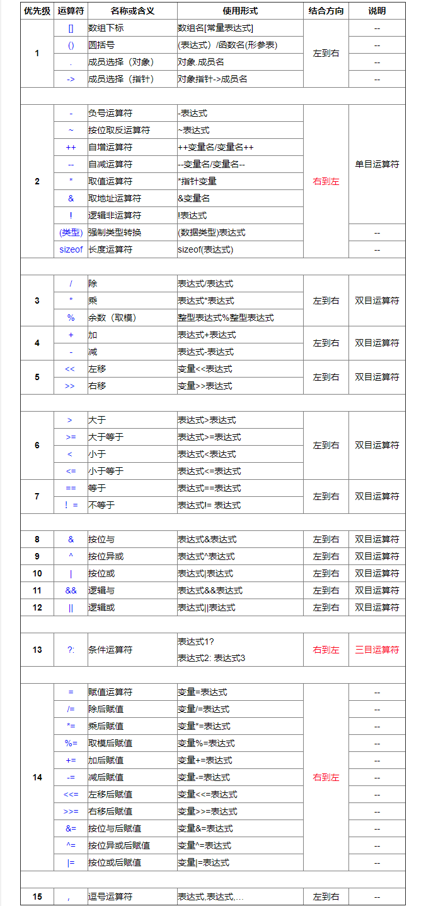

<!-- TOC -->

- [运算符](#运算符)
    - [算术运算符](#算术运算符)
        - [加](#加)
        - [减](#减)
        - [乘](#乘)
        - [除](#除)
        - [取模](#取模)
        - [自增](#自增)
        - [自减](#自减)
    - [逻辑运算符](#逻辑运算符)
        - [与](#与)
        - [或](#或)
        - [非](#非)
    - [关系运算符](#关系运算符)
        - [小于](#小于)
        - [大于](#大于)
        - [小于等于](#小于等于)
        - [大于等于](#大于等于)
        - [等于](#等于)
        - [不等于](#不等于)
    - [位表运算符](#位表运算符)
        - [与](#与-1)
        - [或](#或-1)
        - [非](#非-1)
        - [异或](#异或)
        - [左移](#左移)
        - [右移](#右移)
    - [赋值运算符](#赋值运算符)
        - [赋值](#赋值)
    - [其它运算符](#其它运算符)
        - [数组下标](#数组下标)
        - [函数调用](#函数调用)
        - [结构成员访问](#结构成员访问)
        - [取址](#取址)
        - [间接寻址](#间接寻址)
        - [条件运算符](#条件运算符)
        - [逗号运算符](#逗号运算符)
        - [sizeof](#sizeof)
    - [运算符优先级和优先级](#运算符优先级和优先级)
        - [含义](#含义)
        - [属性列表](#属性列表)

<!-- /TOC -->

# 运算符
/////////////////////////////////////

运算符是一种告诉编译器执行特定的数学或逻辑操作的符号。

- 算术运算符
    - `+`
    - `-`
    - `*`
    - `/`
    - `%`
    - `++`
    - `--`
- 逻辑运算符
    - `&&`
    - `||`
    - `!`
- 关系运算符
    - `<`
    - `>`
    - `<=`
    - `>=`
    - `==`
    - `!=`
- 位运算符
    - `&`
    - `|`
    - `~`
    - `^`
    - `<<`
    - `>>`
- 赋值运算符
    - `=`
    - `+=`
    - `-=`
    - `*=`
    - `/=`
    - `%=`
    - `&=`
    - `|=`
    - `~=`
    - `^=`
    - `>>=`
    - `<<=`
- 其它运算符
    - `[]`：数组下标运算符
    - `()`：函数调用运算符
    - `->` `.`：struct和union访问成员运算符
    - `&`：取址运算符
    - `*`：间接寻址运算符
    - `? :`：条件运算符
    - `,`：逗号运算符
    - `sizeof`：求字节数运算符

/////////////////////////////////////

## 算术运算符

### 加

### 减

### 乘

### 除

### 取模

### 自增

### 自减


## 逻辑运算符

### 与

### 或

### 非

## 关系运算符

### 小于

### 大于

### 小于等于

### 大于等于

### 等于

### 不等于

## 位表运算符

### 与

### 或

### 非

### 异或

### 左移

### 右移

## 赋值运算符

### 赋值

## 其它运算符

### 数组下标

### 函数调用

### 结构成员访问

### 取址

### 间接寻址

### 条件运算符

### 逗号运算符

### sizeof

## 运算符优先级和优先级

### 含义

>问：一个表达式可能存在多个运算符和操作符，那么如何能让这些运算符按指定的顺序执行呢？  
>答：由运算符的两个属性来控制：
> - **优先级**：控制不同级别的执行顺序，级别高的先执行
> - **结合性**：控制处于同一级别的执行顺序，它决定那个运算符先执行
>   - 左结合性：左边先执行
>   - 右结合性：右边先执行

>问：既然结合性决定处于同一优先级的运算符的执行顺序，那么如果同一优先级但是结合性不同呢，此时如何控制执行顺序？  
>答：不存在的！！！处于统一优先级运算符，结合性是一致的。不然，就无法确定运算符的执行顺序了。

> Tips：如果无法确定优先级或结合性，使用 (**括号**) 是一个好的习惯


> 有一个例外：`()` 用括号括起来的可以自定义执行顺序


```c
int a = 1 + 2 * 3;

int a = b = c = d = 1;
int a = 1 + 2 + 3 + 4;
```

### 属性列表




