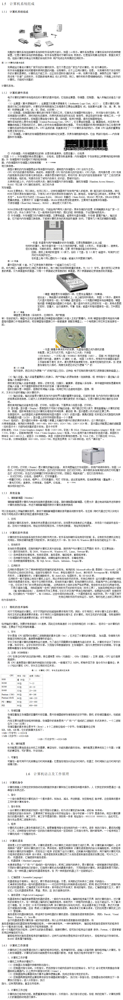

## 计算机组成

- 硬件
    - 运算器
    - 存储器
    - 控制器
    - 输入设备
    - 输出设备
- 软件
    - ...

## 计算机指令？

一个指令规定了计算机执行一个基本的操作。如加法、传输数据等，这些简单的基本工作叫做计算机指令。

## 什么是程序？

把计算器指令排列成一定的执行顺序并完成一定目标的工作指令序列，成为程序。  

这里可以看出来程序实际上就是一份指令序列，通俗点说是一份代码。没错，就像通过c、c++等程序语言编写的代码一样，代码也可以看成“人易懂”的特殊的指令序列。

高级语言的代码最后的执行也是转换为机器语言，指令序列来执行。

计算机无论做多么复杂的工作，都是靠着指令适当的排列成一个序列，逐条的执行指令，最后完成整个工作。

## 计算机语言？

...
...
[汇编](http://baike.baidu.com/item/%E6%B1%87%E7%BC%96%E8%AF%AD%E8%A8%80/61826)

## 工作原理

重复的取指令、分析指令、执行指令。

## 附录

