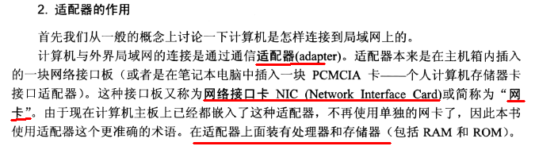

### 网络连接协议中，关于连接建立时为什么需要几次握手确认，例如tcp连接的建立为什么要“三次握手”确认？

> 示例： client发出的第一个连接请求报文段并没有丢失，而是在某个网络结点长时间的滞留了，以致延误到连接释放以后的某个时间才到达server。本来这是一个早已失效的报文段。但server收到此失效的连接请求报文段后，就误认为是client再次发出的一个新的连接请求。于是就向client发出确认报文段，同意建立连接。假设不采用“三次握手”，那么只要server发出确认，新的连接就建立了。由于现在client并没有发出建立连接的请求，因此不会理睬server的确认，也不会向server发送数据。但server却以为新的运输连接已经建立，并一直等待client发来数据。这样，server的很多资源就白白浪费掉了。

这个问题的本质是，**信道不可靠**，但是通信双方需要就这个问题达成一致，解决这个问题。首先，无论消息中含有什么信息，三次通信理论上是最小值。所以，三次握手不是TCP本身的要求，而是为了满足**在不可靠信道上可靠的传输信息**这一需求所导致的。

因此，如果信道是可靠的，即无论什么时候发出消息，对方一定能及时收到，这种情况下就不需要“三次握手”确认了。

### 网卡是什么？具有什么功能？在网络七层协议什么层次？

  

### 物理地址和IP地址区分？

