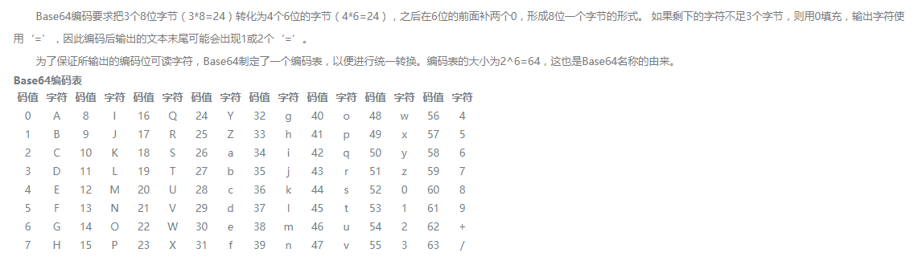

# 字符集和字符编码

这两个东西发展到现在，在概念和使用方面存在着不少历史遗留问题。

- 字符集：规定字符和字符对应的值
- 编码：将字符对应值以一定的规则转换成二进制的存储在计算机上

<!-- TOC -->

- [字符集和字符编码](#字符集和字符编码)
    - [ASCII字符与编码](#ascii字符与编码)
    - ["ANSI编码"](#ansi编码)
        - [记事本](#记事本)
        - [那么什么是BOM？](#那么什么是bom)
    - [Unicode与UTF](#unicode与utf)
        - [Unicode](#unicode)
        - [UTF-8](#utf-8)
    - [操作系统上编辑器如何显示一段字符?](#操作系统上编辑器如何显示一段字符)
    - [理解网络、系统等间的字符传输关于编码解码的理解](#理解网络系统等间的字符传输关于编码解码的理解)
    - [base64编码作用并与ASCII、utf8、gbk等的区别?](#base64编码作用并与asciiutf8gbk等的区别)
    - [附录](#附录)
        - [链接](#链接)
        - [ASCII码表](#ascii码表)

<!-- /TOC -->

下面按照时间线介绍一些字符集和字符编码，Let's start!

## ASCII字符与编码

[ascii码](https://zh.wikipedia.org/wiki/ASCII)(American Standard Code for Information Interchange， 美国信息交换标准代码)一共规定了128个字符的7位编码，占用一个字节，128个字符对应的值为0~127。

ascii字符分两类，对应值为0~31和127(共33个)的字符为不可显示的控制字符，例如换行符；其余的为能显示的字符，例如abcd等。

NOTE：**ascii字符集和字符编码相同，即直接将字符对应值的二进制表示存储在计算机上；故，ascii既代表字符集，也代表了字符编码**

https://www.zhihu.com/question/20152853

## "ANSI编码"

首先 `ANSI编码` 这个说法似乎只有**Windows操作系统**才有这个概念，具体指的是 Windows code pages，会根据当前的Locale选定具体的编码，例如简中locale下是GBK或GB2312，繁中下是Big5。

至于微软为什么把Windows的code pages称为ANSI，嗯~~，难以理解！！！

这些ANSI，可以说是ASCII的扩展，但是这个扩展并不是全球约定统一，而是不同国家和地区指定了不同的标准，互相不兼容。

一般这种扩展的ANSI对ASCII是兼容的，即0x00~0x7f编码还是一致，但是0x80~0xffff就不同了。

ANSI对应不同的地区可以是：
- GB2312、GBK、GB18030，简体中文标准
- Big5，繁体中文标准，主要台湾地区
- Shift_jis，日文
- ...
- [more MSDN](https://msdn.microsoft.com/zh-cn/library/windows/desktop/dd317756(v=vs.85).aspx)
- [more Wiki](https://en.wikipedia.org/wiki/Windows_code_page)

### 记事本


Wondows上记事本程序一直为程序员所诟病，主要是其四种编码：
- `ANSI`：记事本默认编码
- `Unicode`：实则带BOM的小端序 UTF-16
- `Unicode big endian`：实则带有BOM的大端序 UTF-16
- `UTF-8`：实则带有BOM的UTF-8。

### 那么什么是BOM？

字节顺序标记，byte-order mark，BOM，可以区分大小端，还可以区分utf8、utf16、utf32等编码。


其中，utf8编码最小单元为单个字节，故其不需要区分大小端，也就是utf8编码的文本可以不需要BOM。

但是带bom的utf8文本，按理说任何程序都应该能识别，毕竟这是Unicode标准，但似乎一些程序并不能识别带bom的utf8文本，例如linux shell脚本、html等。

所以一个utf8文本带不带bom，其本身没什么区别，区别在于**读取这个文本的程序**是否能正确识别utf8的bom，这就是我们程序员需要注意的点。

> 记事本编辑的utf8文本虽然只能带bom，但是其能识别不带bom的utf8文本，并能正确显示出来。

> vscode、sublime、notepad等高级编辑器编辑文本时一般都有提供带bom的utf8和不带bom的utf8两种选项；Linux上编辑文件，例如vi、vim，一般都直接限制为不带bom的utf8

> nodejs程序两种utf8都能识别，不能识别utf16


## Unicode与UTF

<!-- - Unicode：只是字符集，定义了每个字符对应一个四个字节长度的整数
- UTF：Unicode Transformation format Unicode转换格式，将字符对应的整数以相应规则转换为二进制存储在计算机上，即编码

CJK Unified Ideographs， 中日韩统一表意文字

> 表意文字：即象形文字，其书写字形表示含义，不直接或间接的表示语音。像英语的字形与其读音是相对应的，故英语是表音文字。

统一码联盟，The Unicode Consortium，这个机构管理
- Unicode 统一码
- UTF 统一码转换格式 -->

### Unicode

Unicode字符集的码位空间为：U+0000 ~ u+10FFFF，最大占21个bit位。

Unicode字符集定义了每个字符对应的码位，具体将码位编码成计算机存储的bit位，由UTF-8，UTF-16等具体的编码规则去完成。

- 一个字符 `character` 是具有语义价值的文本的最小单位。
- 一个字符集 `character set` 是可能涵盖多种语言的字符集合。
- 一个编码字符集 `coded character set` 是一个字符集，其中每个字符对应唯一一个编号。
- 一个编码字符集的码位或代码点 `code point` 是字符集给该字符的唯一编号。
- 一个代码单元 `code unit` ，对应一个编码规则可识别的最小单位，例如utf-8可识别最小单位为8bit，utf-16可识别最小单位为16bit。

<!-- 代码单元
- ASCII：7位二进制组成
- UTF-8：8位二进制组成
- UTF-16：16位二进制组成
- UTF-32：32位二进制组成 -->

### UTF-8

|字节数|码点的bit位|码点范围|字节1|字节2|字节3|字节4|
|:-:|:-:|:-:|:-:|:-:|:-:|:-:|
|1|7|U+0000~u+007F|0xxxxxxx||||
|2|11|U+0080~U+07FF|110xxxxx|10xxxxxx|||
|3|16|U+0800~U+FFFF|1110xxxx|10xxxxxx|10xxxxxx||
|4|21|U+10000~U+10FFFF|11110xxx|10xxxxxx|10xxxxxx|10xxxxxx|

举例：


```
汉字：们 的Unicode码点值为 U+4eec，可见其UTF8应该编码为3个字节

4eec -> 0100(4) 1110(e) 1110(e) 1100(c)
     -> [0100] [111011] [101100]

编码三字节规则：1110xxxx 10xxxxxx 10xxxxxx

将4eec的bit位依次填入规则的 "x" 中，得到：1110[0100] 10[111011] 10[101100]

故得到编码结果为：e4bbac

具体使用sublime编辑器测试结果正常，或者在linux上使用xxd测试也可以。
```


## 操作系统上编辑器如何显示一段字符?

以utf8为例，个人理解：  


1. 将磁盘中保存的文件载入内存
2. 系统内置编/解码程序将文本解码，解析成**Unicode码位值**
3. 将解码得到的码位值，到**字体文件**进行查找对应的点阵绘制信息
4. 将点阵绘制信息输入到显示器显示

## 理解网络、系统等间的字符传输关于编码解码的理解

以网页上一个汉字显示 "们" 为例：

1. 网页文本显示通常以"utf8"编码格式，所以汉字"们"对应的unicode码点值为：`\u4eec`，对应的utf8编码后的字节为：`4e bb ac`，即实际存储在硬盘上的实际字节
2. 接下来，将此网页上汉字"们"，通过http网络请求，传输到其它服务程序Server上，传输前约定编码格式为utf8，传输的内容为二进制字节，即字节`4e bb ac`
3. 程序Server接受到字节`4e bb ac`，也知道编码格式为utf8，所以如果解码话，很明显知道是汉字"们"
4. 程序Server因为业务需求将汉字"汉字"，以base64编码后然后在传输给客户端
5. 将汉字"们"base64编码，即将字节`4e bb ac`按照base64规则编码，得到字节 `00111001 00001011 00101110 00101100`对应的十进制为`57 11 46 44`，然后将这四个字节通过http网络返回给客户端
6. 客户端得到这四个字节，并且知道是base64编码的，然后按照base64规则解码得到`4e bb ac`，然后以utf8编码规则解码得到汉字"们"
7. 可见，程序之间、网络之间传输的都是二进制，双方必须约定好编码解码类型，这样才不会产生乱码

## base64编码作用并与ASCII、utf8、gbk等的区别?

首先base64与ASCII、utf8、gbk并不在同一等级上
- ASCII、utf8、gbk属于文字系统的字符集与编码系统，拥有覆盖面较广的字符集，且每一个字符都对应这唯一的码点，对应着唯一的字节值
- 而base64不属于文字系统的字符集和编码系统，它涵盖的字符也只有64个，其规则也必须依赖于ASCII、utf8、gbk等文字系统编码，因为其规则，是将一串字符对应的二进制转换成另外一串二进制，即它在已有文字系统编码的字符上做转化，**本身不产生二进制**

从功能上也不同，文字系统字符集于编码系统功能就是提供定义每个字符对应二进制的编码和解码。

而base64的功能为：

上面已经说到，base64规则是将一段存在的二进制转换为新的一串二进制，也就是说任何数据都能被base64编码，因为任何数据都是二进制，比如img、mp3、gzip等。

base64最大的好处是将一段完全不可读不可显示的二进制（如img），转成base64就成了文本，这样就可读可编辑了。不仅如此，传输数据也方便很多，因为base64编码后的每个字节高两位为0，即每个字节值小于64，范围[0, 2^6)，很明显其值范围在ascii，0~127内，这样可以兼容一些历史问题，例如，一些历史网关只允许传送ASCII字符，也就是一个8bit字节的低7位。因此如果你传送非ASCII字符，有历史问题的网关可能擅自将字节最高位置0，这样可能就会出错。而base64就保证了传输内容的无错误性。

可以说base64是一种数据编码方式，目的是让数据符合传输协议的要求。

标准base64对应的规则为：  


## 附录

### 链接

- https://unicode-table.com/cn/
- http://unicode.org/

### ASCII码表
