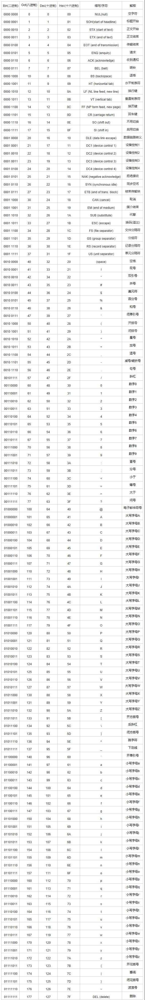

# 字符集和字符编码

这两个东西发展到现在，在概念和使用方面存在着不少历史遗留问题。

- 字符集：规定字符和字符对应的值
- 编码：将字符对应值以一定的规则转换成二进制的存储在计算机上

下面按照时间线介绍一些字符集和字符编码，Let's start!

## ASCII字符与编码

ascii码(American Standard Code for Information Interchange)一共规定了128个字符的编码，占用一个字节，128个字符对应的值为0~127。

ascii字符分两类，对应值为0~31和127(共33个)的字符为不可显示的控制字符，例如换行符；其余的为能显示的字符，例如abcd等。

NOTE：**ascii字符集和字符编码相同，即直接将字符对应值的二进制表示存储在计算机上；故，ascii既代表字符集，也代表了字符编码**

https://www.zhihu.com/question/20152853

## 附录

### ASCII码表
