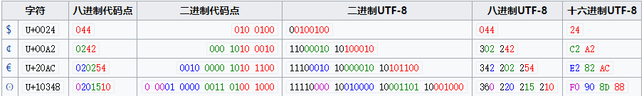

# 字符集和字符编码

这两个东西发展到现在，在概念和使用方面存在着不少历史遗留问题。

- 字符集：规定字符和字符对应的值
- 编码：将字符对应值以一定的规则转换成二进制的存储在计算机上

<!-- TOC -->

- [字符集和字符编码](#字符集和字符编码)
    - [ASCII字符与编码](#ascii字符与编码)
    - [Unicode与UTF](#unicode与utf)
        - [Unicode](#unicode)
        - [UTF-8](#utf-8)
    - [操作系统上编辑器如何显示一段字符？](#操作系统上编辑器如何显示一段字符)
    - [附录](#附录)
        - [ASCII码表](#ascii码表)

<!-- /TOC -->

下面按照时间线介绍一些字符集和字符编码，Let's start!

## ASCII字符与编码

[ascii码](https://zh.wikipedia.org/wiki/ASCII)(American Standard Code for Information Interchange， 美国信息交换标准代码)一共规定了128个字符的7位编码，占用一个字节，128个字符对应的值为0~127。

ascii字符分两类，对应值为0~31和127(共33个)的字符为不可显示的控制字符，例如换行符；其余的为能显示的字符，例如abcd等。

NOTE：**ascii字符集和字符编码相同，即直接将字符对应值的二进制表示存储在计算机上；故，ascii既代表字符集，也代表了字符编码**

https://www.zhihu.com/question/20152853

## Unicode与UTF

<!-- - Unicode：只是字符集，定义了每个字符对应一个四个字节长度的整数
- UTF：Unicode Transformation format Unicode转换格式，将字符对应的整数以相应规则转换为二进制存储在计算机上，即编码

CJK Unified Ideographs， 中日韩统一表意文字

> 表意文字：即象形文字，其书写字形表示含义，不直接或间接的表示语音。像英语的字形与其读音是相对应的，故英语是表音文字。

统一码联盟，The Unicode Consortium，这个机构管理
- Unicode 统一码
- UTF 统一码转换格式 -->

### Unicode

Unicode字符集的码位空间为：U+0000 ~ u+10FFFF，最大占21个bit位。

Unicode字符集定义了每个字符对应的码位，具体将码位编码成计算机存储的bit位，由UTF-8，UTF-16等具体的编码规则去完成。

- 一个字符 `character` 是具有语义价值的文本的最小单位。
- 一个字符集 `character set` 是可能涵盖多种语言的字符集合。
- 一个编码字符集 `coded character set` 是一个字符集，其中每个字符对应唯一一个编号。
- 一个编码字符集的码位或代码点 `code point` 是字符集给该字符的唯一编号。
- 一个代码单元 `code unit` ，对应一个编码规则可识别的最小单位，例如utf-8可识别最小单位为8bit，utf-16可识别最小单位为16bit。

<!-- 代码单元
- ASCII：7位二进制组成
- UTF-8：8位二进制组成
- UTF-16：16位二进制组成
- UTF-32：32位二进制组成 -->

### UTF-8

|字节数|码点的bit位|码点范围|字节1|字节2|字节3|字节4|
|:-:|:-:|:-:|:-:|:-:|:-:|:-:|
|1|7|U+0000~u+007F|0xxxxxxx||||
|2|11|U+008F~U+07FF|110xxxxx|10xxxxxx|||
|3|16|U+0800~U+FFFF|1110xxxx|10xxxxxx|10xxxxxx||
|4|21|U+10000~U+10FFFF|11110xxx|10xxxxxx|10xxxxxx|10xxxxxx|

举例：


```
汉字：们 的Unicode码点值为 U+4eec，可见其UTF8应该编码为3个字节

4eec -> 0100(4) 1110(e) 1110(e) 1100(c)
     -> [0100] [111011] [101100]

编码三字节规则：1110xxxx 10xxxxxx 10xxxxxx

将4eec的bit位依次填入规则的 "x" 中，得到：1110[0100] 10[111011] 10[101100]

故得到编码结果为：e4bbac

具体使用sublime编辑器测试结果正常，或者在linux上使用xxd测试也可以。
```




## 操作系统上编辑器如何显示一段字符？

以utf8为例，个人理解：  


1. 将磁盘中保存的文件载入内存
2. 系统内置编/解码程序将文本解码，解析成**Unicode码位值**
3. 将解码得到的码位值，到**字体文件**进行查找对应的点阵绘制信息
4. 将点阵绘制信息输入到显示器显示

## 附录

### ASCII码表
