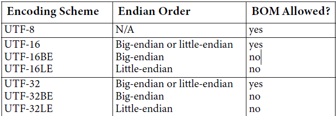

<!-- TOC -->

- [章节2 基本结构](#章节2-基本结构)
    - [构建上下文](#构建上下文)
        - [基本文本进程](#基本文本进程)
        - [文本元素，字符和文本进程](#文本元素字符和文本进程)
        - [文本进程和编码](#文本进程和编码)
    - [Unicode设计原则](#unicode设计原则)
    - [兼容性字符](#兼容性字符)
    - [码点和字符](#码点和字符)
        - [码点类型](#码点类型)
    - [编码形式](#编码形式)
        - [utf-32](#utf-32)
        - [utf-16](#utf-16)
        - [utf-8](#utf-8)
        - [比较utf8/utf16/utf32各自的优点](#比较utf8utf16utf32各自的优点)
    - [编码方案](#编码方案)
    - [Unicode字符串](#unicode字符串)
    - [Unicode分配](#unicode分配)
        - [平面](#平面)
        - [区域和块](#区域和块)
        - [码点](#码点)
    - [分配细节](#分配细节)
        - [平面0](#平面0)
        - [平面1](#平面1)
        - [平面2](#平面2)
        - [其它平面](#其它平面)
    - [书写方向](#书写方向)
    - [结合字符](#结合字符)
    - [等价的序列](#等价的序列)
    - [特殊字符](#特殊字符)
    - [符合Unicode标准](#符合unicode标准)

<!-- /TOC -->

# 章节2 基本结构

## 构建上下文

- 诸如Unicode标准之类的字符代码（character code）标准可以实现对文本数据进行操作的有用进程。有趣的是最终产品不是字符代码，而是文本进程，因为它们直接服务系统用户的需要。
- 字符代码（character code）就像你螺母和螺栓，虽然是次要的，但是是必不可少的和普遍存在的组件。
- 没有什么单个设计的字符集能够适合所有的用途，因此Unicode体系结构标准在一些需求之间取得平衡。

### 基本文本进程

- 大多数计算机系统提供了少量的低级别的文本进程，基于此能够构建更复杂的文本处理功能
- 下列文本进程在某种程度上被大多数计算机系统支持：
    - 渲染字符可见（包括连字，上下文forms等等）
    - 渲染时断行（包括用连字符连接的）
    - 修改外观，例如磅值，字距下划线，倾斜和重量（光，半亮，粗体等）
    - 确定“单词”和“句子”等单位
    - 在处理选择和高亮文本等过程中与用户交互
    - 接受键盘的输入编辑存储的文本，来达到插入和删除
    - 搜索或确定两个字符串的顺序来比较文本
    - 分析文本内容，例如拼写检查，连字符连接，解析词法（即确定词根，词干，词缀）
    - 将文本作为批量数据操作，例如压缩，解压，阶段，传输和接受

### 文本元素，字符和文本进程

- ...
- 相反，字符编码标准提供了一组基本单位编码，它唯一地分配数字代码点。 这些单位称为*分配字符*（assigned characters），是存储文本的最小可解释单位。 然后表示文本元素通过一个或多个字符的序列。
- 此图有例图，详情看原文
- 字符编码的设计必须精确的提供一组字符，允许程序员能够实现各种语言文本处理的应用程序。因此，在大多数文本进程中遇到的文本元素表示为**字符代码序列**。
- ...

### 文本进程和编码

## Unicode设计原则

## 兼容性字符

## 码点和字符

- 在计算机上，字符在内部编码为数字。为了创建一个完整字符编码，有必要定义要编码的所有字符列表，和建立系统的数字映射字符的规则。
- 用于编码字符的整数范围称为*代码空间*（codespace）。该代码空间的其中一个称为*码点*（code point）。将一个字符赋予代码空间中的一个值，则称其为*编码的字符*（encoded character）。
- 在Unicode标准中，代码空间由0到10FFFF整数组成，包括1,114,112个码点可用于分配字符。有关代码空间分配的更多信息，请参阅章节2.8。
- 在引用Unicode的码点时，通常的做法是是使用它们的以十六进制表示的数值，带有`U+`前缀。（见附录A，符号约定）。编码的字符只能通过其码点来引用。为了防止歧义，字符Unicode官方的名称也会被添加，这会清楚的表示编码的字符，例如：
    - U+0061 latin small letter a（拉丁文小写字母a）
    - U+10330 gothic letter ahsa（哥特式字母 ahsa）
    - U+201DF cjk unified ideograph-201df（cjk统一表意文字 201df）

### 码点类型

- 有许多方法可以对码点进行分类。下表说明了一些分类和Unicode标准中使用的基本术语。七种基本类型的代码点定义在3.4节。
    1. 图形（Graphic）
        - 类型简介：letter, mark, number, punctuation, symbol, space
        - 一般类别：L, M, N, P, S, Zs
        - 字符状态：分配到字符
        - 码点状态：指定了分配的码点
    2. 格式（Format）
        - 类型简介：不可见，但会影响相邻字符；包括行、段分隔符
        - 一般类别：Cf, Zl, Zp
        - 字符状态：分配到字符
        - 码点状态：指定了分配的码点
    3. 控制（Control）
        - 类型简介：用法被协议定义，或Unicode标准之外的标准
        - 一般类别：Cc
        - 字符状态：分配到字符
        - 码点状态：指定了分配的码点
    4. 私人使用（Private-use）
        - 类型简介：被Unicode标准之外的私人协议定义用法
        - 一般类别：Co
        - 字符状态：分配到字符
        - 码点状态：指定了分配的码点
    5. 代理（Surrogate）
        - 类型简介：永久保留给UTF-16；限制互换（interchange）
        - 一般类别：Cs
        - 字符状态：不能分配到字符
        - 码点状态：指定了分配的码点
    6. 非字符（Noncharacter）
        - 类型简介：永久保留为内部使用；限制互换（interchange）
        - 一般类别：Cn
        - 字符状态：还没有分配字符
        - 码点状态：指定了分配的码点
    7. 保留（Reserved）
        - 类型简介：保留为未来分配；限制互换（interchagne）
        - 一般类别：Cn
        - 字符状态：还没有分配字符
        - 码点状态：还未指定分配的码点
- 不是所有分配的码点都代表字符：只有图形、格式、控制和私人使用才对应字符。
- 代理和非字符类别，被分配码点，但是不对应字符。
- 保留的码点是可分配的，任何可以在未来的标准版本中分配。
- 上面的“一般类别”，将图形类别更加细分，同时也可以区分其它基本类型（非字符和保留类型除外）
- 同时，Unicode字符数据库中定义的属性properties提供了Unicode码点不同的分类
- **控制码（Control Codes）**：65个码点（[U+0000, U+001F], [U+007F, U+009F]）被特别的定义为控制码。其中一些控制码，Unicode标准给出了具体的解释。（请参阅23.1小结，控制码）
- **非字符（Noncharacters）**：66个码点不用来对应字符。分别为范围[U+FDD0, U+FDEF]，32个，和所有以FFFF或FFFE结尾的值，共17个平面，每个平面有两个，故有34个。故总共66个。(请参阅小结23.7)
- **私人使用（Private Use）**：有三个码点范围可以供私人使用，这三个区域永远不会被Unicode标准定义。这些代码点可以自由使用，可以用于任何目的的字符，但是数据成功的交换需要发送者和接受者协议一致，这样双方才能正常解析。（请参阅23.5小结）
- **代理（Surrogates）**：已经分配了大约2048个码点作为代理码点，来用作UTF-16编码形式。（请参阅23.6）
- **限制交换（Restricted Interchange）**：未分配给字符的码点会被限制交换。
    - 使用Unicode编码形式，不能一致性的`交换代理码点（Surrogate code points）`。这些代理码点不符合Unicode标量值，因此不能用Unicode编码形式来很好的表示出来。（请参阅3.8小结，代理）
    - `非字符码点（Noncharacter code points）`保留为内部使用，例如哨兵值（sentinel values）。它们在Unicode编码形式中有良好的表示形式，并且能够在编码形式之间转换。这允许哨兵值在Unicode编码形式内部保留，即它们不用来外部交换
    - 所有的实现都需要维持`保留码点（Reserved code points）`，因为它们可能在Unicode标准的未来版本实现。
- **码点语义（Code Point Semantics）**：大多数码点的语义都是此标准建立的，除了控制码点、私人使用码点，非字符码点。控制码语义通常被其他标准定义，例如ISO/IEC 6429，但是也有少量控制码点被Unicode标准指定特别语义，参阅小结23.1，Control Codes，中的表格23-1。私人使用字符的语义定义在Unicode标准之外，通常被私有协议决定，例如供应商之间。非字符码点尽在内部使用时才有语义。

## 编码形式

- 计算机处理的数字不仅仅是抽象的数学对象，而是像字节和32bit字这样固定大小单位的组合。字符编码模型确定数字和字符的关联时，必须考虑这个问题。
- 实际上，在计算机系统中，整数以特定尺寸的`代码单元（code units）`表示，尺寸有8bit、16bit、32bit三种。`在Unicode字符模型中，编码形式（encoding forms）精确指定了每个码点如何表示为一个或多个代码单元（code units）的序列`。
- **编码形式（Encoding Forms）**。即UTF-8，UTF-16，UTF-32。“UTF”是早期术语的延续，意味着Unicode转换格式（Unicode(UCS) Transformation Format）。
- 该三种编码形式都可用于表示Unicode字符的全部编码，因此处于各种原因而选择不同编码形式的实现，它们是完全可互操作的。三种Unicode编码中的每一种形式，都可以有效的转换为其他两种形式，而不会丢失数据。
- **非重叠（Non-overlap）**。每种Unicode编码形式都按照非重叠原则来设计。即每个码点对应的代码单元序列，必须是一一对应，独一无二的，无歧义。
- 非重叠Non-overlap设计使得所有Unicode的编码形式都能很好的用于搜索和比较。搜索特定字符时，它永远不会匹配到其它字符中所代表的代码单元序列。
- 非重叠设计的另一方面就是，所有的Unicode字符当以任何编码的形式表达时具有确定的边界。即，字符代表的代码单元序列的边界很容易被本地检查器检查出来。在Unicode字符文本中，不需要无限期往回扫描来确定字符的边界。编码形式容易确定边界的这个属性，有时被称为 *自同步*。这个属性有另外一个非常重要的暗示：单个代码单元的损坏只会破坏一个字符，周围的字符不会受到影响。
- **一致性（Conformance）**。Unicode联盟完全支持使用三种编码形式中的任一一种来作为实现Unicode标准的一致性方法。

### utf-32

- UTF-32是最简单的Unicode编码形式。每个Unicode的码点直接由一个32bit代码单元构成。因此，UTF-32在编码字符和代码单元之间具有一对一的关系。它是一个固定宽度的字符编码形式。这个是UTF-32称为传递单个字符值的API的理想形式。
- UTF-32虽然代码单位有32位，但是也仅仅表示[0, 10FFFF]范围内的码点，即Unicode代码空间。这保证了和UTF-8和UTF-16的之间的互操作性。
- **固定宽度（Fixed Width）**。每个UTF-32代码单元的值完全对应于Unicode码点值。这种情况与UTF-16，特别是UTF-8有很大的区别。例如U+10000在utf32表示为`<00010000>`，在utf8表示为`<F0 90 80 80>`。这样，从utf32代码单元来确定Unicode字符是简单的，但是要由utf16和utf8的代码单元来确定Unicode字符，则需要进行相关规则的转换。
- **首选用法**。如果不在意内存和磁盘的存储空间，而在意字符编码为固定宽度的单个代码单元，则优先选择utf32。大多数unix平台上，utf32也是优先选择的编码形式。

### utf-16

- 在utf16编码形式中，范围[u+0000, u+ffff]内的码点可以直接由单个16位的代码单元表示；至于范围[u+10000, u+10ffff]的码点，需要由一对16位的代码单元来表示。这对特别代码单元称为`代理对`。用于代理的代码单元的值与用于单个代码单元表示值完全分离，从而保持了utf16中所有码点表示不重叠。（代理的正式定义，请参阅小结3.8，Surrogate）
- **BMP优化（Optimized for BMP）**。utf16针对BMP中的码点会优化表示。该范围内的码点可以仅用单个16位的代码单元来编码，因此对比utf32编码，utf16可以减少一般的内存或磁盘的占用。对于bmp，utf16可以有效的视为固定宽度的编码形式。
- **补充字符和代理（Supplementary Characters and Surrogates）**。对于补充字符，utf16需要使用两个16位的代码单元来表示。总体来说，utf16是一种可变宽度的编码形式。utf16比utf32处理起来更加复杂一点。
- **首选用法**。在许多环境下，需要平衡访问字符的效率和字符的存储，utf16是个不错的选择。
- **起源（Origin）**。utf16是早期Unicode形式的历史后代，它最初设计为专门使用固定宽度的16位编码形式。后来，Unicode代码空间扩大，utf16为了能够编码[u+10000, u10ffff]范围内的码点，原始的utf16添加了代理（surrogates）。代理的设计，使其成为一个简单有效的扩展机制，既能兼容旧版Unicode实现，还避免了许多可变宽度字符编码的问题。（请参阅5.4节，处理utf16 代理对）
- **排序（Collation）**。

### utf-8

- 为了满足面向字节、基于ASCII的系统的要求，Unicode标准给出了第三种编码形式：utf8，这是可变宽度的编码形式，并且兼容使用ASCII。
- **面向字节（Byte-Oriented）**。当前许多软件和信息技术的实践都长时间的依赖用单个字节所表示的字符数据，依赖于ASCII。最简单的方法就是使用基于8位的代码单元的编码形式，使其能编码Unicode所有码点，并且不打扰或重用任何ASCII或C0控制码值。这就是utf8所做的。
- **可变宽度（Variable Width）**。utf8是一种可变宽度的编码形式，基于8位的代码单元，其中每个代码单元的高位指示其在代码单元序列中的位置。
- **ASCII透明（ASCII Transparency）**。utf8编码形式对ASCII所有码点[0x00, 0x7f]保持透明度。这意味着，使用utf8编码的话，会将Unicode范围为[u+0000, u+007f]的字符码点编码为[0x00, 0x7f]，这样就和ASCII一样。同时值[0x00, 0x7f]不会出现在其他码点的编码序列中，这样就不会产生歧义。超越ASCII的码点，许多非表意字符用utf8两个单元表示；所有范围在[u+0800, u+ffff]的非代理码点，用utf8三个单元表示；码点值大于u+ffff的补充码点用utf8的四个单元表示。
- **首选用法**。utf8通常是html和类似协议的首选编码形式，特别是internet。utf8对ASCII透明，有助于迁移。像现存的大多数8位字符集一样，utf8具有字节序列化的优势。
- **自同步（Self-synchronizing）**。在需要8位字符处理的环境中，不管怎样，与其他多字节编码相比，utf8具有以下吸引人的功能：
    - utf8代码单元序列的第一个字节指出在多字节序列中后跟随的字节数。这允许utf8序列可以有效的被正向解析。
    - 当从utf8字节流中任意位置开始，查找字符的起始位置很容易。程序需要向后搜索最多4个字节，通常少的多。识别初始字节对utf8是一项很简单的任务，因为初始字节被限制在一个固定的值范围内，故可以根据特定值判断为初始字节。
    - 与其他编码形式一样，utf8编码的字节值也没有重叠。
- 编码尺寸
    - [u+0000, u+007f] 1个字节
    - [u+0080, u+07ff] 2个字节
    - [u+0800, u+ffff] 3个字节
    - [u+10000, u+10ffff] 4个字节
    - 可以看到在bmp平面，utf8大多数编码为3个字节，而utf16将bmp真个平面都编码为2个字节，所以一定程度上utf16在存储空间和处理效率要比utf8要好

### 比较utf8/utf16/utf32各自的优点

- 从表面上看，对于内部处理代码，utf32编码形式似乎是明显的选择，因为它是固定宽度的编码形式。它可以绑定到c和c++ wchar_t，这意味着程序员可以直接利用该编程语言提供的内置的和现成的字符串API。然而，utf16也有许多对抗性的优势，可能会导致实施者选择它作为内部处理码。
- 虽然三种编码形式中，字符编码最多都是需要4个字节。但是，在实际情况下，utf32对于真实数据的所有情况下，其占用存储空间是utf16的两倍。因此，一个常见的策略是让内部字符串存储使用utf16或utf8，但是操作单个字符时使用utf32。
- **utf32与utf16**。从存储占用和效率上utf16比utf32具有优势；utf32等宽更易设计与维护。（utf32实际性能比utf16差视为，对于相同的数据，额外的内存开销意味着将更加频繁的超出缓存限制，并且更加频繁的发生内存换页）。...待整理...
- **字符与码点**。...
- **utf8**。utf8在使用的字节数量方面相当紧凑。在针对东亚地区语言字符（例如cjk）的编码时，utf8在尺寸方面具有劣势，需要三个字节。在处理效率方面，utf8编码形式也比其它两者低。
- **二进制排序（binary Sorting）**。utf8字符串二进制顺序和Unicode码点的二进制顺序是一样的。显然这也与utf32字符串的顺序一样。
- 在处理bmp范围内的字符时，当二进制字符串比较或排序时，三种编码形式给出的结果都是一致的。但是当处理补充字符[u+1000, u+10ffff]时，其编码序列二进制顺序与Unicode码点顺序不匹配。在UTF-16系统和UTF-8或UTF-32系统之间，尝试二进制排序列表互操作时，可能会产生并发症（complications）。但是数据是根据特定语言或区域设置而不是使用二进制顺序（binary order），那么不管使用那种编码形式，数据的顺序总数一致的。

## 编码方案

- 编码方案（Encoding Schemes）
- 上一节关于Unicode编码形式的讨论设计到Unicode编码单元的机器表示。每个编码单元在计算机中简单的作为数字数据类型；就像其他数字类型一样，bit位内部布局的方式与大多数处理无关。但是，文本数据的交换，尤其是不同架构类型计算机之间交换，涉及到数字表示时，需要考虑到bits和bytes的确切排序。为了外部交换，整数数据（包括字符数据）被序列化成字节序列。这种字节序列化的过程允许所有的应用程序正确的解释交换的数据，并准确的重建数字值（字符值）。在Unicode标准中，Unicode数据所使用的不同类型的字节序列化的规范称为`编码方案（Encoding Schemes）`。
- **字节顺序（Byte Order）**。在内部表示中，数字类型中高位字节和低位字节，在不同的结构体系中的计算机中的顺序不同。这些序列分别称为“大端序列”和“小端序列”。对于uft16和utf32，字节序列化的规范必须考虑到表示数据的系统的大端或小端的体系结构，以便在对数据进行字节序列化交换时，能够很好的定义它。
- `字符编码方案由字符编码形式和如何将编码单元序列化成字节的规范组成。`
- Unicode标准还指定在某些Unicode编码方案中，使用`初始字节顺序标记（Byte Order Mark, BOM）`显示区分大端和小端数据。（请参阅，23.8小结）
- 当更高级别的协议提供处理整数数据类型的字节顺序的机制时，就不必使用Unicode编码方案或字节顺序标记bom。在这种情况下，unicode文本只是整数数据（integral data）的序列。
- 对于utf8，编码方案仅包含utf8编码单元序列，因此，用utf8表示的数据，不存在大端小端的顺序问题。但是，对于utf16和32编码形式，必须序列化成2个或4个字节，同时这些字节的顺序必须明确界定。正因为如此，由bom的使用规则和三个编码形式组合，总共形成了7个Unicode编码方案：
    - `Encoding Scheme` / `Endian Order` / `BOM Allowed?`
    - `UTF-8` / `N/A` / `√`
    - `UTF-16` / `大端或小端` / `√`
    - `UTF-16BE` / `大端` / `×`
    - `UTF-16LE` / `小端` / `×`
    - `UTF-32` / `大端或小端` / `√`
    - `UTF-32BE` / `大端` / `×`
    - `UTF-32LE` / `小端` / `×`
    - 
- **编码方案与编码形式**。注意一些Unicode编码方案与三种unicode编码形式具有相同的标签，这可能会引起混淆。所以当使用以下术语时，保持上下文清晰很重要。
    - 字符编码形式，指在内存或API中数据单元（integral data units），没有字节序列化处理的，即纯编码单元序列。
    - 字符编码方案，指字符经过编码和字节序列化后的数据，像流式传输i/o或文件存储的数据，其中必须指定或确定字节顺序。

## Unicode字符串

- Unicode字符串数据类型是一组有序的编码单元。因此，unicode 8位字符串是8位编码单元的有序序列，unicode16位字符串是16位编码单元有序序列，unicode32位字符串是32位编码单元的有序序列。
- 依赖于编程环境，一个unicode字符串可能和unicode的编码形式不一致。例如，在java、c#、ECMAScript编程语言中的字符串是unicode 16位字符串，但是不一定是格式正确的utf-16序列。在正常的处理中，允许含有非良好格式的utf16序列（此处的非良好格式指，隔离utf16中的代理部分，isolated surrogates）的字符串可以更有效。因为字符串是每个程序的基本组成部分，所以在每个修改字符串操作中检查isolated surrogates会产生很大的开销，尤其是补充字符（非bmp平面上的字符）仅占整个文本的很小部分。
- ...isolated surrogates...
- ...待整理...
- ...待整理...

## Unicode分配

- 为了方便起见，unicode标准编码字符按语言和功能分组。

### 平面

- unicode编码空间范围为[0, 10FFFF]。但实际上，为了方便处理，将编码空间划分为多个平面，每个平面含有64k码点。基本多语言平面（bmp）是平面0。
- **基本多语言平面（Basic Multilingual Plane，BMP，plane 0）**。bmp包含了世界上所有现代script的常用字符以及许多古老的、稀有的字符。到目前为止，几乎所有文本数据的大多数unicode字符可以在bmp中找到。
- **补充多语言平面（Supplementary Multilingual Plane，smp，plane 1）**。补充多语言平面（smp，平面1）主要用于scripts或符号字符编码无法适应bmp或这非常少用的用法。这包括了许多历史性的scripts，一些较少...
- **补充表意文字平面（Supplementary Ideographic Plane，sip，plane 2）**。
- **补充专用平面（Supplementary Special-purpose Plane，ssp，plane 14）**。
- **私人使用平面（Private Use Planes，plane 15 和 16）**。

### 区域和块

### 码点

## 分配细节

### 平面0
### 平面1
### 平面2
### 其它平面

## 书写方向
## 结合字符
## 等价的序列
## 特殊字符
## 符合Unicode标准
