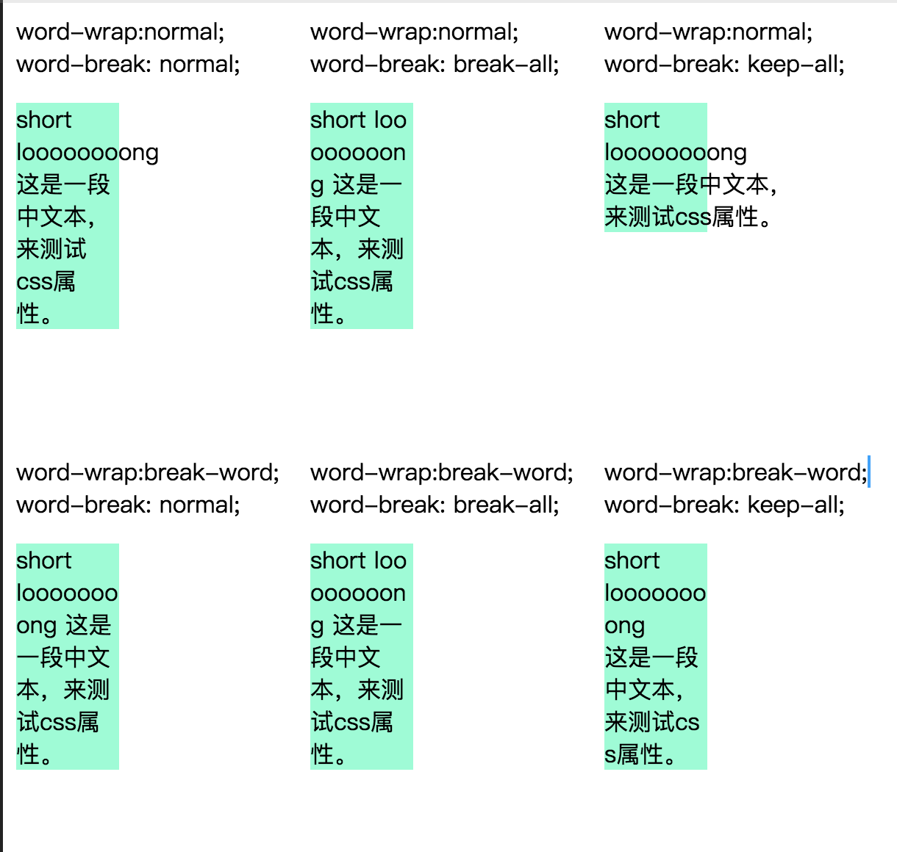

<!-- TOC -->

- [css属性](#css属性)
    - [概要](#概要)
    - [布局](#布局)
        - [line-height](#line-height)
    - [文本](#文本)
        - [text-indent](#text-indent)
        - [text-align](#text-align)
        - [text-decoration](#text-decoration)
        - [letter-spacing](#letter-spacing)
        - [word-spacing](#word-spacing)
        - [text-transform](#text-transform)
        - [white-space](#white-space)
        - [text-overflow](#text-overflow)
        - [word-wrap](#word-wrap)
        - [word-break](#word-break)
    - [字体](#字体)
        - [font-family](#font-family)
        - [font-style](#font-style)
        - [font-variant](#font-variant)
        - [font-weight](#font-weight)
        - [font-size](#font-size)
    - [参考链接](#参考链接)

<!-- /TOC -->

# css属性

<!-- 
- 语法
    - 属性名：
    - 属性值：
    - 初始值：
    - 适用于：
    - 能继承： 
- 概要
    - 
-->

## 概要

- 布局
    - display
    - position
    - top
    - right
    - bottom
    - left
    - float
    - clear
    - z-index
    - direction
    - overflow
    - visibility
    - line-height
    - vertical-align
    - clip
- 盒模型
    - width
    - height
    - padding
    - margin
    - border
    - box-sizing
- 背景
    - background
    - background-color
    - background-image
    - background-repeat
    - background-attachment
    - background-position
- 字体
    - font
    - font-family
    - font-style
    - font-variant
    - font-weight
    - font-size
- 文本
    - color
    - text-indent
    - text-align
    - text-decoration
    - letter-spacing
    - word-spacing
    - text-transform
    - white-space
- 列表
    - list-style-type
    - list-style-image
    - list-style-position
    - list-style
- 表格
    - caption-side
    - table-layout
    - border-collapse
    - border-spacing
    - empty-cells
- 其他
    - content

## 布局

### line-height

- 语法
    - 属性名：
    - 属性值：
    - 初始值：
    - 适用于：
    - 能继承：
- 概要
    - 

## 文本

### text-indent

- 语法
    - 属性名：text-indent
    - 属性值：`	<length> | <percentage> | inherit`
    - 初始值：0
    - 适用于：块容器
    - 能继承：yes
    - 百分比：参考包含块的宽度
- 概要
    - 文本缩进属性。
    - 该属性指定了块容器中第一行文本的缩进。更精确的，它指定了排列在该块内第一个行框里的第一个盒的缩进。
    - 属性值：
        - 长度：固定长度，可为负
        - 百分比：包含快宽度的百分比

### text-align

- 语法
    - 属性名：text-align
    - 属性值：`	left | right | center | justify | inherit`
    - 初始值：如果'direction'为'ltr'，就是'left'，如果'direction'为'rtl'就是'right'
    - 适用于：块容器
    - 能继承：yes
- 概要
    - 文本对齐属性。
    - 该属性描述了块容器的行内级内容怎样对齐。

### text-decoration

- 语法
    - 属性名：text-decoration
    - 属性值：`none | [ underline || overline || line-through || blink ] | inherit`
    - 初始值：none
    - 适用于：all
    - 能继承：no
- 概要
    - 文本修饰属性。

### letter-spacing

- 语法
    - 属性名：letter-spacing
    - 属性值：`normal | <length> | inherit`
    - 初始值：normal
    - 适用于：all
    - 能继承：yes
- 概要
    - 字母间距属性。
    - 该属性指定了文本字符间隔的行为。
    - 属性值：
        - 长度：可以为负

### word-spacing

- 语法
    - 属性名：word-spacing
    - 属性值：`normal | <length> | inherit`
    - 初始值：normal
    - 适用于：all
    - 能继承：yes
- 概要
    - 单词间距属性。
    - 该属性指定了单词间的间隔行为。
    - 属性值：
        - 长度：可以为负

### text-transform

- 语法
    - 属性名：text-transform
    - 属性值：`capitalize | uppercase | lowercase | none | inherit`
    - 初始值：none
    - 适用于：all
    - 能继承：yes
- 概要
    - 该属性控制元素文本的大写效果。
    - 属性值：
        - capitalize：每个单词的第一个字符大写
        - uppercase：每个单词所有字符都大写
        - lowercase：每个单词所有字符都小写

### white-space


- 语法
    - 属性名：white-space
    - 属性值：`normal | pre | nowrap | pre-wrap | pre-line | inherit`
    - 初始值：normal
    - 适用于：all
    - 能继承：yes
- 概要
    - 该属性声明了如何处理元素内的空白字符。
    - 属性值：
        - normal：连续的空白符和换行符会被合并。文字超过盒子宽度时，会自动换行。
        - nowrap：同normal一样，连续空白符和换行符会被合并。而且文字超过盒子宽度时，不会自动换行。
        - pre：连续的空白符和换行符会被保留。在遇到换行符或者`<br>`会换行。而且文字超过盒子宽度时，不会自动换行。
        - pre-wrap：连续的空白符和换行符会被保留。在遇到换行符或者`<br>`会换行。而且文字超过盒子宽度时，会自动换行。
        - pre-line：连续的空白符会被合并，换行符保留。在遇到换行符或者`<br>`或文字会超过盒子宽度式，会换行。
            ```
                        换行符      空格和制表符    文字转行
            normal      合并        合并            转行
            nowrap      合并        合并            不转行
            pre         保留        保留            不转行
            pre-wrap    保留        保留            转行
            pre-line    保留        合并            转行
            ```

### text-overflow

- 语法
    - 属性名：text-overflow
    - 属性值：`clip | ellipsis | <string>`
    - 初始值：clip
    - 适用于：块容器
    - 能继承：no
- 概要
    - 规定当文本溢出包含元素时发生的事情。
    - 属性值：
        - clip：截断文本。
        - ellipsis：用省略号（...）表示截断文本。
        - 字符串：使用给定的字符串来表示截断文本。
    - 这个属性不会强制“溢出”事件的发生，因此为了让“text-overflow”能够生效，常和其它几个属性配合使用。
        ```css
        .ellipsis {
            overflow: hidden;
            text-overflow: ellipsis;
            white-space: nowrap;
            word-wrap: normal;
        }
        ```

### word-wrap

- 语法
    - 属性名：word-wrap
    - 属性值：`normal | break-word`
    - 初始值：normal
    - 适用于：all
    - 能继承：yes
- 概要
    - 允许长单词换行到下一行，否则溢出处理。
    - 属性值：
        - normal：表示在正常的单词结束处换行。
        - break-word：表示如果行内没有多余的地方容纳该单词到结尾，则那些正常的不能被分割的单词会被强制分割换行。

### word-break

- 语法
    - 属性名：word-break
    - 属性值：`normal | break-all | keep-all`
    - 初始值：normal
    - 适用于：all
    - 能继承：yes
- 概要
    - word-break 指定了怎样在单词内断行。
    - 属性值：
        - normal：使用默认的断行规则。一般默认是，非cjk单词不断行，cjk断行。
        - break-all：cjk文本和非cjk单词都断行。
        - keep-all：cjk文本连续不断行，非cjk单词不断行。
    - 和word-break和word-wrap文字可能表示不清，详细参见下图
    - 

## 字体

### font-family

- 语法
    - 属性名：font-family
    - 属性值：`[<family-name> | <generic-family>]`
    - 初始值：取决于浏览器
    - 适用于：all
    - 能继承：yes
- 概要
    - 字体族属性。
    - font-family 可以把多个字体名称作为一个“回退”系统来保存。如果浏览器不支持第一个字体，则会尝试下一个。浏览器会使用它可识别的第一个值。
    - 也就是说，font-family 属性的值是用于某个元素的字体族名称或/及类族名称的一个优先表。
    - 一般样式表设计者提供一个通用字体族作为最后一个备选项。
    - 有两种类型的字体系列名称：
        - 具体字体族（family-name）
        - 通用字体族（generic-family）
    - 对于具体字体族名，可能含有空白字符、数字、特殊标点等，建议用引号引起来。
    - 通用字体族名是关键字，不要用引号包起来。
        - serif：衬线字体
        - sans-serif：无衬线字体
        - cursive：手写体字体
        - fatasy：装饰字体
        - monospace：等宽字体

### font-style

- 语法
    - 属性名：font-style
    - 属性值：`normal | italic | oblique | inherit`
    - 初始值：normal
    - 适用于：all
    - 能继承：yes
- 概要
    - 字体样式属性。


### font-variant

- 语法
    - 属性名：font-variant
    - 属性值：`normal | small-caps | inherit`
    - 初始值：normal
    - 适用于：all
    - 能继承：yes
- 概要
    - 小型大写字母属性。
    - 属性值：
        - normal：默认
        - small-caps：设置为小型大写字母的字体，小写字母看起来和大写字母很相似，但尺寸更小，而且比例稍有差异。

### font-weight

- 语法
    - 属性名：font-weight
    - 属性值：`	normal | bold | bolder | lighter | 100 | 200 | 300 | 400 | 500 | 600 | 700 | 800 | 900 | inherit`
    - 初始值：normal
    - 适用于：all
    - 能继承： yes
- 概要
    - 字重属性。
    - 属性值：
        - normal：正常粗细，与400等值。
        - bold：加粗，与700等值。
        - bolder：比父元素继承的值更粗。
        - lighter：比父元素继承的值更细。

### font-size

- 语法
    - 属性名：font-size
    - 属性值：`	<absolute-size> | <relative-size> | <length> | <percentage> | inherit`
    - 初始值：medium
    - 适用于：all
    - 能继承： yes
- 概要
    - 字体大小属性。
    - 属性值：
        - 绝对值：`xx-small | x-small | small | medium | large | x-large | xx-large`
        - 相对值：比父元素的字体大或小，`larger, smaller`
        - 长度：设置为一个固定值
        - 百分比：设置为基于父元素的一个百分比值


## 参考链接

- 标准文档
    - https://www.w3.org/standards/techs/css#w3c_all
    - https://www.w3.org/TR/CSS22
    - https://www.w3.org/TR/2018/REC-css-fonts-3-20180920/
    - https://www.w3.org/TR/2018/REC-css-ui-3-20180621/
    - https://www.w3.org/TR/css-text-3/
- MDN
    - https://developer.mozilla.org/zh-CN/docs/Web/CSS/Reference
- Google
    - https://fonts.google.com/

<!-- - https://www.w3.org/TR/CSS22/visuren.html
- 这个文档仅描述了css的一部分，更多可以查看更多标准文档。

各个章节中CSS属性：
8. Box model
    - border
    - margin
    - padding
9. Visual formatting model
    - display
    - position
    - top
    - right
    - bottom
    - left
    - float
    - clear
    - z-index
    - direction
10. Visual formatting model details
    - width
    - height
    - line-height
    - vertical-align
11. Visual effects
    - overflow
    - clip
    - visibility
12. Generated content, automatic numbering, and lists
    - content
    - quotes
    - counter-rest
    - connter-increment
    - list-style-type
    - list-style-image
    - list-style-position
    - list-style
13. Paged media
    - 略
14. Colors and Backgrounds
    - color
    - background
    - background-color
    - background-image
    - background-repeat
    - background-attachment
    - background-position
15. Fonts
    - font
    - font-family
    - font-style
    - font-variant
    - font-weight
    - font-size
16. Text
    - text-indent
    - text-align
    - text-decoration
    - letter-spacing
    - word-spacing
    - text-transform
    - white-space
17. Tables
    - caption-side
    - table-layout
    - border-collapse
    - border-spacing
    - empty-cells
18. User interface
    - cursor
    - outline
    - outline-width
    - outline-style
    - outline-color -->

<!-- 
背景属性、边框属性、文本属性、内外边距属性、内容生成属性、尺寸属性、定位属性、表格属性、打印属性

- 布局
    - float
    - position
    - top
    - right
    - bottom
    - left
    - overflow
    - z-index
- 盒模型
    - width
    - height
    - margin
    - padding
    - border
- 颜色和背景
    - color
    - background-color
    - background-image
    - background-repeat
    - background-position
    - background-attachment
    - background-size
    - background-clip
    - background-origin
- 字体
    - font-family
    - font-weight
    - font-size
    - font-style
    - font-variant
    - font-stretch
- 文本
    - text-indent
    - text-align
    - line-height
    - vertical-align
    - word-spacing
    - letter-spacing
    - text-transform
    - text-decoration
    - text-shadow
    - white-space
    - direction
- 等 -->