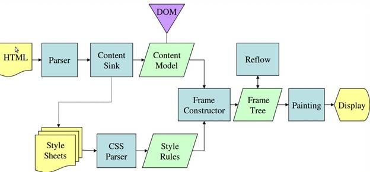

<!-- TOC -->

- [浏览器工作原理](#浏览器工作原理)
    - [temp](#temp)
    - [博客：浏览器的工作原理，新式网络浏览器幕后解密](#博客浏览器的工作原理新式网络浏览器幕后解密)
        - [1. 简介](#1-简介)
        - [2. 渲染引擎](#2-渲染引擎)
        - [3. 解析和DOM树构建](#3-解析和dom树构建)
        - [4. 渲染树构建](#4-渲染树构建)
        - [5. 布局](#5-布局)
        - [6. 绘制](#6-绘制)
        - [7. 动态变化](#7-动态变化)
        - [8. 呈现引擎的线程](#8-呈现引擎的线程)
        - [9. CSS2可视化模型](#9-css2可视化模型)
        - [10. 资源](#10-资源)
    - [链接](#链接)

<!-- /TOC -->

# 浏览器工作原理

## temp

- 浏览器会解析三个东西
    1. 一个是html/svg/xhtml，事实上，webkit有三个C++的类对应这三类文档。解析这三种文件会产生一个DOM Tree。
    2. CSS，解析CSS会产生CSS规则树
    3. Javascript，脚本，主要通过 DOM API 和 CSSOM API 来操作 DOM Tree 和 CSS Rule Tree。
- 解析完成后，浏览器引擎会通过 DOM Tree 和 CSS Rule Tree 来构造 Rendering Tree 渲染树。注意：
    1. 渲染树不等同于dom树，因为一些像Header或display:none的东西就没必要放在渲染树上了。
    2. CSS rule tree主要完成匹配并把CSS Rule附加上rendering tree上的每个element。也就是dom节点。
    3. 然后，计算每个element的位置，这又叫layout和reflow过程。
- 最后通过调用操作系统Native GUI的API绘制。 

基本流程：
1. 构建dom树/css规则树
2. 构建render树
3. 布局render树 
4. 绘制render树

## 博客：浏览器的工作原理，新式网络浏览器幕后解密

- [博客地址](https://www.html5rocks.com/zh/tutorials/internals/howbrowserswork/#The_browsers_we_will_talk_about)
- 注意该博文发布时间为：2011-05-05，时间比较久了，一些知识点要保持怀疑态度

### 1. 简介

1. 我们要讨论的浏览器
2. 浏览器的主要功能
    - 浏览器的主要功能就是向服务器发出请求，然后在浏览器窗口展示你选择的网络资源；
        - 这里说的资源一般是指HTML文档，不过也可以是pdf、img、video等其他类型；
        - 资源的位置由URI指定；
3. 浏览器的高层结构
    - 浏览器的主要组件为：
        1. 用户界面 —— 
        2. 浏览器引擎 —— 在用户界面和渲染引擎之间传送指令；
        3. 渲染引擎 —— 负责显示请求的内容；如果请求的内容是HTML，它就负责解析HTML和CSS内容，并将解析后的内容显示在屏幕上；
        4. 网络 —— 用于网络调用，比如HTTP请求。 
        5. 用户界面后端 —— 
        6. JS解释器 —— 用于解析和执行JS代码；
        7. 数据存储 —— 这是持久层；浏览器需要在硬盘上保存各种数据，例如Cookie；浏览器还支持存储机制，例如localStorage，indexedDB，WebSQL和FileSystem；
        - 
    - 值得注意的是，和大多数浏览器不同，Chrome浏览器每个标签页都分别对应一个渲染引擎示例，每个标签页都是一个独立的进程；

### 2. 渲染引擎

1. 渲染引擎
    - 本文所讨论的浏览器（Firefox、Chrome、Safari）是基于两种渲染引擎构建的；
    - Firefox使用的是Gecko，这是Mozilla公司自研的渲染引擎；
    - 而Safari和Chrome浏览器使用的都是WebKit；
        - WebKit是一种开放源代码的渲染引擎，起初用于Linux平台，随后由Apple公司进行修改，从而支持苹果机和Windows；
        - 有关详情，请参阅官网[webkit.org](https://webkit.org/)
2. 主流程
    - 渲染引擎一开始会从网络层获取请求文档的内容；
    - 然后，进行如下所示的基本流程
        - 渲染引擎的基本流程
            - 
            - 渲染引擎解析html和css为dom树和cssom树，然后结合两者形成渲染树（Render Tree）；
            - 渲染树构建完毕之后，便进入布局Layout阶段，确定每个阶段的坐标等；
            - 下一阶段是绘制painting，渲染引擎会遍历渲染树，由用户界面后端层将每个节点绘制处理；
            - 需要注意的是：这个一个渐近的过程。为了达到更好的用户体验，渲染引擎会力求尽快将内容显示的屏幕上；其不必等到整个HTML文档解析完毕之后，才开始构建渲染树和布局，而是在不断接受和处理来自网络的其余内容的同时，将内容解析并显示处理；
3. 主流程示例
    - WebKit主流程
        - 
    - Gecko主流程
        - 

### 3. 解析和DOM树构建

1. 综述
    1. 语法
    2. 解析器和词法分析器的组合
    3. 翻译
    4. 解析示例
    5. 词汇和语法的正式定义
    6. 解析器类型
    7. 自动生成解析器
2. HTML解析器
    1. HTML语法定义
    2. 非上下文无关语法
    3. HTML DTD
    4. DOM
    5. 解析算法
    6. 标记化算法
    7. 树构建算法
    8. 解析结束后的操作
    9. 浏览器的容错机制
3. CSS解析
    1. WebKit CSS 解析器
4. 处理脚本和样式表的顺序
    1. 脚本
    2. 预解析
    3. 样式表

### 4. 渲染树构建

1. 渲染树和DOM树的关系
2. 构建渲染树流程
3. 样式计算
4. 渐进式处理

### 5. 布局
- 概要
    - 渲染树创建完成时，并不包含位置和大小信息，计算这些值的过程称为布局；
1. Dirty位系统
2. 全局布局和增量布局
3. 异步布局和同步布局
4. 优化
5. 布局处理
6. 宽度计算
7. 换行

### 6. 绘制

1. 全局绘制和增量绘制
2. 绘制顺序
3. Firefox显示列表
4. WebKit矩形存储

### 7. 动态变化
### 8. 呈现引擎的线程
### 9. CSS2可视化模型

1. 画布
2. CSS盒模型（box model）
3. 定位方案
4. 盒类型（box types）
5. 定位
6. 分层展示

### 10. 资源

## 链接

- https://github.com/alienzhou/frontend-tech-list
- https://www.html5rocks.com/zh/tutorials/internals/howbrowserswork/
- http://taligarsiel.com/Projects/howbrowserswork1.htm
- https://zhuanlan.zhihu.com/p/47407398
- https://zhuanlan.zhihu.com/p/29418126
- https://blog.fundebug.com/2019/01/03/understand-browser-rendering/
- https://github.com/ljianshu/Blog
- https://github.com/ljianshu/Blog/issues/24