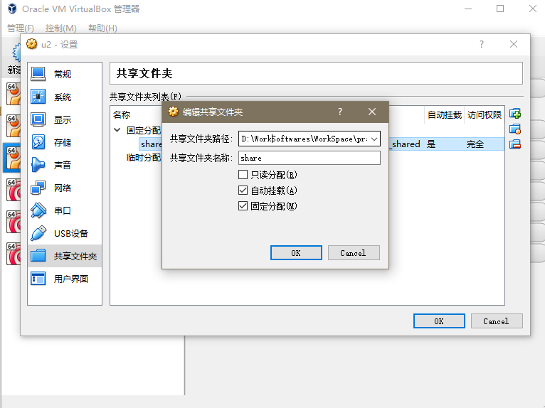

1. 安装增强功能包

安装好后，你会发现在 /sbin 目录下会多出一些文件，这些文件分别作用于不同的功能，有全屏功能、等等

其中一个文件即是用于文件共享：  
`mount.vboxsf -> /usr/lib/x86_64-linux-gnu/VBoxGuestAdditions/mount.vboxsf`

确认该文件的存在。

2. 在host上配置共享文档

3. 在虚拟机上挂载配置

确定挂载目录，这里选择挂载到/mnt目录下。

`mkdir /mnt/shared`  
`mount -t vboxsf share /mnt/shared`

上面的 “share” 是在第二步设置的 “共享文件夹名称”。

到此为止就挂载成功了。

4. 如果想卸载的话可以：`umount -f /mnt/shared`

> 注意：共享文档夹的名称不要和挂载点名称相同（未测试）