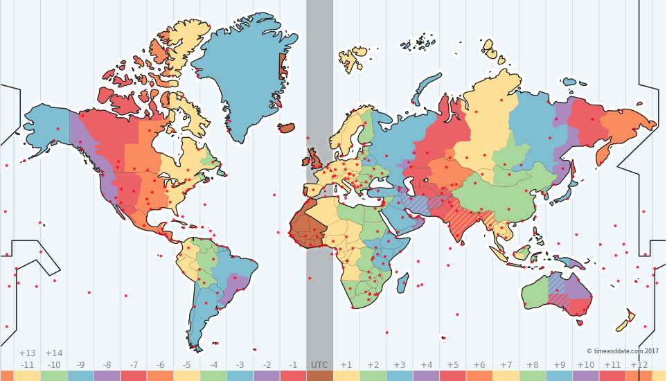

# Date

<!-- TOC -->

- [Date](#date)
    - [API](#api)
        - [静态属性](#静态属性)
            - [Date.prototype](#dateprototype)
        - [静态方法](#静态方法)
            - [Date.UTC()](#dateutc)
            - [Date.now()](#datenow)
            - [Date.parse()](#dateparse)
        - [原型属性](#原型属性)
        - [原型方法](#原型方法)
            - [Date.prototype.xxx()](#dateprototypexxx)
    - [详解](#详解)
        - [基本概念](#基本概念)
        - [Javascrit中的时间](#javascrit中的时间)
            - [构造器](#构造器)
                - [字符串参数](#字符串参数)

<!-- /TOC -->

## API

### 静态属性

#### Date.prototype

### 静态方法

#### Date.UTC()

#### Date.now()

#### Date.parse()

### 原型属性

### 原型方法

#### Date.prototype.xxx()

## 详解

### 基本概念

> IETF-compliant RFC 2822 timestamps 或 version of ISO8601）

[](https://www.timeanddate.com/time/map/)

为了统一管理全世界的时间，以及同步控制。给出了"标准时间"和"时区"的概念。


1. 时区
    - 以标准时间为中心，向东西两侧延伸，每15读划分一个时区，共24个时区，每差一个时区，时间就差一个小时。
    - 各个时区根据标准时间确定自己的本地local时间，往东的时区早(GMT +hhmm)，往西的时区晚（GMT -hhmm）。比如，中国的标准时间为东八区，我们的时间就比GMT/UTC早8小时，例如伦敦时间为当天中午12:00时，中国标准时间是当天20:00
2. 标准时间
    - `GMT`：老的时间计量标准。最开始的时间标准（子午线中心处时间）是英国伦敦的皇家格林威治天文台的标准时间，即GMT。GMT是根据地球自转、公转计算，也就是太阳每天经过位于英国伦敦郊区的皇家格林威治天文台的时间。而地球的自转正在缓速变慢，不是很准确。
    - `UTC`：目前的时间计量标准。根据原子钟计算的标准时间，较精确。
    - 从作用上，`GMT`和`UTC`是一致的，`UTC`可以说是`GMT`的代替，从平时的概念上也认为两者是一致的。

### Javascrit中的时间

#### 构造器

```javascript
new Date(); // 当前时间
new Date(value); // value为 1970-01-01 00:00:00 UTC 经过的毫秒数
new Date(dateString); // 时间字符串
new Date(year, month[, day[, hour[, minutes[, seconds[, milliseconds]]]]]);
```

##### 字符串参数

字符串参数支持两种格式（两种标准）：
- ISO 8601
- RFC-2822


**ISO 8601**

iso 8601标准格式为：`YYYY-MM-DDTHH:mm:ss.sssZ`，分别表示：  
- `YYYY`：年份，0000~9999 
- `MM`：月份，01~12
- `DD`：日，01~31 
- `T`：分隔日期和时间 
- `HH`：小时，00~24 
- `mm`：分钟，00~59
- `ss`：秒，00~59
- `.sss`：毫秒，
- `Z`：时区，可选值：`Z`（utc标准时区，同+00:00或-00:00）、`+HH:mm`、`-HH:mm`

`Z` 表示传入时间的时区（zone），**只要指定了zone，该时间串就按照UTC标准时间处理。**

```javascript
// 指定了Zone则必定按照UTC处理

// 以下"时间字符串值"按照UTC标准时间处理
new Date('2000-01-01T00:00:00.000Z');
> 2000-01-01T00:00:00.000Z

new Date('2000-01-01 00:00:00.000Z');
> 2000-01-01T00:00:00.000Z

// 以下"时间字符串值"按照本地标准时间处理，本人此处按照东八区，CST处理
new Date('2000-01-01 00:00:00.000');
> 1999-12-31T16:00:00.000Z
```

关于`T`和空格space的分隔符：
```javascript
// 指定或没有指定T的处理，不同的node版本，处理不同

// v4.4.4
new Date('2000-01-01T00:00:00.000'); // 按UTC处理
new Date('2000-01-01 00:00:00.000'); // 按本地处理

// v8.4.0
new Date('2000-01-01T00:00:00.000'); // 按本地处理
new Date('2000-01-01 00:00:00.000'); // 按本地处理
```


**RFC-2822**

RFC-2822的标准大概格式：`Thu Jan 01 1970 00:00:00 GMT+0800 (CST)`  

除了基本信息，还可以显示星期，但是可读性没有ISO 8601标准好，完整的规范可查看：https://tools.ietf.org/html/rfc2822#page-14


