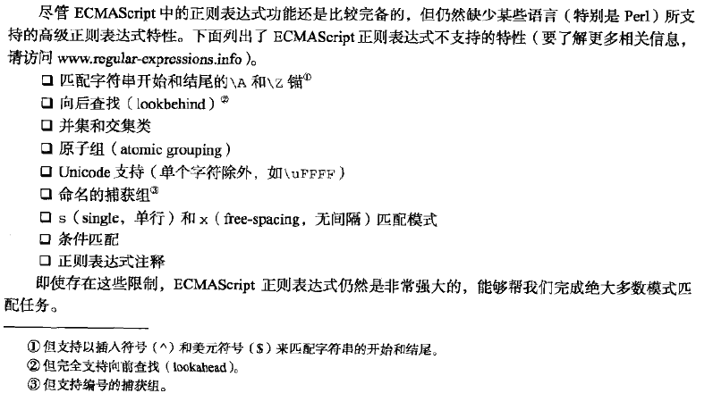

# Javacript 所支持的正则表达式

ECMAScript通过RegExp类型支持正则，RegExp对正则的支持也不是很全，基本上够用，下面列出RegExp支持的情况。完整的情况可以参考  
[正则表达式30分钟](http://deerchao.net/tutorials/regex/regex.htm)  
[正则-维基百科](https://zh.wikipedia.org/wiki/%E6%AD%A3%E5%88%99%E8%A1%A8%E8%BE%BE%E5%BC%8F)  
[各种语言或工具软件的不同风格的正则表达式文法规定](http://www.greenend.org.uk/rjk/tech/regexp.html)  

## RegExp Pattern特殊字符含义

### 字符类别 (character classes)

| 字符 | 含义 |
| :--: | :-- |
| `.` | 匹配除了换行符的任意单个字符，等价与 `[^\r\n]`。换行符有：\n \r \u2028 \u2029 |
| `\d` | 等价于 `[0-9]` |
| `\D` | 等价于 `[^0-9]` |
| `\w` | 等价与 `[A-Za-z0-9]` |
| `\W` | 等价于 `[^A-Za-z0-9]` |
| `\s` | 匹配一个空白符，包括空格，制表符，换页符，换行符和其它Unicode空格等。等价于  [ \f\n\r\t\v​\u00a0\u1680​\u180e\u2000​\u2001\u2002​\u2003\u2004​ \u2005\u2006​\u2007\u2008​\u2009\u200a​\u2028\u2029​​\u202f\u205f​ \u3000]。 |
| `\S` | 等价于 `[^\s]` |
| `\t` | 匹配一个水平制表符(horizontal tab) |
| `\v` | 匹配一个垂直制表符(vertical tab) |
| `\r` | 匹配一个回车符(carriage return) |
| `\n` | 匹配一个换行符(linefeed) |
| `\f` | 匹配一个换页符(form-feed) |
| `[\b]` | 匹配一个退格符(backspace) (不要和\b混淆) |
| `\0` | 匹配一个空字符(NUL character)，注意不要在后面跟其它数字 |
| `\cX` | (**此字符暂时没搞明白**) X 是 A - Z 的一个字母。匹配字符串中的一个控制字符。例如，/\cM/ 匹配字符串中的 control-M。 |
| `\xhh` | 匹配一个编码为hh的字符(两个十六进制数)，可见，值范围局限为[0, 255] |
| `\uhhhh` | 匹配Unicode值为hhhh的字符(四个十六进制数) |


### 字符集合 (character sets)

| 字符 | 含义 |
| :--: | :-- |
| [xyz] | 一个字符集合，也叫字符组，可以使用 "-" 指定一个范围 |
| [^xyz] | 一个反义或补充字符集，也叫反义字符组，JS下用"^"表示，不是"!" |

### 边界 (boundaries)

### 分组和反向引用 (grouping, back references)

| 字符 | 含义 |
| :--: | :-- |
| `(x)` | 匹配并捕获匹配项，这被称为捕获括号( capturing parentheses )。 例如，/(foo)/ 匹配并捕获 "foo bar" 中的 "foo" 。被匹配的子字符串可以在结果数组的元素[1]，..., [n] 中找到，或在RegExp构造函数的属性 $1，...，$9 中找到。捕获组有性能惩罚，如果不需要再次访问被匹配的子字符串，最好使用非捕获括号(non-capturing parentheses)，接下面 |
| `\n` | n是一个整数。一个反向引用(back reference)，指向正则表达式中第n个括号(从左开始数)中匹配的子字符串。 |
| `(?:x)` | 匹配x不会捕获匹配项，称为非捕获括号(non-capturing parentheses)。匹配项不能从结果数组元素[0]，...，[n] 或在RegExp构造函数的属性$1，...，$9访问。|   

```javascript
// 反向引用

var re = /(ab(c))\1\2/;

var result1 = re.exec('abc');
var result2 = re.exec('abcabccddd'); 

// result1 = null
// result2 = [ 'abcabcc', 'abc', 'c', index: 0, input: 'abcabcc' ]
var conclusion = "反向引用`\1`,'\2'只是占位符而已，类似与es6特性中的字符串模版用法，相当于两个变量，其值为前面括号匹配的内容";
```

反向引用的用法还是蛮有趣的，可以很好的[实现子串的重复，或更换顺序等要求](#)。再给些例子：

```javascript
var re1 = /(\w)(\w)(\w)\3\2\1/;// 123321, abccba
```

```javascript
// 非捕获括号

var re = /(?:a|b)c/;

var result1 = re.exec('c');
var result2 = re.exec('ac'); 

// result1 = null
// result2 = [ 'ac', index: 0, input: 'ac' ]
var conclusion = "从result2可以看到，只有匹配内容result[0]，没有捕获，故注意这种情况下，使用反向引用是没有作用的";
```

### 数量词 (quantifiers)

| 字符 | 含义 |
| :--: | :-- |
| `x*` | 匹配前一项x [0, +∞)次 |
| `x+` | [1, +∞) |
| `x?` | [0, 1] |
| `x{n}` | n 次 |
| `x{n,}` | [n, +∞) |
| `x{n, m}` | [n, m] |
| 贪婪模式 | 默认下，`*` `+`  `?` `{}` 均为贪婪模式，即匹配最大化 |
| 非贪婪模式 | 在 `*` `+`  `?` `{}` 后面再跟上 `?` 表示非贪婪模式，即匹配最小化 |

```javascript
var re_greedy = /ab*/;
var re_non_greedy = /ab*?/;

re_greedy.exec('abbb');// 默认为贪婪，[ 'abbbb', index: 0, input: 'abbbb' ]
re_non_greedy.exec('abbb');// 非贪婪匹配最小化 [ 'a', index: 0, input: 'abbbb' ]
```

### 正向查找 (lookahead) (不支持反向查找 lookahead)

| 字符 | 含义 |
| :--: | :-- |
| `x(?=y)` | 正向肯定预查(positive lookahead)。若x后面为y，则匹配x。此括号为非捕获匹配，且匹配不消耗括号中的字符。 |
| `y(?!y)` | 正向否定预查(negative lookadhead)。若x后面不为y，则匹配x。也为非捕获匹配，不消耗括号中的字符。 |

> 不支持的反向查找(用法和正向类似)：  
> `(?<=y)x`　若x前面是y则匹配x，为非捕获匹配  
> `(?<!y)x`　若x前面不是y则匹配x，为非捕获匹配  

```javascript
var re1 = /win(?=97|98)/;
var result1_1 = re1.exec('win97');
var result1_2 = re1.exec('win2000');

// result1_1 = [ 'win', index: 0, input: 'win97' ]
// result1_2 = null

var re2 = /win(?!97|98)/;
var result2_1 = re2.exec('win97');
var result2_2 = re2.exec('win2000');

// result2_1 = null
// result2_2 = [ 'win', index: 0, input: 'win2000' ]
```

### 或 |

`|` 会在正则表达式内进行或运算匹配，两个操作数即左边全部字符和右边全部字符；若 `|` 在圆括号 `()` 内使用，则 `|` 针对括号内的子正则表达式起作用。

```javascript
var re1 = /^a|^bc/;
re1.exec('aaa');// [ 'a', index: 0, input: 'aaa' ]
re1.exec('bc');// [ 'bc', index: 0, input: 'bc' ]

var re2 = /^(a|b)c/;
re2.exec('ac');// [ 'ac', index: 0, input: 'ac' ]
re2.exec('bc');// [ 'bc', index: 0, input: 'bc' ]
```


## 创建正则表达式

- 字面量，可使用类似Perl语法创建
- RegExp构造函数

```javascript
var pattern1 = /pattern/flags;
var pattern2 = new RegExp("pattern", "flags");
var pattern3 = new RegExp(/pattern/flags, "flags");// es6后支持
```

note：传递给RegExp构造函数的两个参数都是字符串，不能将正则表达式字面量pattern传递给RegExp构造函数。(**但是，es6中，构造函数能直接传字面量**)参数中的所有元字符都必须双重转义，在字面量模式的基础上对应转义：

| 字面量模式        | 等价的字符串           |
| :--:             | :--:                  |
| /\[bc\]at/       | "\\[bc\\]at"          |
| /\w\\hello\\123/ | "\\w\\\\hello\\\\123" |

需要转义的元字符有：
`{ } ( ) [ ] | \ ^ $ ? * + .`

> ECMAScript3中，字面量会共享同一个RegExp实例，而构造函数每次都是创建新实例  
> ECMAScript5重新规定，字面量须和构造函数一样，每次都创建新实例


模式flags可选值：
- `g`：global，全局模式，即pattern应用所有字符串，不会在发现第一个匹配项时停止
- `i`：ignoreCase，不区分大小写
- `m`：multiline，多行模式，将开始和结束字符（^和$）视为在多行上工作（例如，分别匹配每一行的开始和结束（由 \n 或 \r 分割），而不只是只匹配整个输入字符串的最开始和最末尾处。
- `u`：unicode，将pattern视为Unicode编码点序列，开启了Unicode相关特性，任何Unicode代码点的转义都会被解释。
- `y`：sticky，指定y标志，表示RexExp匹配不是从lastIndex开始匹配搜索，而是必须在lastIndex位置匹配成功，否者直接失败，也不会往后继续搜索。

## RegExp 实例属性

每个RegExp均具有下列属性：
- global：布尔值，表示是否设置了g标志
- ignoreCase：布尔值，表示是否设置i标志
- multiline：布尔值，表示是否设置了m标志
- unicode：布尔值，表示是否设置了u标志
- sticky：布尔值，表示是否设置了y标志
- lastIndex：表示开始搜索下一个匹配项的字符位置，从0算起
- source：正则表达式字符串表示，source保存规范形式的字符串，即字面量形式所用的字符串。即使是RegExp构造函数实例，其source也会转换为字面量规范字符串

## RegExp 实例方法

[实例方法](http://devdocs.io/javascript-regexp/)

### exec

`regexpObj.exec(str)`  

如果成功匹配，则返回一个数组，并更新正则表达式对象的属性。返回的数组具有匹配的文本作为第一项，然后匹配的每个捕获括号的一个项包含捕获的文本。  

如果是匹配失败，返回null

```javascript
let regexpObj = /quick\s(brown).+?(jumps)/ig;

let result = regexpObj.exec('The Quick Brown Fox Jumps Over The Lazy Dog');
```

| 对象 | 属性/索引 | 描述 | 例子 |
| :--: | :--: | :--: | :--: |
| result | [0] | 匹配的字符串 | Quick Brown Fox Jumps |
|  |[1], ...[n] | 圆括号中的分组捕获 | [1] = Brown, [2] = Jumps|
|  | index | 匹配到的字符串与原字符串的索引值 | 4 |
|  | input | 原字符串 | The ... Dog |
| regexpOjb | lastIndex | 下一次匹配开始的索引位置 | 25 |
|  | ignoreCase | ... | true |
|  | global | ... | true |
|  | multiline | ... | false |
|  | source | 正则模式字符串 | quick\s(brown).+?(jumps) |

**Note**：`g` 标记对方法exec的影响？

```javascript
// re.lastIndex=0
var re = /a/i;

// ret1.index=1, re.lastIndex=2
var ret1 = re.exec('-a-a-');

// ret2.index=3, re.lastIndex=4
var ret2 = re.exec('-a-a-');

// ret3=null, re.lastIndex=0, 匹配失败则lastIndex重置为0
var ret3 = re.exec('-a-a-');


// reG.lastIndex=0
var reG = /a/gi;

// retG1.index=1, reG.lastIndex=0
var retG1 = reG.exec('-a-a-');
```

**Note**：对于复用RegExp实例，来进行正则匹配的时候，要注意RegExp实例lastIndex的值的变化；若每次都直接使用RegExp字面量来正则匹配，则不用考虑这样的问题了，因为字面量es5后就不共享实例了，即会创建新实例，每个新实例的lastIndex均为0。

### test

`regexpObj.test(str)`  

若只想知道一个pattern是否存在于一个字符串中，就可以使用test()方法，返回true或false。

注意使用test方法也会改变RegExp实例的lastIndex属性
 

## RegExp 构造函数属性

RegExp 构造函数包含一些属性，这些属性在其它语言中看作静态属性。这些属性使用于作用域中的所有正则表达式，并且**基于所执行最近一次正则表达式操作而变化**。

详细暂略...

## JS正则表达式不支持的规则




[1](http://cenalulu.github.io/linux/character-encoding/)
[2](http://polaris.blog.51cto.com/1146394/377468)
[3](http://www.unicode.org/)
[4](http://www.qqxiuzi.cn/zh/unicode-zifu.php)

[5](https://segmentfault.com/a/1190000002471140#articleHeader13)