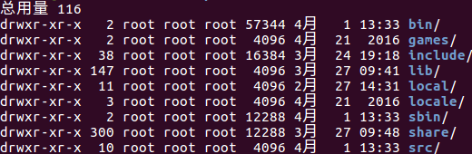

# 文件系统

## Linux的文件权限与系统目录结构

### 文件属性

`ls -laF`  



上图各列属性含义：

- 文件类型
    - \- 代表文件
    - d 代表目录
    - l 代表链接
    - c 代表字符型设备
    - b 代表块设备
    - n 代表网络设备
- 文件权限
    - 1-3：user
    - 4-6：group
    - 7-9：other
- 文件硬链接总数
- 文件属主的用户名
- 文件属组的组名
- 文件的大小（字节单位）
- 文件上次修改时间
- 文件名或目录名

> ls 指令文件过滤用法：  
> - `?` 代表一个字符  
> - `*` 代表零个或多个字符  
> - `[abc]``[!abc]``[a-m]` 可以使用类似于正则中的中括号

> Note：ls对于文件夹需要读r权限，而cd需要文件夹的执行x权限  

### 更改文件属性

文件权限也属于文件属性

常用指令：

- chgrp：更改文件属组
- chown：更改文件属组
- chmod：更改文件权限

#### chgrp

`chgrp groupname filename`  

注意groupName必须在`/etc/group`文件中存在  

#### chown

`chown username filename`  

注意userName必须在`/etc/passwd`文件中存在

#### chmod

chmod有两种模式：数字和符号

- 数字模式： `chmod 777 filename`
- 符号模式： `chmod <u|g|o|a> <+|-|=> <r|w|x> filename`

```bash
# 符号模式

chmod a+x             filename
chmod ugo+r           filename
chmod u=rwx,g=rx,o=rx filename
chmod ugo=rwx         filename
```

### 权限rwx对于文件和目录的作用

#### 文件

- r（read）：读取文件内容
- w（write）：可以编辑，修改文件内容（不含删除文件）
- x（execute）：该文件具有被系统执行的权限

是否可执行在Windows下根据文件名的扩展类型来判断，而Linux下根据是否具有x权限！至于w权限，只针对文件的内容，与文件的新建和删除无关！  

#### 目录 

- r（read）：表示具有读取目录下列表的权限，允许使用ls指定来读取列表内容
- w（modify）：表示具有改动该目录结构列表的权限，例如
    - 建立新的文件和目录
    - 删除存在的文件和目录（不论被删除文件权限为何！）
    - 将已存在的文件和目录进行更名
    - 搬移该目录内的文件、目录位置
- x（access dir）：目录没有什么执行之说，目录x权限表示**用户能否进入该目录成为工作目录，即成为当前目录**，cd指令需要此权限！

目录的主要内容是记录文件名列表

### Linux文件种类

[Linux文件种类-鸟哥](http://cn.linux.vbird.org/linux_basic/0210filepermission.php#filepermission_type)

### Linux目录结构、配置

[Linux目录结构、配置-鸟哥](http://cn.linux.vbird.org/linux_basic/0210filepermission.php#dir)

## Linux文件与目录管理

### 常见目录操作


