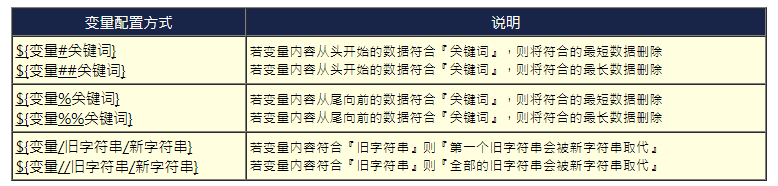
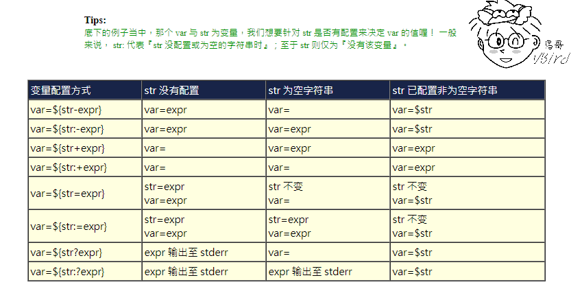

## SHELL脚本

系统shell程序在 `/bin` 目录下，合法的shell写在配置文件 `/etc/shells`。  

### 变量

**变量读取**

使用 `$` 或 `${}` 符号：$variable, ${variable}

**变量赋值**

- 使用 `=` 符号  
- `=` 两边不能有空格，除非在引号内  
- 变量名不能以数字开头
- 使用 `反引号` 或 `$(command)` 可以将某个shell命令执行后的结果赋值给变量

```shell
# 错误

# 不能有空格
var1 = value1;
var2=var ue2;

# 不能数字开头
3var=value3;
```
### 变量的修改及${}详细用法




### 判断符号 []

### 结构语句if,case,while,until,for

```shell
#//////////////////////////////////////////////
# If
#//////////////////////////////////////////////
if command;then
    xxx
elif command;then
    yyy
else
    zzz
fi

#//////////////////////////////////////////////
# case
#//////////////////////////////////////////////
case "$var" in
    'value1')
        程序段
        ;;
    'value2')
        程序段
        ;;
    *)
        程序段
        ;;
esac

#//////////////////////////////////////////////
# While 状态为true执行循环
#//////////////////////////////////////////////
while command
do
    程序段
done

#//////////////////////////////////////////////
# Until 状态为false执行循环
#//////////////////////////////////////////////
until command
do
    程序段
done

#//////////////////////////////////////////////
# for
#//////////////////////////////////////////////
for variable in varlist
do
    程序段
done

# c风格for写法，注意有些sh不支持，例如dash会报错，bash没问题
for ((初始值；循环限制；步阶))
do
    程序段
done
```

## 单、双引号

在赋值变量时，右边不能直接存在空格space，如果欲赋值的字符串中存在空格，则必须以 `''` `""`引号包围起来。

**单、双引号的区别**

基本上作用是一致的，区别在于shell不识别单引号 `''` 内所有特殊字符，而会识别双引号 `""` 内部分特殊字符：`$` `\` `反引号`

## 常见实用Command

```shell
# linux node脚本
"#!/usr/bin/env node" 
```