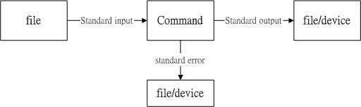
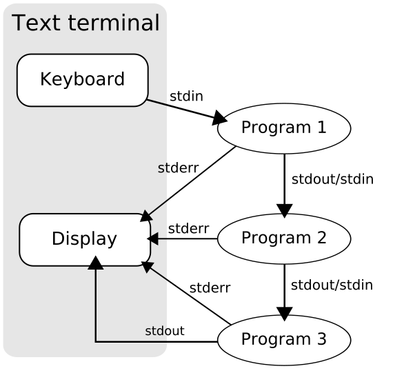

## SHELL

系统shell程序在 `/bin` 目录下，合法的shell写在配置文件 `/etc/shells`。 

<!-- TOC -->

- [SHELL](#shell)
    - [变量](#变量)
    - [变量的修改及${}详细用法](#变量的修改及详细用法)
    - [判断符号 []](#判断符号-)
    - [结构语句if,case,while,until,for](#结构语句ifcasewhileuntilfor)
    - [单、双引号](#单双引号)
    - [shell脚本的第一行作用](#shell脚本的第一行作用)
    - [重定向](#重定向)
    - [管道](#管道)
    - [一行执行多个命令](#一行执行多个命令)
    - [shell脚本中打印一段文本](#shell脚本中打印一段文本)
    - [shell函数](#shell函数)
    - [shell用户输入](#shell用户输入)
        - [参数变量](#参数变量)
        - [参数移位](#参数移位)
        - [处理选项](#处理选项)
        - [获得用户输入](#获得用户输入)

<!-- /TOC -->

<hr> 

### 变量

**变量读取**

使用 `$` 或 `${}` 符号：$variable, ${variable}

**变量赋值**

- 使用 `=` 符号  
- `=` 两边不能有空格，除非在引号内  
- 变量名不能以数字开头
- 使用 `反引号` 或 `$(command)` 可以将某个shell命令执行后的结果赋值给变量

```shell
# 错误

# 不能有空格
var1 = value1;
var2=var ue2;

# 不能数字开头
3var=value3;
```

<hr> 

### 变量的修改及${}详细用法


> **NOTE**：若shell脚本中变量名和当前shell环境变量同名的话，则会覆盖环境变量；为了区分脚本变量和环境变量，约定**脚本变量小写，环境变量大写**
> ```shell
> #!/bin/sh
> #
> # 脚本中指定了变量PATH，覆盖了环境变量，此时PATH指定路径中
> # 是没有 ls 命令的，而且ls不是shell内建命令，故此脚本执行ls
> # 会报错：找不到命令
> # 
> 
> PATH=/var
> ls
> ```
>

<hr> 

### 判断符号 []

<hr> 

### 结构语句if,case,while,until,for

```shell
#//////////////////////////////////////////////
# If
#//////////////////////////////////////////////
if command;then
    xxx
elif command;then
    yyy
else
    zzz
fi

#//////////////////////////////////////////////
# case
#//////////////////////////////////////////////
case "$var" in
    'value1')
        程序段
        ;;
    'value2')
        程序段
        ;;
    *)
        程序段
        ;;
esac
-----------------------------------------------
case $1 in
    -a|A)
        echo $1
        ;;
    -b|B)
        echo $1
        ;;
    *)
        echo Wrong
        ;;
eaac

#//////////////////////////////////////////////
# While 条件command退出状态码为0时执行循环，否者停止循环
#//////////////////////////////////////////////
while test command
do
    程序段
done

#//////////////////////////////////////////////
# Until 状态为false执行循环
#//////////////////////////////////////////////
until command
do
    程序段
done

#//////////////////////////////////////////////
# for
#//////////////////////////////////////////////
for variable in varlist
do
    程序段
done

# c风格for写法，注意有些sh不支持，例如dash会报错，bash没问题
for ((初始值；循环限制；步阶))
do
    程序段
done
```

<hr> 

### 单、双引号

在赋值变量时，右边不能直接存在空格space，如果欲赋值的字符串中存在空格，则必须以 `''` `""`引号包围起来。

**单、双引号的区别**

基本上作用是一致的，区别在于shell不识别单引号 `''` 内所有特殊字符，而会识别双引号 `""` 内部分特殊字符：`$` `\` `反引号`

<hr> 

### shell脚本的第一行作用

第一行的作用：指定脚本的解释器，例如下面举例

```shell
# linux 找到node程序解析执行脚本
"#!/usr/bin/env node" 

# linux 找到python程序解析执行脚本
"#!/usr/bin/env python" 

# linux 找到sh程序解析执行脚本
"#!/bin/sh"

# 等等
```

<hr> 

### 重定向


一般情况下，每个 Unix/Linux 命令运行时都会打开三个文件：
- 标准输入文件(stdin)：stdin的文件描述符为0，Unix程序默认从stdin读取数据。
- 标准输出文件(stdout)：stdout 的文件描述符为1，Unix程序默认向stdout输出数据。
- 标准错误文件(stderr)：stderr的文件描述符为2，Unix程序会向stderr流中写入错误信息。
-  
- （可以将stdin，stdout，stderr看作和普通文件一模一样）

默认下Linux指令程序的输入从stdin读入或者指定参数读入，然后输出到stdout、stderr文件，这个三个文件一般与键盘和屏幕等外设相关联。



**正常定向**

```shell
# 操作：linux 终端下输入指令，然后结果会立马显示在终端上面
# 原因：只是因为who指令将结果输出到stdout文件，stdout文件与屏幕连接在一起，所以直接显示在屏幕上

who
>summer tty7 2017-08-01 15:55 (:0)
```

**重定向**

```shell
#　操作：linux 终端下输入指令，结果不会显示在终端上面
#　原因：who指令将结果输出到stdout文件，使用">"符号将stdout文件内容重新输出到temp.txt文件

who > temp.txt
```

- 标准输入 `stdin`：文件描述符0（文件/dev/stdin），使用`<`，`<<`， `0<`， `0<<`
- 标准输出 `stdout`：文件描述符1（文件/dev/stdout），使用`>`， `>>`， `1>`， `1>>`
- 标准错误输出 `stderr`：文件描述符2（文件/dev/stderr），使用`2>`， `2>>`

|命令|说明|
|:-:|:-:|
|command > file|将stdout重定向到 file|
|command < file|将stdin重定向到 file|
|command >> file|将stdout以追加的方式重定向到 file|
|<< tag|将开始标记 tag 和结束标记 tag 之间的内容作为输入。|
|n> file|将文件描述符为 n 的文件重定向到 file|
|n>> file|将文件描述符为 n 的文件以追加的方式重定向到 file|
|n>&m |把往文件描述符 n 的输出重定向到文件描述符 m 上|
|n<&m |把往文件描述符 n 的输入重定向到文件描述符 m 上|

**例子**
```shell
ls -alF 1>/dev/null 2>&1

cat > newfile << eof
```


<hr> 

### 管道

在类Unix操作系统中，管道是原始的软件管道：即是一个由标准输入输出链接起来的进程集合，所以每一个进程的输出（stdout）被直接作为下一个进程的输入（stdin）。

**可见，pipe适用于，有使用stdin，stdout，stderr作为输入输出的Linux Command**




```shell
ps aux | grep 'node'
l -laF | wc
```

<hr> 

### 一行执行多个命令

- `;`  ：不考虑命令相关性，不考虑对错，连续执行命令
- `&&` ：前一个命令运行完毕且正确返回，则运行下一个命令，否者终止
- `||` ：前一个命令正确，则终止，否者运行下一个命令

`&&`,`||` 和编程语言中的逻辑其实是一致的

```shell
# ;
who;who;who

# &&
test -e /root/.bashrc && cat /root/.bashrc
```

<hr> 

### shell脚本中打印一段文本

```shell
#!/bin/sh

# 脚本中支持 cat <<eof 
cat << eof
    Summerlius Usage

    -a: a is a
    -b: b is b
eof
```

<hr> 

### shell函数

```sh
[function] funname [()]
{
    commands;

    [return int;]
}
```

说明：
- `function funname {}` 或 `funname() {}` 函数定义
- 函数返回值，可以显示添加，以`return`返回，不加的话，将以最后一条命令运行结果，作为返回值。return后跟数值(0-255)
- 函数必须在使用前定义

函数参数：
```sh
funname ()
{
    echo "$1, $2, ${10}, ${11}"
}

funname 1 2 3 4 5 6 7 8 9 10 11 12
```

<!-- 参数说明：
- 函数体内如，通过`$n`形式获取参数，n超过9用`${n}`形式
- 还有其它特殊参数
    - `$0`: 脚本的路径，函数和脚本一样
    - `$#`：参数个数，函数和脚本不同
    - `$*`：以一个字符串显示所有参数，函数和脚本不同
    - `$@`：以多个字符串显示所有参数，函数和脚本不同
    - `$$`：shell本身PID，函数和脚本一样
    - `$-`：显示shell使用的当前选项，例如如果设置了`set -u; set -e;`，则`$-`值为`ue`
    - `$?`：显示最后命令的退出状态 -->

<hr> 

### shell用户输入

- 命令行参数
- 特殊参数变量
- 移动变量
- 处理选项
- 将选项标准化
- 获得用户输入

#### 参数变量
- `$0`：脚本完整路径，相对或绝对路径
- `$1~$9, ${10}~`：大于9的参数，必须以花括号{}引用
- `$#`：参数个数
    - 通过该变量获取最后一个参数：`${$#}` => 错误，{}里面不能含有$；那么怎么获取最后一个参数呢 => `${!#}`
- `$*、$@`：获取所有参数，这两个变量都能够在单个变量中存储所有参数。
    - `$*`：将所有参数当成单个参数
    - `$@`：当成多个参数，这样可以遍历所有参数值，通常通过for命令完成
- `$$`：
- `$-`：
- `$?`：

参数说明：
- 多个参数以空格space分开，如果参数含有空格，需以引号`''`或`""`包含

#### 参数移位
`shift命令`：默认下将每个参数向左移动一个位置，例如$2移到$1，$1移除（注意$0不是用户传的参数，是shell路径，不会改变），可以指定移动数目：shift number

#### 处理选项

1. 一些处理选项和参数的获取，可以使用while和case控制处理

2. getopt、getopts命令处理

getopt命令是一个在处理命令行选项和参数时非常方便的工具。

`getopt optstring parameters`  

在optstring列出你要在脚本中用到的每个命令行选项**字母**。然后在每个需要参数值的选项字母后加一个冒号。getopt命令会基于你定义的optstring解析提供的参数。

```sh
# 脚本中，getopt 不擅长处理带空格和引号的参数值。它会将空格当作参数的分隔符，
# 而不是根据双引号将二者当作一个参数。===>> 可以使用getopts
# 
# 
getopt ab:cd 
```

`getopts optstring variable`  

getopts和getopt类似，但功能更健全。

与getopt不同，getopt将命令行上所有参数处理后只生成一个输出，而getopts命令可以和shell参数更好的配合使用。

1. 如果选项字母要求有参数值，就后面加个冒号:
2. 要去掉错误信息的话，可以在optstring之前加一个冒号:
3. 可以很好的识别参数引号和空格
4. getopts会用到两个环境变量。如果选项需要跟一个参数值，OPTARG环境变量就会保存这个值。OPTIND环境变量保存了参数列表中getopts正在处理的参数位置。
5. getopts命令解析命令行选项时，会移除开头的单破折线，所以在case定义中不用单破折线
6. 可以将字母和参数值放在一起，不用加空格
7. optstring中未定义的选项字母会以问号形式返回

```sh

```

#### 获得用户输入

shell脚本的交互性

主要使用**read**指令


