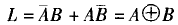
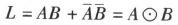

## 布尔代数

布尔代数，又称为逻辑代数。

布尔（Boole·George，1815—1864）英国数学家和逻辑家，欲将数学应用于逻辑，故在1949年提出逻辑代数，以其名，又称布尔代数。

1938年香农（Claude Elwood Shannon ，1916—2001）

- 与 `·`
- 或`+`
- 非`_`，这个符号不好打，以`~`代替表示
- 异或`⊕`
- 同或`⊙`

符号表示举例：
- 
- 

逻辑运算的操作数，其值的范围仅有两个，可以用`[真假]`、`[true, false]`、`[1， 0]`表示。

逻辑运算表示
- 列出表达式，例如上面图片的显示
- 列出真值表，穷举出所有情况

> 这里所说的"逻辑运算"是一种数学或概念上的，不是指具体程序中的，如果应用到具体可能会有所不同，以C语言为例：
> - c逻辑运算符：`&&`,`||`,`!`，与或非，与此处的概念类似，用于判断真假两种状态
> - c位运算符：`&`,`|`,`~`,`^`,`<<`,`>>`，这里的操作数就不是单纯的真假状态，而是整数，细化到整数二进制表示的每一位1和0两种状态的具体操作。

### 异或

- **逻辑**：逻辑值相同为假，逻辑值不同为真。
- **性质**：
    1. 交换律：A ⊕ B = B ⊕ A
    2. 结合律：(A ⊕ B) ⊕ C = A ⊕ (B ⊕ C)
    3. 恒等律：X ⊕ 0 = X
    4. 归零律：X ⊕ X = 0
    5. 任何值异或假得真：X ⊕ 0  = 1
    6. 任何值异或真得非逻辑：X ⊕ 1 = ~X （非逻辑）

