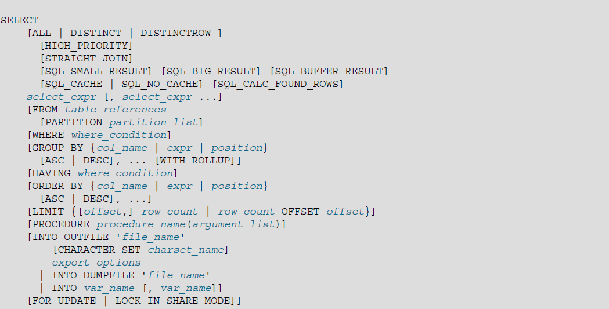

# Select

<!-- TOC -->

- [Select](#select)
    - [select](#select)
        - [WHERE](#where)
        - [GROUP BY](#group-by)
        - [HAVING](#having)
        - [ORDER BY](#order-by)
        - [LIMIT](#limit)
    - [select ...into](#select-into)
    - [join](#join)
    - [union](#union)
    - [附录](#附录)

<!-- /TOC -->

## select

语法（点击可跳原官方文档）：

[](https://dev.mysql.com/doc/refman/5.6/en/select.html)

部分语法说明：
- *`select_expr`*：你要检索的列名列表，至少含有一个；或其它表达式，例如算术表达式 1+1 等
    - 当 *`select_expr`* 表示列名时，可以给其起一个别名，`select_expr [AS] alias`，可以别名可以用在子句 `group by`、`order by`、`having`中，注意别名不能在`where`子句中使用，因为MySQL执行Select语句时，`where`子句可能较 *`select_expr`* 列表先被检查、执行。
- *`table_references`*：一个具体表名或其它子查询语句的返回结果
    - 其也可以指定一个别名，`tbl_name [AS] alias_name`
- ``
- ``
- ``
- ``
- ``
- ``
- ``
- ``
- ``
- ``
- ``
- ``
- ``


从上面语法可以看到，select的子句有许多，此处详述几种常见的，其它的后续了解：
- `where`
- `group by`
- `having`
- `order by`
- `limit`
- ...

> NOTE：  
> 注意这些子句是有顺序的，不能随意组合，否者会报错。例如 `having` 子句必须在 `group by` 之后，必须在 `order by` 之前。 

### WHERE

### GROUP BY

### HAVING

### ORDER BY

### LIMIT


## select ...into

## join

## union

## 附录

```
连接（join）group by、order by、where的执行顺序
一、group by

group by主要用于分组，达到对数据的分类更加精确。
group by中存在的列必须是有效的列（即为表的列字段）。同时若在select 中存在，必须在group by中列出，不能使用别名。
group by必须位于where 后，order by前；此外一般与order by一起使用。
group by 会对Null进行单独分组，若为一行则单独一组，若多行，则多行为一组。
二、与having,where的比较 
5. 使用group by 后，若想进行再次筛选可以使用having。 
6. having是在分组后进行筛选；where是在执行条件后再分组。 
7. having对一组数据进行操作；where是对行进行操作。 
8. 
三、与order by的比较 
-**在使用group by时，一般与order by同时使用，执行顺序为： 
先group by ，然后order by。

四、在SQL中执行的顺序 
1. 先连接from后的数据源(若有join，则先执行on后条件，再连接数据源)。 
2. 执行where条件 
3. 执行group by 
4.执行having 
5.执行order by 
6.最后select 输出结果。
```


