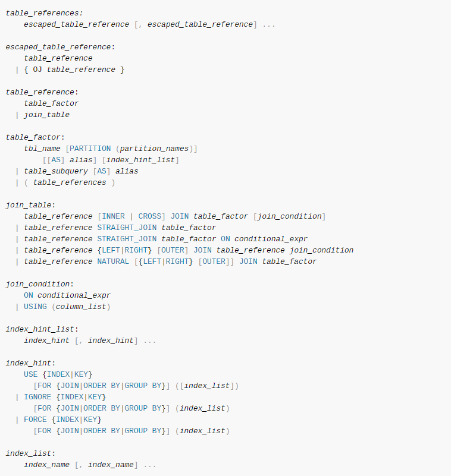

# Select

<!-- TOC -->

- [Select](#select)
    - [select](#select)
        - [WHERE](#where)
        - [GROUP BY](#group-by)
        - [HAVING](#having)
        - [ORDER BY](#order-by)
        - [LIMIT](#limit)
    - [select ...into](#select-into)
    - [join](#join)
    - [union](#union)
    - [附录](#附录)

<!-- /TOC -->

## select

语法（点击可跳原官方文档）：

[](https://dev.mysql.com/doc/refman/5.6/en/select.html)

部分语法说明：
- `all` `distinct` `distinctrow` 修饰符：默认是all，distinctrow是distinct的别名，distinct作用是记录去重，注意distinct作用后面指定的**所有列名**去重
- ``
- *`select_expr`*：你要检索的列名列表，至少含有一个；或其它表达式，例如算术表达式 1+1 等
    - 当 *`select_expr`* 表示列名时，可以给其起一个别名，`select_expr [AS] alias`，可以别名可以用在子句 `group by`、`order by`、`having`中，注意别名不能在`where`子句中使用，因为MySQL执行Select语句时，`where`子句可能较 *`select_expr`* 列表先被检查、执行。
- *`table_references`*：一个具体表名或其它子查询语句的返回结果
    - 其也可以指定一个别名，`tbl_name [AS] alias_name`
- 尽管列名和表名其别名时，AS 可以省略，但是最好不要
- *`table_references`*：`tbl_name [[AS] alias] [index_hint]`
- ...
- ...
<!-- - ``
- ``
- ``
- ``
- ``
- ``
- ``
- ``
- ``
- ``
- ``
- ``
- `` -->


从上面语法可以看到，select的子句有许多，此处详述几种常见的，其它的后续了解：
- `where`
- `group by`
- `having`
- `order by`
- `limit`
- ...

> NOTE：  
> 注意这些子句是有顺序的，不能随意组合，否者MySQL会报错处理。例如从前到后的顺序：`group by` -> `having` -> `order by` -> `limit` ，同时这也是sql子句被执行的顺序。

### WHERE

### GROUP BY

释义：对所有记录，根据某些列名进行分组筛选处理


关于`group by`子句自带的排序扩展功能：
- 如果使用`group by`子句，其子句被执行后的输出默认会被排序，而且其排序的效果等同于`order by 'the same columns'`，即以什么列名分组，后面就以相同的列名排序，并且默认是ASC，可以手动指定ASC或DESC。

- 当然，大多数情况下，我们不需要这种排序，那么为了**避免这种默认排序的开销**，可以在后面加上子句 `order by NULL` 来取消这种默认的排序动作。

- 不要太依赖`group by`子句携带的默认排序功能，这种`group by`携带的扩展功能在未来版本可能会改变。如果有排序的需求，最好显示的添加`order by`子句。


### HAVING

### ORDER BY

### LIMIT

```sql
-- 检索6-15行
select * from tbl limit 5,10; 

-- 检索95行到最后，给出一个超大的数来检索来末尾
select * from tbl limit 95,99999999999999999999999
```


## select ...into

## join

[](https://dev.mysql.com/doc/refman/5.6/en/join.html)


部分讲解：
- 在mysql中join、cross join 和inner join语法上是相等的，但是在标准的SQL中，他们用法可能是不相等的。
- 通常，仅含有inner join的情况下，(括号)可以省略
- 有上图语法可知，内连接不需要指定连接约束条件，左右连接必须指定连接约束条件，否者报错。
- 在没有添加join约束条件下，inner join和逗号的作用是一样的：结果都是指定的几个表的笛卡尔乘积（Cartesian product），即前一张表的每一行和后一张表的每一行join成一行。这个测试可以使用一个简单的查询语句看看结果：`select * from student inner join school;` 或 `select * from student,school;` ，正如前面说的inner join和逗号作用一样，故这两句效果一样。**注意，后一查询语句，以逗号来表示内连接，其后不能使用`ON`子句，否者报错**。
- 注意逗号的优先级比innner join，left join等的优先级都低，当混合有逗号和这些运算符时，注意区分好
- on子句里面的约束条件运算符和where子句中的一致。通常情况下，使用ON子句中的条件去指定如何join表，使用WHERE子句从join后的结果中检索想要的行。由此也可知，join较先执行，故on子句也随着先执行。


内连接、左连接、右连接的顺序，首先了解到整个流程类似于笛卡尔乘积：
- 内：`a inner join b [join_condition]`：拿出表`b`的第一行，根据join约束条件对表`a`每一行依次进行匹配、然后连接成新的一行，然后拿出表b第二行...依次下去
- 左：`a left join b join_conditon`：第一步其实和上面内连接一样，拿出表`b`的第一行...；区别的地方在于，如果在约束条件下，左表`a`中的某个行和右表`b`没有匹配的，那么该行还是会形成一个新的行，只不过该新行对应仅有表`a`的数据，对应表`b`的数据置为`NULL`
- 右：`a right join b join_conditon`：功能和左连接相同，只是顺序和左连接相反。例如，反过来首先那表`a`的第一行，去匹配、连接表`b`的每一行...


## union

## 附录

<!-- ```
连接（join）group by、order by、where的执行顺序
一、group by

group by主要用于分组，达到对数据的分类更加精确。
group by中存在的列必须是有效的列（即为表的列字段）。同时若在select 中存在，必须在group by中列出，不能使用别名。
group by必须位于where 后，order by前；此外一般与order by一起使用。
group by 会对Null进行单独分组，若为一行则单独一组，若多行，则多行为一组。
二、与having,where的比较 
5. 使用group by 后，若想进行再次筛选可以使用having。 
6. having是在分组后进行筛选；where是在执行条件后再分组。 
7. having对一组数据进行操作；where是对行进行操作。 
8. 
三、与order by的比较 
-**在使用group by时，一般与order by同时使用，执行顺序为： 
先group by ，然后order by。

四、在SQL中执行的顺序 
1. 先连接from后的数据源(若有join，则先执行on后条件，再连接数据源)。 
2. 执行where条件 
3. 执行group by 
4.执行having 
5.执行order by 
6.最后select 输出结果。
``` -->


