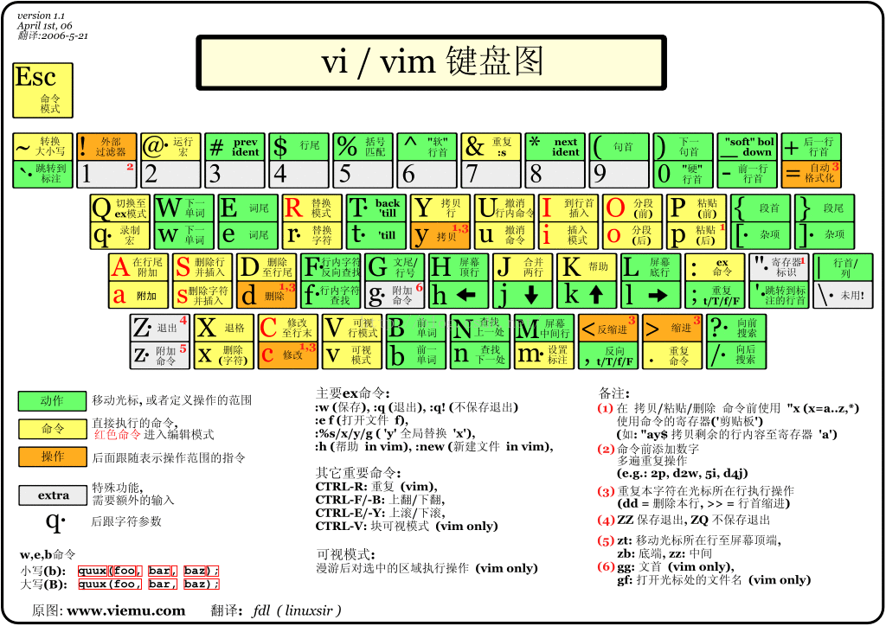

## vi

### 一般模式

**移动光标**
- `h j k l`：左 下 上 右 移动光标，可以加上数字
- `ctrl f|page down`：屏幕向下移动一页
- `ctrl b|page up`：屏幕向上移动一页
- `ctrl d`：屏幕向下移动半页
- `ctrl u`：屏幕向上移动半页
- `n<space>`：跳过n个字符
- `0零`：切换编辑模式的“插入”和“替换”
- `home`：回到一行的最前面
- `$|end`：回到一行的最后面
- `H`：大写H回到屏幕（不是整个文本）第一行的第一个字符
- `M`：大写M回到屏幕中央那行第一个字符
- `L`：大写L回到屏幕最后一行第一个字符
- `G`：移动到整个文本的最后一行
- `nG`：移动到文本第n行，（可配合:set nu）
- `gg`：移动到文本第一行，相当于1G
- `n<enter>`：向下移动n行
- `zt`：移动光标所在行至屏幕顶端
- `zz`：移动光标所在行至屏幕中间
- `zb`：移动光标所在行至屏幕低端
- `>>|<<`：行首缩进，两个方向

**搜寻和取代**
- `/word`：向光标之下搜寻名称为word的字符串
- `?word`：向光标之上搜寻
- `n`：代表重复前一个搜寻动作
- `N`：代表执行前一个搜寻动作的相反的动作
- `:n1,n2/word1/word2/g`：在n1和n2行之间搜寻word1，并将其替换为word2
- `:1,$s/word1/word2/g`：从第一行到最后一行
- `:1,$s/word1/word2/gc`：从第一行到最后一行，并且在替换的时候提示给用户确认

**删除 复制 粘贴**
- `x X`：x表示删除光标所在的字符，X表示删除光标所在前一位
- `nx nX`：nx连续向后删除n个字符，包括光标所在的字符; nX，向前删除n个，不包括光标所在的字符
- `dd`：删除游标所在的整行
- `ndd`：删除光标向下n行，包含所在行
- `d1G`：删除光标所在到第一行的所有数据
- `dG`：删除光标所在到最后一行，G表示最后一行，前面有数字表示删除光标到该行的数据
- `d$`：删除游标所在处，到该行最后一个字符
- `d0`：删除游标所在处的前一位，到该行最前面一个字符，包括删掉前面的空格等
- `yy`：复制游标所在那一行
- `nyy`：复制游标所在向下n行，包括当前行
- `y1G`：复制游标所在至第一行
- `yG`：复制游标所在至最后一行
- `y0`：复制光标所在字符至行首
- `y$`：复制光标所在至行尾
- `p P`：小写p，将已复制的数据在光标下一行贴上；大写P，粘贴到游标上一行；如果复制内容是一行内，那么在游标所在字符之后、之前粘贴插入
- `J`：大写J，将光标当前行与下一行合并，中间空一格合并，可加数字n
- `c`：小写c，删除游标向下n行，包括当前行，并进入插入编辑模式
- `u`：复原前一个动作，类似与win上常用的ctrl z
- `ctrl r`：重做上一个动作
- `.`：重复前一个动作

### 编辑模式

- i：光标所在处前一位插入
- I：光标移到当前行第一个非空字符前
- a：光标处后一位字符插入
- A：光标移到当前行最后
- o ：在下一行插入新的一行
- O ：在上一行插入新的一行
- r ：会替换光标所在字符一次，便自动回到normal模式
- R：一直替换光标所在的字符，直到按下esc回到normal模式
- esc：回到normal模式

### 指令列模式

这个模式是在一般模式下输入特殊的指令

- `:w`：将数据写入硬盘，即保存修改
- `:w!`：若文件属性只读时，强制写入该档案。不过到底能不能写入，还要看权限
- `:q`：退出vi，如果无修改会直接退出，有修改会提示之前的修改未保存，不会退出
- `:q!`：不管有无修改，强制退出，不保存修改
- `:wq`：保存并退出
- `:wq!`：强制储存后离开
- `ZZ`：储存后离开
- `ZQ`：不保存离开
- `:w [filename]`：另存文件
- `:r [filename]`：读取另一个文件数据，加在游标后面
- `:n1,n2 w [filename]`：将n1到n2内容存储成filename这个文件
- `:!command`：暂时离开vi到指令列模式下执行command的显示结果，显示完后再回到vi编辑器。例如`:! ls /home`