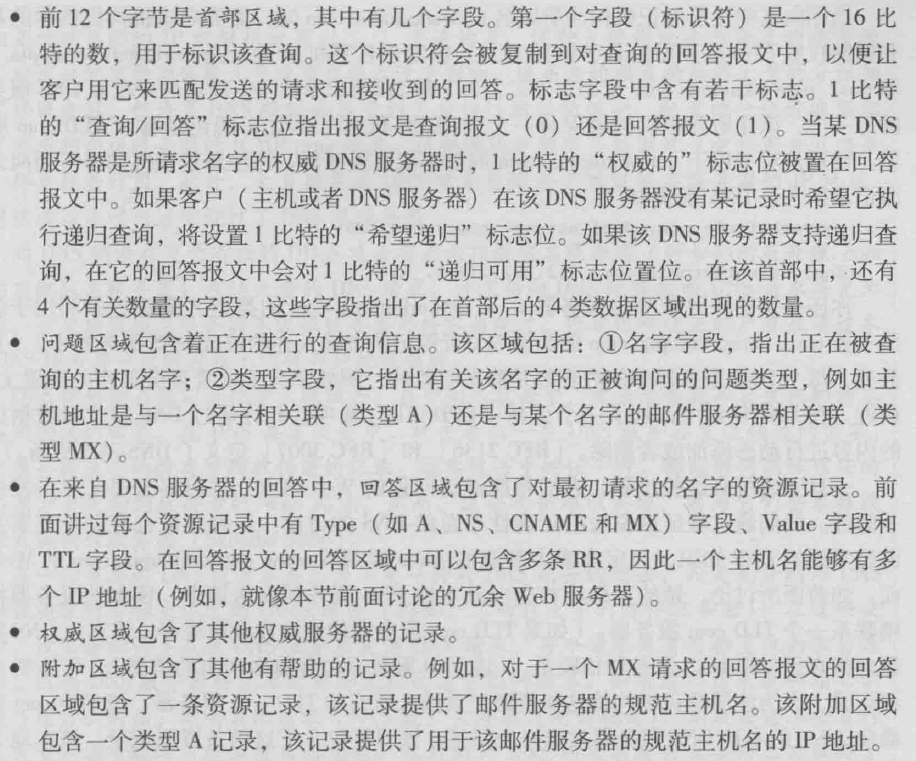

<!-- TOC -->

- [DNS](#dns)
    - [提问？](#提问)
    - [概述](#概述)

<!-- /TOC -->

# DNS

- [rfc1034：域名 - 概念和设施](https://tools.ietf.org/html/rfc1034)
- [rfc1035：域名 - 实施和规范](https://tools.ietf.org/html/rfc1035)
- [rfc2036：域名系统中的动态更新（DNS更新）](https://tools.ietf.org/html/rfc2136)
- [rfc2181：说明DNS规范](https://tools.ietf.org/html/rfc2181)
- [rfc2535：域名系统安全扩展](https://tools.ietf.org/html/rfc2535)
- [rfc2929：域名系统（DNS）IANA注意事项](https://tools.ietf.org/html/rfc2929)
- ...
- [dns相关rfc文档归纳](https://www.isc.org/community/rfcs/dns/)
- [根DNS服务器的域名和IP地址](https://www.iana.org/domains/root/servers)

## 提问？

1. dns是什么，提供了什么功能，它的出现解决了什么问题？
2. dns架构设计？
2. 浏览器域名解析的过程是怎样的？

## 概述

- 《计算机网络 自顶向下》，dns工作机理概述
    1. 分布式、层次数据库
        - 由于DNS面对的请求是全球整个网络，考虑到故障处理、维护、负载均衡等原因，网络上DNS服务器的设计是：分布式、层次式的。
        - 为了处理扩展性的问题，dns使用了大量的dns服务器，它们以层次方式组织，并且分布在全世界范围内。
        - 大致来说，有三种类型的DNS服务器：
            - 根dns服务器（root DNS servers）
            - 顶级域dns服务器（top-level domain (TLD) DNS servers）
            - 权威dns服务器（authoritative DNS servers）
            - 层次为：根 → 顶级域 → 权威
        - 基本流程：
            - 一个dns客户要决定 “www.amazon.com” 的ip地址。
            - [client → root]：那么，该dns客户先与根服务器之一联系，它将返回顶级域名com的TLD服务器的ip地址。
            - [client → top-level]：然后，该客户则与这些TLD服务器之一联系，它将返回 “amazon.com”。
            - [client → authoritative]：最后，该客户与 “amazon.com” 权威服务器之一联系，它为主机名 “www.amazon.com” 返回其ip地址。
        - 三种dns服务器详述：
            - 根dns服务器
                - 以下地址可以明确的看到13个根dns服务器的详细情况：域名、ip等
                    - [IANA国际组织：根dns服务器](https://www.iana.org/domains/root/servers)
                    - [维基百科：根dns服务器](https://en.wikipedia.org/wiki/Root_name_server)
                - 在因特网上有13个根服务器（标号从 A 到 M），域名形式为：“a.root-servers.net”。
                - 尽管我们将这13个根dns服务器中的每个都视为单个服务器，但是实际上是一个冗余的服务器网络，以提供安全性和可靠性。
            - 顶级域dns服务器
                - 这些服务器负责顶级域名。
                    - 通用类：com、org、net、edu、...
                    - 国家代号类：cn、us、...
                - [IANA国际组织：顶级域名列表](https://www.iana.org/domains/root/db)
            - 权威dns服务器
                - 在因特网上具有公共可访问主机（例如服务器）的每个组织结构必须提供公共可访问的dns记录，这些记录将这些主机的名字映射成ip地址。一个组织机构的权威dns服务器收藏了这些dns记录。
                - 一个组织机构能够选择实现它自己的权威dns服务器以保存这些记录，（例如amazon公司，实现自己的权威dns服务器：amazon.com）。
                - 另一种方法是，该组织支付费用，让这些记录存储在某个服务提供商isp的一个权威dns服务器中。
                - 多数大学和大公司实现和维护它们自己的基本和备份的权威dns服务器。
        - 根、TLD和权威dns服务器都处于因特网DNS服务器的层次结构中，此外，还有另外一类重要的dns，称为本地dns服务器（local dns server）。一个本地的dns服务器严格来说并不属于因特网dns服务器的层次结构，但它对dns层次结构是重要的。
        - 本地dns服务器（local dns server）
            - 每个isp（如一个大学，一个系，一个公司或一个居民区的isp）都有一台本地的dns服务器。
            - 当主机与某个isp连接时，该isp分配该主机一个ip地址，同时也会告诉该主机本地dns服务器的ip地址，（通常通过DHCP分配）。
            - 主机的本地dns服务器，通常邻近主机，可能就在同一个局域网内。
            - 当主机发出dns请求时，该请求被发往本地dns服务器，它起着**代理作用**，并将该请求转发到因特网dns服务器层次结构中。
        - 查询流程：
            1. 迭代
                - 
            2. 递归
                - 
            3. 小结：从理论上讲，任何dns查询既可以是迭代也能是递归的。实践中，查询通常遵循第一种模式。从请求主机到本地dns服务器的查询是递归的，其余的查询是迭代的。
    2. dns缓存
        - 为了改善时延性能并减少在因特网上到处传输的dns报文数量，dns广泛使用了缓存技术。
        - 每一个层级上的dns服务器都有缓存，可以大大的减少响应时间。
- 《计算机网络 自顶向下》，dns记录和报文
    1. 概述
        - 共同实现dns分布式数据库的所有dns服务器存储了**资源记录（Resource Record）**，RR提供主机名到IP地址的映射。
        - 每个dns回答报文包含了一条或多条资源记录。
        - 关于更多详细，可以参考rfc1034、rfc1035。
        - RR是一个包含了下列字段的4元组：`(Name, Value, Type, TTL)`
        - ttl是该记录的生存时间，它决定RR应当从缓存中删除的时间。
        - name和value的值，取决于type。
        - 以下例子中，先忽略掉ttl字段。
            - Type=A。
                - name是主机名，value是该主机名对应的ip地址。
                - 因此，一条类型为 A 的RR提供了标准的主机名到ip地址的映射。
                - 例如，（relay1.bar.foo.com， 145.37.93.126，A）就是一条类型你A记录。
            - Type=NS。
                - name是个域（如foo.com），而value是个知道如何获得该域中主机ip地址的权威dns服务器的主机名。
                - 例如（foo.com，dns.foo.com，NS）就是一个类型为NS的记录。
            - Type=CNAME。
                - value是别名为name的主机对应的规范主机名。
                - 该记录能够向查询的主机提供一个主机名对应的规范主机名。
                - 例如（foo.com，relay1.bar.foo.com，CNAME）就是一条CNAME类型的记录。
            - Type=MX。
                - value是别名为name的邮件服务器的规范主机名。
                - 例如（foo.com，mail.bar.foo.com，MX）就是一条MX记录。
                - 通过使用mx记录，一个公司的邮件服务器和其它服务器可以使用相同的别名。
                    - 例如,“foo.com” 域名可以同时是两台服务器的别名，可以通过type来区分开
                    - （foo.com，mail.bar.foo.com，MX）
                    - （foo.com，relay1.bar.foo.com，CNAME）
                - 为了获取邮件服务器的规范主机名，dns客户应当请求一条mx记录；而为了获取其它服务器的规范主机名，dns客户应当请求cname记录。
        - 小结：
            - 如果一台dns服务器是用于某特定主机名的权威dns服务器，那么该权威dns服务器会含有一条包含该主机名的类型A记录。
            - 如果服务器不是用于某主机名的权威服务器，那么该服务器将包含一条类型NS记录，该记录对应于包含主机名的域；它还将包含一条类型A记录，该记录提供了在NS记录的value字段中的dns服务器的ip地址。
    2. dns报文
        - dns只有两种报文：查询和回答。并且两者报文具有相同的格式。
        - 
        - 
    3. 在dns数据库中插入记录
        - 实例分析：假如你要注册域名 “networkutopia.com”
        - 首先，当你向某些注册登录机构注册域名 “networkutopia.com” 时，需要向该机构提供你的基本和辅助（备份）dns服务器的名字和ip地址。假定该名字和ip地址是：“dns1.networkutopia.com和dns2.networkutopia.com，以及212.212.212.1和212.212.212.2”。对于这两个权威dns服务器的每一个，该注册登录机构确保将一个类型ns和一个类型A的记录输入TLD com服务器。
        - 特别是对于用于 “networkutopia.com” 的基本权威服务器，该注册登录机构将下列两条RR插入该dns系统中：
            - (networkutopia.com, dns1.networkutopia.com, NS)
            - (dns1.networkutopia.com, 212.212.212.1, A)
        - 然后，对于你自己的权威dns服务器中，你必须确保用于web服务器 “www.networkutopia.com” 的类型A资源记录和用于邮件服务器 “mail.networkutopia.com” 的类型MX资源记录被输入其中。
