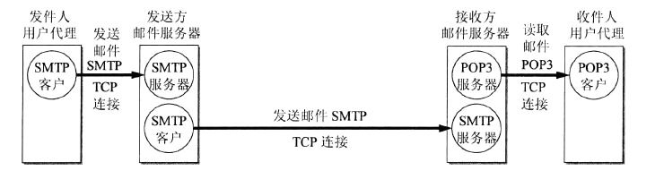

<!-- TOC -->

- [Email](#email)
    - [提问？](#提问)
    - [概述](#概述)

<!-- /TOC -->

# Email

- [SMTP协议](https://tools.ietf.org/html/rfc5321)
- [pop3协议](https://tools.ietf.org/html/rfc1939)
- [imap4协议](https://tools.ietf.org/html/rfc3501)
- [Internet Message Format](https://tools.ietf.org/html/rfc5322)
- MIME（Multipurpose Internet Mail Extensions）
- [鸟哥的私房菜 - 邮件](http://cn.linux.vbird.org/linux_server/0380mail.php#whatmail)

## 提问？

1. email当前面临有哪些问题？

## 概述

- 基本流程：
    - 
- 实体结构组成
    - MUA（Mail User Agent）。例如，foxmail
    - MTA（Mail Transfer Agent）。例如，postfix
    - MDA
    - MRA
    - ...

