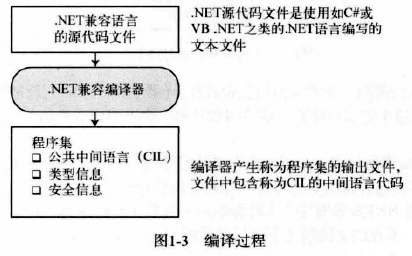
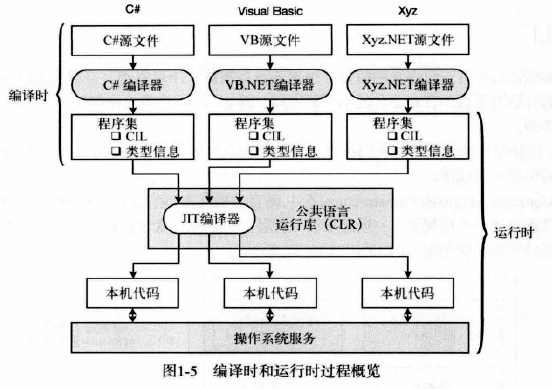
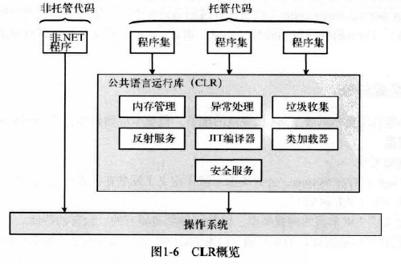
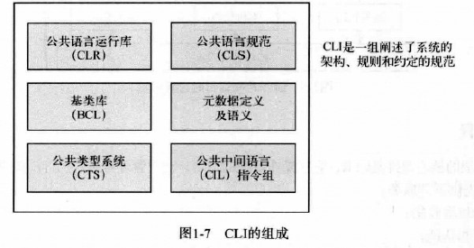
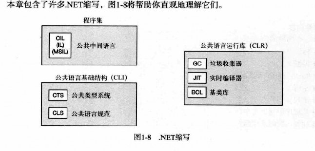

<!-- TOC -->

- [c#图解教程](#c图解教程)
    - [第1章 c#和.net框架](#第1章-c和net框架)

<!-- /TOC -->

# c#图解教程

- 《c#图解教程 第四版》

## 第1章 c#和.net框架

1. 在.net之前
2. .net时代
3. 编译成CIL
    - .net语言的编译器接受源代码文件，并生成名为**程序集**的输出文件。
        - 程序集要么是可执行的，要么是DLL。
        - 程序集里面的代码并不是本机代码，而是一种名为CIL（Common Intermediate Language，公共中间语言）的中间语言。
        - 程序集包含以下的信息：
            1. 程序的CIL
            2. 程序中使用的类型的元数据
            3. 对其它程序集引用的元数据
            
        - 
4. 编译成本机代码并执行
    - 程序的CIL直到它被调用运行时才会被编译成本机代码。在运行时，CLR执行下面的步骤：
        1. 检查程序集的安全性
        2. 在内存中分配空间
        3. 把程序集中的可执行代码发送给实时（Just-in-Time）编译器，把其中的一部分编译成本机代码
    - 程序集中的可执行代码只在需要的时候有JIT编译器编译，然后他就被缓存起来以备在后台的程序中执行。使用这个方法意味着不被调用的代码不会被编译成本机代码，而且被调用到的代码只编译一次。
    - 一旦CIL被编译成本机代码，CLR就在它运行时管理它，执行像释放内存、检查数组边界、检查参数类型和管理异常之类的任务。有两个重要的的术语由此而生。
        - 托管代码：为.net框架编写的代码成为托管代码（managed code），需要CLR。
        - 非托管代码：不在CLR控制之下运行的代码，比如Win32 c/c++ DLL，成为非托管代码（unmanaged code）
    - 微软公司还提供了一个称为本机映像生成器的工具Ngen，可以把一个程序集转换成当前处理器的本机代码。经过Ngen处理过的代码免除了运行时的JIT编译过程。
    - 编译和执行
        - 无论原始源文件的语言是什么，都遵循同样的编译和执行过程。
        - 
5. CLR
    - .NET框架的核心组件是CLR，它在操作系统的顶层，负责管理程序的执行，CLR还提供下列服务
        - 自动垃圾收集
        - 安全和认证
        - ...
        - 
        - 
6. CLI
    - 每种编程语言都有一组内置的类型，用来表示整数、浮点数和字符之类的对象。过去这些类型的特征因编程语言和平台的不同而不同。例如，组成整数的位数对于不同的语言和平台就有很大的差别。
    - 然而，这种统一性的缺乏使我们难以让使用不同语言编程的程序及库一起良好协作。为了有序协作，必须有一组标准。
    - CLI（Common Language Infrastructure，公共语言基础结构）就是这样一组标准，它把所有.net框架的组件连结成一个内骤的、一致的系统。它展示了系统的概念和架构，并详细说明了所有软件都必须坚持的规则和约定。
    - 
    - CLI和C#都已经被ECMA批准为开放的国际标准规范。
7. 各种缩写
    - 
8. C#演化

<!-- ##第2章 c#编程概述

1. 一个简单的C#程序
2. 标识符
3. 关键字
4. Main：程序的起始点
5. 空白
6. 语句
7. 从程序中输出文本
8. 注释：为代码添加注释 -->