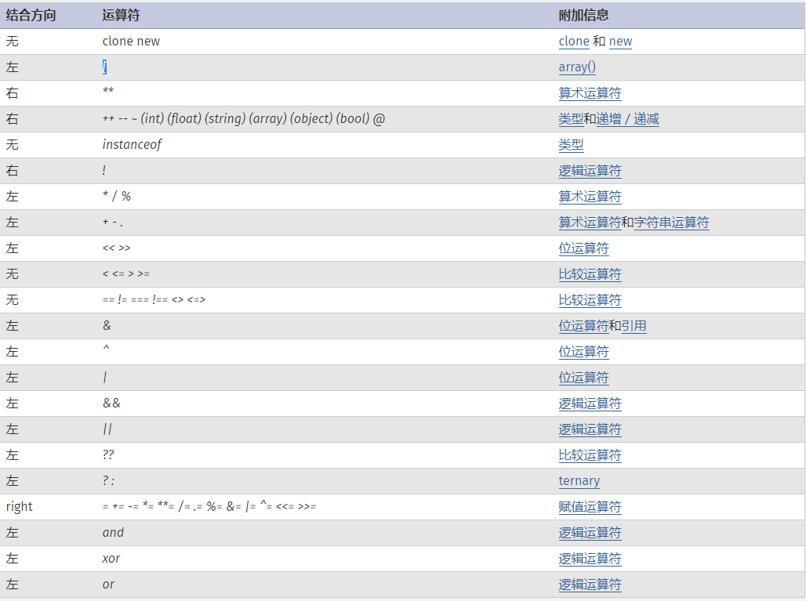

<!-- TOC -->

- [基本语法](#基本语法)
    - [PHP 标记](#php-标记)
    - [从 HTML 中分离](#从-html-中分离)
    - [指令分隔符](#指令分隔符)
    - [注释](#注释)
- [类型](#类型)
    - [简介](#简介)
    - [Boolean 布尔类型](#boolean-布尔类型)
    - [Integer 整型](#integer-整型)
    - [Float 浮点型](#float-浮点型)
    - [String 字符串](#string-字符串)
    - [Array 数组](#array-数组)
    - [Object 对象](#object-对象)
    - [Resource 资源类型](#resource-资源类型)
    - [NULL](#null)
    - [Callback / Callable 类型](#callback--callable-类型)
    - [本文档中使用的伪类型与变量](#本文档中使用的伪类型与变量)
    - [类型转换的判别](#类型转换的判别)
- [变量](#变量)
    - [基础](#基础)
    - [预定义变量](#预定义变量)
    - [变量范围](#变量范围)
    - [可变变量](#可变变量)
    - [来自 PHP 之外的变量](#来自-php-之外的变量)
- [常量](#常量)
    - [语法](#语法)
    - [魔术常量](#魔术常量)
- [表达式](#表达式)
- [运算符](#运算符)
    - [运算符优先级](#运算符优先级)
    - [算术运算符](#算术运算符)
    - [赋值运算符](#赋值运算符)
    - [位运算符](#位运算符)
    - [比较运算符](#比较运算符)
    - [错误控制运算符](#错误控制运算符)
    - [执行运算符](#执行运算符)
    - [递增／递减运算符](#递增／递减运算符)
    - [逻辑运算符](#逻辑运算符)
    - [字符串运算符](#字符串运算符)
    - [数组运算符](#数组运算符)
    - [类型运算符](#类型运算符)
- [流程控制](#流程控制)
    - [简介](#简介-1)
    - [if](#if)
    - [else](#else)
    - [elseif/else if](#elseifelse-if)
    - [流程控制的替代语法](#流程控制的替代语法)
    - [while](#while)
    - [do-while](#do-while)
    - [for](#for)
    - [foreach](#foreach)
    - [break](#break)
    - [continue](#continue)
    - [switch](#switch)
    - [declare](#declare)
    - [return](#return)
    - [require](#require)
    - [include](#include)
    - [require_once](#require_once)
    - [include_once](#include_once)
    - [goto](#goto)
- [函数](#函数)
    - [用户自定义函数](#用户自定义函数)
    - [函数的参数](#函数的参数)
    - [返回值](#返回值)
    - [可变函数](#可变函数)
    - [内部（内置）函数](#内部内置函数)
    - [匿名函数](#匿名函数)
- [类与对象](#类与对象)
    - [简介](#简介-2)
    - [基本概念](#基本概念)
    - [属性](#属性)
    - [类常量](#类常量)
    - [类的自动加载](#类的自动加载)
    - [构造函数和析构函数](#构造函数和析构函数)
    - [访问控制（可见性）](#访问控制可见性)
    - [对象继承](#对象继承)
    - [范围解析操作符 （::）](#范围解析操作符-)
    - [Static（静态）关键字](#static静态关键字)
    - [抽象类](#抽象类)
    - [对象接口](#对象接口)
    - [Trait](#trait)
    - [匿名类](#匿名类)
    - [重载](#重载)
    - [遍历对象](#遍历对象)
    - [魔术方法](#魔术方法)
    - [Final 关键字](#final-关键字)
    - [对象复制](#对象复制)
    - [对象比较](#对象比较)
    - [类型约束](#类型约束)
    - [后期静态绑定](#后期静态绑定)
    - [对象和引用](#对象和引用)
    - [对象序列化](#对象序列化)
    - [OOP 变更日志](#oop-变更日志)
- [命名空间](#命名空间)
    - [命名空间概述](#命名空间概述)
    - [定义命名空间](#定义命名空间)
    - [定义子命名空间](#定义子命名空间)
    - [在同一个文件中定义多个命名空间](#在同一个文件中定义多个命名空间)
    - [使用命名空间：基础](#使用命名空间基础)
    - [命名空间和动态语言特征](#命名空间和动态语言特征)
    - [namespace关键字和__NAMESPACE__常量](#namespace关键字和__namespace__常量)
    - [使用命名空间：别名/导入](#使用命名空间别名导入)
    - [全局空间](#全局空间)
    - [使用命名空间：后备全局函数/常量](#使用命名空间后备全局函数常量)
    - [名称解析规则](#名称解析规则)
    - [FAQ: things you need to know about namespaces](#faq-things-you-need-to-know-about-namespaces)
- [Errors](#errors)
    - [Basics](#basics)
    - [PHP 7 错误处理](#php-7-错误处理)
- [异常处理](#异常处理)
    - [扩展（extend） PHP 内置的异常处理类](#扩展extend-php-内置的异常处理类)
- [生成器](#生成器)
    - [生成器总览](#生成器总览)
    - [生成器语法](#生成器语法)
    - [Comparing generators with Iterator objects](#comparing-generators-with-iterator-objects)
- [引用的解释](#引用的解释)
    - [引用是什么](#引用是什么)
    - [引用做什么](#引用做什么)
    - [引用不是什么](#引用不是什么)
    - [引用传递](#引用传递)
    - [引用返回](#引用返回)
    - [取消引用](#取消引用)
    - [引用定位](#引用定位)
- [预定义变量](#预定义变量-1)
    - [超全局变量 — 超全局变量是在全部作用域中始终可用的内置变量](#超全局变量--超全局变量是在全部作用域中始终可用的内置变量)
    - [$GLOBALS — 引用全局作用域中可用的全部变量](#globals--引用全局作用域中可用的全部变量)
    - [$_SERVER — 服务器和执行环境信息](#_server--服务器和执行环境信息)
    - [$_GET — HTTP GET 变量](#_get--http-get-变量)
    - [$_POST — HTTP POST 变量](#_post--http-post-变量)
    - [$_FILES — HTTP 文件上传变量](#_files--http-文件上传变量)
    - [$_REQUEST — HTTP Request 变量](#_request--http-request-变量)
    - [$_SESSION — Session 变量](#_session--session-变量)
    - [$_ENV — 环境变量](#_env--环境变量)
    - [$_COOKIE — HTTP Cookies](#_cookie--http-cookies)
    - [$php_errormsg — 前一个错误信息](#php_errormsg--前一个错误信息)
    - [$HTTP_RAW_POST_DATA — 原生POST数据](#http_raw_post_data--原生post数据)
    - [$http_response_header — HTTP 响应头](#http_response_header--http-响应头)
    - [$argc — 传递给脚本的参数数目](#argc--传递给脚本的参数数目)
    - [$argv — 传递给脚本的参数数组](#argv--传递给脚本的参数数组)
- [预定义异常](#预定义异常)
    - [Exception](#exception)
    - [ErrorException](#errorexception)
- [预定义接口](#预定义接口)
    - [遍历 — Traversable（遍历）接口](#遍历--traversable遍历接口)
    - [迭代器 — Iterator（迭代器）接口](#迭代器--iterator迭代器接口)
    - [聚合式迭代器 — IteratorAggregate（聚合式迭代器）接口](#聚合式迭代器--iteratoraggregate聚合式迭代器接口)
    - [数组式访问 — ArrayAccess（数组式访问）接口](#数组式访问--arrayaccess数组式访问接口)
    - [序列化 — 序列化接口](#序列化--序列化接口)
    - [Closure — Closure 类](#closure--closure-类)
    - [生成器 — 生成器类](#生成器--生成器类)
- [上下文（Context）选项和参数](#上下文context选项和参数)
    - [套接字上下文选项 — 套接字上下文选项列表](#套接字上下文选项--套接字上下文选项列表)
    - [HTTP context 选项 — HTTP context 的选项列表](#http-context-选项--http-context-的选项列表)
    - [FTP context options — FTP context option listing](#ftp-context-options--ftp-context-option-listing)
    - [SSL 上下文选项 — SSL 上下文选项清单](#ssl-上下文选项--ssl-上下文选项清单)
    - [CURL context options — CURL 上下文选项列表](#curl-context-options--curl-上下文选项列表)
    - [Phar 上下文（context）选项 — Phar 上下文（context）选项列表](#phar-上下文context选项--phar-上下文context选项列表)
    - [MongoDB context options — MongoDB context option listing](#mongodb-context-options--mongodb-context-option-listing)
    - [Context 参数 — Context 参数列表](#context-参数--context-参数列表)
- [支持的协议和封装协议](#支持的协议和封装协议)
    - [file:// — 访问本地文件系统](#file--访问本地文件系统)
    - [http:// — 访问 HTTP(s) 网址](#http--访问-https-网址)
    - [ftp:// — 访问 FTP(s) URLs](#ftp--访问-ftps-urls)
    - [php:// — 访问各个输入/输出流（I/O streams）](#php--访问各个输入输出流io-streams)
    - [zlib:// — 压缩流](#zlib--压缩流)
    - [data:// — 数据（RFC 2397）](#data--数据rfc-2397)
    - [glob:// — 查找匹配的文件路径模式](#glob--查找匹配的文件路径模式)
    - [phar:// — PHP 归档](#phar--php-归档)
    - [ssh2:// — Secure Shell 2](#ssh2--secure-shell-2)
    - [rar:// — RAR](#rar--rar)
    - [ogg:// — 音频流](#ogg--音频流)
    - [expect:// — 处理交互式的流](#expect--处理交互式的流)

<!-- /TOC -->


## 基本语法

### PHP 标记

- 当解析一个文件时，PHP 会寻找起始和结束标记，也就是 <?php 和 ?>，这告诉 PHP 开始和停止解析二者之间的代码。此种解析方式使得 PHP 可以被嵌入到各种不同的文档中去，而任何起始和结束标记之外的部分都会被 PHP 解析器忽略。
- 如果文件内容是纯 PHP 代码，最好在文件末尾删除 PHP 结束标记。这可以避免在 PHP 结束标记之后万一意外加入了空格或者换行符，会导致 PHP 开始输出这些空白，而脚本中此时并无输出的意图。

### 从 HTML 中分离

- 凡是在一对开始和结束标记之外的内容都会被 PHP 解析器忽略，这使得 PHP 文件可以具备混合内容。 可以使 PHP 嵌入到 HTML 文档中去，如下例所示。
    ```php
    <p>This is going to be ignored by PHP and displayed by the browser.</p>
    <?php echo 'While this is going to be parsed.'; ?>
    <p>This will also be ignored by PHP and displayed by the browser.</p>
    ```
- 这将如预期中的运行，因为当 PHP 解释器碰到 ?> 结束标记时就简单地将其后内容原样输出（除非马上紧接换行 - 见指令分隔符）直到碰到下一个开始标记；
- 其中有个例外情况是，处于条件语句中间时，此时 PHP 解释器会根据条件判断来决定哪些输出，哪些跳过。见下例。使用条件结构：
    ```php
    <?php if ($expression == true): ?>
      This will show if the expression is true.
    <?php else: ?>
      Otherwise this will show.
    <?php endif; ?>
    ```
- 上例中 PHP 将跳过条件语句未达成的段落，即使该段落位于 PHP 开始和结束标记之外。由于 PHP 解释器会在条件未达成时直接跳过该段条件语句块，因此 PHP 会根据条件来忽略之。
- 要输出大段文本时，跳出 PHP 解析模式通常比将文本通过 echo 或 print 输出更有效率。
- 可以在 PHP 中使用四对不同的开始和结束标记。其中两种，`<?php ?>` 和 `<script language="php"> </script>` 总是可用的。另两种是短标记和 ASP 风格标记，可以在 php.ini 配置文件中打开或关闭。尽管有些人觉得短标记和 ASP 风格标记很方便，但移植性较差，通常不推荐使用。

### 指令分隔符

- 同 C 或 Perl 一样，PHP 需要在每个语句后用分号结束指令。
- 一段 PHP 代码中的结束标记隐含表示了一个分号。在一个 PHP 代码段中的最后一行可以不用分号结束。
- 如果后面还有新行，则代码段的结束标记包含了行结束。
- 文件末尾的 PHP 代码段结束标记可以不要，有些情况下当使用 include 或者 require 时省略掉会更好些，这样不期望的空白符就不会出现在文件末尾，之后仍然可以输出响应标头。在使用输出缓冲时也很便利，就不会看到由包含文件生成的不期望的空白符。
    ```php
    <?php
    echo "This is a test";
    ?>
    
    <?php echo "This is a test" ?>
    
    <?php echo 'We omitted the last closing tag';
    ```

### 注释

- PHP 支持 C，C++ 和 Unix Shell 风格（Perl 风格）的注释。
    ```php
    <?php
    echo "This is a test"; // This is a one-line c++ style comment
    /* This is a multi line comment
       yet another line of comment */
    echo "This is yet another test";
    echo 'One Final Test'; # This is a one-line shell-style comment
    ?>
    ```

## 类型

### 简介

- php支持9种原始数据类型：
    - 四种标量类型：
        - boolean
        - integer
        - float（也称作 double）
        - string
    - 三种复合类型：
        - array
        - object
        - callable（可调用）
    - 两种特殊类型：
        - resource（资源）
        - NULL
- 可能还会读到一些关于“双精度（double）”类型的参考。实际上 double 和 float 是相同的，由于一些历史的原因，这两个名称同时存在。
- 变量的类型通常不是由程序员设定的，确切地说，是由 PHP 根据该变量使用的上下文在运行时决定的。
    ```php
    <?php
    $a_bool = TRUE;   // 布尔值 boolean
    $a_str  = "foo";  // 字符串 string
    $a_str2 = 'foo';  // 字符串 string
    $an_int = 12;     // 整型 integer
    
    echo gettype($a_bool); // 输出:  boolean
    echo gettype($a_str);  // 输出:  string
    
    // 如果是整型，就加上 4
    if (is_int($an_int)) {
        $an_int += 4;
    }
    
    // 如果 $bool 是字符串，就打印出来
    // (啥也没打印出来)
    if (is_string($a_bool)) {
        echo "String: $a_bool";
    }
    ?>
    ```
- 如果要将一个变量强制转换为某类型，可以对其使用强制转换或者 settype() 函数。
- 注意变量根据其当时的类型在特定场合下会表现出不同的值。更多信息见 [类型转换的判别](#)。此外，还可以参考 [PHP 类型比较表](#) 看不同类型相互比较的例子。

### Boolean 布尔类型

- 这是最简单的类型。boolean 表达了真值，可以为 TRUE 或 FALSE。
- 语法：要指定一个布尔值，使用常量TRUE或FALSE。俩个都不区分大小写。
- 通常运算符所返回的boolean值结果会被传递给控制流程：
    ```php
    <?php
    // == 是一个操作符，它检测两个变量是否相等，并返回一个布尔值
    if ($action == "show_version") {
        echo "The version is 1.23";
    }
    
    // 这样做是不必要的...
    if ($show_separators == TRUE) {
        echo "<hr>\n";
    }
    
    // ...因为可以使用下面这种简单的方式：
    if ($show_separators) {
        echo "<hr>\n";
    }
    ?>
    ```
- 转换为布尔值
    - 要明确地将一个值转换成 boolean，用 (bool) 或者 (boolean) 来强制转换。
    - 但是很多情况下不需要用强制转换，因为当运算符，函数或者流程控制结构需要一个 boolean 参数时，该值会被自动转换。
    - 当转换为boolean时，以下值被认为是FALSE：
        - 布尔值false本身
        - 整型值0
        - 浮点值0.0
        - 空字符串，以及空字符串"0"
        - 不包括任何元素的数组
        - 特殊类型NULL（包括尚未复制的变量）
        - 从空标记生成的SimpleXML对象
    - 其它值都被认为是true（包括任何资源和NAN）
        ```php
        <?php
        var_dump((bool) "");        // bool(false)
        var_dump((bool) 1);         // bool(true)
        var_dump((bool) -2);        // bool(true)
        var_dump((bool) "foo");     // bool(true)
        var_dump((bool) 2.3e5);     // bool(true)
        var_dump((bool) array(12)); // bool(true)
        var_dump((bool) array());   // bool(false)
        var_dump((bool) "false");   // bool(true)
        ?>
        ```

### Integer 整型

- integer 是集合 ℤ = {..., -2, -1, 0, 1, 2, ...} 中的某个数。
- 语法：
    - 整型值可以使用十进制，十六进制，八进制或二进制表示，前面可以加上可选的符号（- 或者 +）。
    - 二进制表达的 integer 自 PHP 5.4.0 起可用。
    - 要使用八进制表达，数字前必须加上 0（零）。要使用十六进制表达，数字前必须加上 0x。要使用二进制表达，数字前必须加上 0b。
    - integer语法的结构形式是：
        ```sh
        decimal     : [1-9][0-9]*
                    | 0
        
        hexadecimal : 0[xX][0-9a-fA-F]+
        
        octal       : 0[0-7]+
        
        binary      : 0b[01]+
        
        integer     : [+-]?decimal
                    | [+-]?hexadecimal
                    | [+-]?octal
                    | [+-]?binary
        ```
- 整型数的字长和平台有关，尽管通常最大值是大约二十亿（32 位有符号）。64 位平台下的最大值通常是大约 9E18，除了 Windows 下 PHP 7 以前的版本，总是 32 位的。
- PHP 不支持无符号的 integer
- Integer 值的字长可以用常量 PHP_INT_SIZE来表示，自 PHP 4.4.0 和 PHP 5.0.5后，最大值可以用常量 PHP_INT_MAX 来表示，最小值可以在 PHP 7.0.0 及以后的版本中用常量 PHP_INT_MIN 表示。
- > NOTE：PHP 7 以前的版本里，如果向八进制数传递了一个非法数字（即 8 或 9），则后面其余数字会被忽略。PHP 7 以后，会产生 Parse Error。
- 整数溢出：
    - 如果给定的一个数超出了 integer 的范围，将会被解释为 float。同样如果执行的运算结果超出了 integer 范围，也会返回 float。
        ```php
        # 32位系统下的整数溢出
        <?php
        $large_number = 2147483647;
        var_dump($large_number);                     // int(2147483647)
        
        $large_number = 2147483648;
        var_dump($large_number);                     // float(2147483648)
        
        $million = 1000000;
        $large_number =  50000 * $million;
        var_dump($large_number);                     // float(50000000000)
        ?>

        # 64位系统下的整数溢出
        <?php
        $large_number = 9223372036854775807;
        var_dump($large_number);                     // int(9223372036854775807)
        
        $large_number = 9223372036854775808;
        var_dump($large_number);                     // float(9.2233720368548E+18)
        
        $million = 1000000;
        $large_number =  50000000000000 * $million;
        var_dump($large_number);                     // float(5.0E+19)
        ?>
        ```
- PHP 中没有整除的运算符。1/2 产生出 float 0.5。 值可以舍弃小数部分，强制转换为 integer，或者使用 round() 函数可以更好地进行四舍五入。
    ```php
    <?php
    var_dump(25/7);         // float(3.5714285714286) 
    var_dump((int) (25/7)); // int(3)
    var_dump(round(25/7));  // float(4) 
    ?>
    ```
- 转换为整型
    - 要明确地将一个值转换为 integer，用 (int) 或 (integer) 强制转换
    - 不过大多数情况下都不需要强制转换，因为当运算符，函数或流程控制需要一个 integer 参数时，值会自动转换。
    - 还可以通过函数 intval() 来将一个值转换成整型。
    - 将 resource 转换成 integer 时， 结果会是 PHP 运行时为 resource 分配的唯一资源号。
    - 从boolean值转换，false对应0，true对应1
    - 从float值转换，将向下取整。
    - 如果浮点数超出了整数范围（32 位平台下通常为 +/- 2.15e+9 = 2^31，64 位平台下，除了 Windows，通常为 +/- 9.22e+18 = 2^63），则结果为未定义，因为没有足够的精度给出一个确切的整数结果。在此情况下没有警告，甚至没有任何通知！
    - > NOTE: PHP 7.0.0 起，NaN 和 Infinity 在转换成 integer 时，不再是 undefined 或者依赖于平台，而是都会变成零。
    - > NOTE：绝不要将未知的分数强制转换为 integer，这样有时会导致不可预料的结果。
    - 从字符串转换，见string小节

### Float 浮点型

- 浮点型（也叫浮点数 float，双精度数 double 或实数 real）可以用以下任一语法定义：
    ```php
    <?php
    $a = 1.234; 
    $b = 1.2e3; 
    $c = 7E-10;
    ?>
    ```
- 浮点数的形式表示：
    ```php
    LNUM          [0-9]+
    DNUM          ([0-9]*[\.]{LNUM}) | ({LNUM}[\.][0-9]*)
    EXPONENT_DNUM [+-]?(({LNUM} | {DNUM}) [eE][+-]? {LNUM})
    ```
- 浮点数的字长和平台相关，尽管通常最大值是 1.8e308 并具有 14 位十进制数字的精度（64 位 IEEE 格式）。
- 浮点数注意：
    - > Warning
    - > 浮点数的精度
    - > 浮点数的精度有限。尽管取决于系统，PHP 通常使用 IEEE 754 双精度格式，则由于取整而导致    的最大相对误差为 1.11e-16。非基本数学运算可能会给出更大误差，并且要考虑到进行复合运 算时的误差传递。
    - > 此外，以十进制能够精确表示的有理数如 0.1 或 0.7，无论有多少尾数都不能被内部所使用的 二进制精确表示，因此不能在不丢失一点点精度的情况下转换为二进制的格式。这就会造成混乱 的结果：例如，floor((0.1+0.7)*10) 通常会返回 7 而不是预期中的 8，因为该结果内部的表  示其实是类似 7.9999999999999991118...。
    - > 所以永远不要相信浮点数结果精确到了最后一位，也永远不要比较两个浮点数是否相等。如果确    实需要更高的精度，应该使用任意精度数学函数或者 gmp 函数。
    - > 参见» 浮点数指南网页的简单解释。
- 转换为浮点型
    - 如果希望了解有关何时和如何将字符串转换成浮点数的信息，请参阅“字符串转换为数值”一节。对于其它类型的值，其情况类似于先将值转换成整型，然后再转换成浮点。请参阅“转换为整型”一节以获取更多信息。自 PHP 5 起，如果试图将对象转换为浮点数，会发出一条 E_NOTICE 错误消息。
- 比较浮点数
    - 如上述警告信息所言，由于内部表达方式的原因，比较两个浮点数是否相等是有问题的。不过还是有迂回的方法来比较浮点数值的。
    - 要测试浮点数是否相等，要使用一个仅比该数值大一丁点的最小误差值。该值也被称为机器极小值（epsilon）或最小单元取整数，是计算中所能接受的最小的差别值。
    - $a 和 $b 在小数点后五位精度内都是相等的。
        ```php
        <?php
        $a = 1.23456789;
        $b = 1.23456780;
        $epsilon = 0.00001;
        
        if(abs($a-$b) < $epsilon) {
            echo "true";
        }
        ?>
        ```
- NAN
    - 某些数学运算会产生一个由常量 NAN 所代表的结果。此结果代表着一个在浮点数运算中未定义或不可表述的值。任何拿此值与其它任何值（除了 TRUE）进行的松散或严格比较的结果都是 FALSE。
    - 由于 NAN 代表着任何不同值，不应拿 NAN 去和其它值进行比较，包括其自身，应该用 is_nan() 来检查。

### String 字符串

- 一个字符串 string 就是由一系列的字符组成，其中每个字符等同于一个字节。这意味着 PHP 只能支持 256 的字符集，因此不支持 Unicode 。
    - > Note：string最大可以达到2GB
- 语法：
    - 字符串有4种方式表达
        - 单引号
        - 双引号
        - heredoc 语法结构
        - nowdoc 语法结构（自 PHP 5.3.0 起）
    - 单引号
        - 定义一个字符串的最简单的方法是用单引号把它包围起来
        - 要表达一个单引号自身，需在它的前面加个反斜线（`\`）来转义。要表达一个反斜线自身，则用两个反斜线（`\\`）。其它任何方式的反斜线都会被当成反斜线本身：也就是说如果想使用其它转义序列例如 `\r` 或者 `\n`，并不代表任何特殊含义，就单纯是这两个字符本身。
        - 不像双引号和 heredoc 语法结构，在单引号字符串中的变量和特殊字符的转义序列将不会被替换。
            ```php
            <?php
            echo 'this is a simple string';
            
            // 可以录入多行
            echo 'You can also have embedded newlines in 
            strings this way as it is
            okay to do';
            
            // 输出： Arnold once said: "I'll be back"
            echo 'Arnold once said: "I\'ll be back"';
            
            // 输出： You deleted C:\*.*?
            echo 'You deleted C:\\*.*?';
            
            // 输出： You deleted C:\*.*?
            echo 'You deleted C:\*.*?';
            
            // 输出： This will not expand: \n a newline
            echo 'This will not expand: \n a newline';
            
            // 输出： Variables do not $expand $either
            echo 'Variables do not $expand $either';
            ?>
            ```
    - 双引号
        - 如果字符串是包围在双引号（"）中， PHP 将对一些特殊的字符进行解析：
            ```sh
            转义字符
            
            序列    含义
            \n      换行（ASCII 字符集中的 LF 或 0x0A (10)）
            \r      回车（ASCII 字符集中的 CR 或 0x0D (13)）
            \t      水平制表符（ASCII 字符集中的 HT 或 0x09 (9)）
            \v      垂直制表符（ASCII 字符集中的 VT 或 0x0B (11)）（自 PHP 5.2.5 起）
            \e      Escape（ASCII 字符集中的 ESC 或 0x1B (27)）（自 PHP 5.4.0 起）
            \f      换页（ASCII 字符集中的 FF 或 0x0C (12)）（自 PHP 5.2.5 起）
            \\      反斜线
            \$      美元标记
            \"      双引号
            \[0-7]{1,3}     符合该正则表达式序列的是一个以八进制方式来表达的字符
            \x[0-9A-Fa-f]{1,2}      符合该正则表达式序列的是一个以十六进制方式来表达的字符
            ```
        - 和单引号字符串一样，转义任何其它字符都会导致反斜线被显示出来。PHP 5.1.1 以前，`\{$var}` 中的反斜线还不会被显示出来。
        - 用双引号定义的字符串最重要的特征是变量会被解析，详见变量解析。
    - Heredoc结构
        - 第三种表达字符串的方法是用 heredoc 句法结构：<<<。在该运算符之后要提供一个标识符，然后换行。接下来是字符串 string 本身，最后要用前面定义的标识符作为结束标志。
        - 结束时所引用的标识符必须在该行的第一列，而且，标识符的命名也要像其它标签一样遵守 PHP 的规则：只能包含字母、数字和下划线，并且必须以字母和下划线作为开头。
            - > Warning
            - > 要注意的是结束标识符这行除了可能有一个分号（;）外，绝对不能包含其它字符。这意味着标识符不能缩进，分号的前后也不能有任何空白或制表符。更重要的是结束标识符的前面必须是个被本地操作系统认可的换行，比如在 UNIX 和 Mac OS X 系统中是 \n，而结束定界符（可能其后有个分号）之后也必须紧跟一个换行。
            - > 如果不遵守该规则导致结束标识不“干净”，PHP 将认为它不是结束标识符而继续寻找。如果在文件结束前也没有找到一个正确的结束标识符，PHP 将会在最后一行产生一个解析错误。
            - > Heredocs 结构不能用来初始化类的属性。自 PHP 5.3 起，此限制仅对 heredoc 包含变量时有效，如果不包含变量，则可以赋值。
        - Heredoc 结构就象是没有使用双引号的双引号字符串，这就是说在 heredoc 结构中单引号不用被转义，但是上文中列出的转义序列还可以使用。变量将被替换，但在 heredoc 结构中含有复杂的变量时要格外小心。
        - 在 PHP 5.3.0 以后，也可以用 Heredoc 结构来初始化静态变量和类的属性和常量：
            ```php
            <?php
            // 静态变量
            function foo()
            {
                static $bar = <<<LABEL
            Nothing in here...
            LABEL;
            }
            
            // 类的常量、属性
            class foo
            {
                const BAR = <<<FOOBAR
            Constant example
            FOOBAR;
            
                public $baz = <<<FOOBAR
            Property example
            FOOBAR;
            }
            ?>
            ```
        - 自 PHP 5.3.0 起还可以在 Heredoc 结构中用双引号来声明标识符：
    - Nowdoc结构
        - Nowdoc 结构是在 PHP 5.3.0 中加入的。
        - 就象 heredoc 结构类似于双引号字符串，Nowdoc 结构是类似于单引号字符串的。
        - Nowdoc 结构很象 heredoc 结构，但是 nowdoc 中不进行解析操作。
        - 这种结构很适合用于嵌入 PHP 代码或其它大段文本而无需对其中的特殊字符进行转义。与 SGML 的 `<![CDATA[ ]]>` 结构是用来声明大段的不用解析的文本类似，nowdoc 结构也有相同的特征。
        - 一个 nowdoc 结构也用和 heredocs 结构一样的标记 <<<， 但是跟在后面的标识符要用单引号括起来，即 <<<'EOT'。Heredoc 结构的所有规则也同样适用于 nowdoc 结构，尤其是结束标识符的规则。
            ```php
            <?php
            $str = <<<'EOD'
            Example of string
            spanning multiple lines
            using nowdoc syntax.
            EOD;
            
            /* 含有变量的更复杂的示例 */
            class foo
            {
                public $foo;
                public $bar;
            
                function foo()
                {
                    $this->foo = 'Foo';
                    $this->bar = array('Bar1', 'Bar2', 'Bar3');
                }
            }
            
            $foo = new foo();
            $name = 'MyName';
            
            echo <<<'EOT'
            My name is "$name". I am printing some $foo->foo.
            Now, I am printing some {$foo->bar[1]}.
            This should not print a capital 'A': \x41
            EOT;
            ?>
            ```
        - 不象 heredoc 结构，nowdoc 结构可以用在任意的静态数据环境中，最典型的示例是用来初始化类的属性或常量：
            ```php
            # 静态数据示例
            <?php
            class foo {
                public $bar = <<<'EOT'
            bar
            EOT;
            }
            ?>
            ```
- 变量解析
    - 当字符串用双引号或 heredoc 结构定义时，其中的变量将会被解析。
    - 这里共有两种语法规则：一种简单规则，一种复杂规则。
        - 简单的语法规则是最常用和最方便的，它可以用最少的代码在一个 string 中嵌入一个变量，一个 array 的值，或一个 object 的属性。
        - 复杂规则语法的显著标记是用花括号包围的表达式。
    - 简单语法
        - 当 PHP 解析器遇到一个美元符号（$）时，它会和其它很多解析器一样，去组合尽量多的标识以形成一个合法的变量名
        - 可以用{花括号}来明确变量名的界线
        - 类似的，一个 array 索引或一个 object 属性也可被解析。数组索引要用方括号（]）来表示索引结束的边际，对象属性则是和上述的变量规则相同。
            ```php
            <?php
            $juices = array("apple", "orange", "koolaid1" => "purple");
            
            echo "He drank some $juices[0] juice.".PHP_EOL;
            echo "He drank some $juices[1] juice.".PHP_EOL;
            echo "He drank some juice made of $juice[0]s.".PHP_EOL; // Won't work
            echo "He drank some $juices[koolaid1] juice.".PHP_EOL;
            
            class people {
                public $john = "John Smith";
                public $jane = "Jane Smith";
                public $robert = "Robert Paulsen";
                
                public $smith = "Smith";
            }
            
            $people = new people();
            
            echo "$people->john drank some $juices[0] juice.".PHP_EOL;
            echo "$people->john then said hello to $people->jane.".PHP_EOL;
            echo "$people->john's wife greeted $people->robert.".PHP_EOL;
            echo "$people->robert greeted the two $people->smiths."; // Won't work
            ?>
            ```
    - 复杂（花括号）语法
        - 复杂语法不是因为其语法复杂而得名，而是因为它可以使用复杂的表达式。
        - 任何具有 string 表达的标量变量，数组单元或对象属性都可使用此语法。只需简单地像在 string 以外的地方那样写出表达式，然后用花括号 { 和 } 把它括起来即可。由于 { 无法被转义，只有 $ 紧挨着 { 时才会被识别。可以用 {\$ 来表达 {$。
        - 也可以在字符串中用此语法通过变量来调用类的属性。
            ```php
            <?php
            class foo {
                var $bar = 'I am bar.';
            }
            
            $foo = new foo();
            $bar = 'bar';
            $baz = array('foo', 'bar', 'baz', 'quux');
            echo "{$foo->$bar}\n";
            echo "{$foo->$baz[1]}\n";
            ?>
            ```
        - 函数、方法、静态类变量和类常量只有在 PHP 5 以后才可在 {$} 中使用。然而，只有在该字符串被定义的命名空间中才可以将其值作为变量名来访问。只单一使用花括号 ({}) 无法处理从函数或方法的返回值或者类常量以及类静态变量的值。
            ```php
            <?php
            // 显示所有错误
            error_reporting(E_ALL);
            
            class beers {
                const softdrink = 'rootbeer';
                public static $ale = 'ipa';
            }
            
            $rootbeer = 'A & W';
            $ipa = 'Alexander Keith\'s';
            
            // 有效，输出： I'd like an A & W
            echo "I'd like an {${beers::softdrink}}\n";
            
            // 也有效，输出： I'd like an Alexander Keith's
            echo "I'd like an {${beers::$ale}}\n";
            ?>
            ```
- 存取和修改字符串中的字符
    - string 中的字符可以通过一个从 0 开始的下标，用类似 array 结构中的方括号包含对应的数字来访问和修改，比如 $str[42]。可以把 string 当成字符组成的 array。函数 substr() 和 substr_replace() 可用于操作多于一个字符的情况。
        - > Warning：
        - > 用超出字符串长度的下标写入将会拉长该字符串并以空格填充。非整数类型下标会被转换成整数。非法下标类型会产生一个 E_NOTICE 级别错误。用负数下标写入字符串时会产生一个 E_NOTICE 级别错误，用负数下标读取字符串时返回空字符串。写入时只用到了赋值字符串的第一个字符。用空字符串赋值则赋给的值是 NULL 字符。
        - > PHP 的字符串在内部是字节组成的数组。因此用花括号访问或修改字符串对多字节字符集很不安全。仅应对单字节编码例如 ISO-8859-1 的字符串进行此类操作。
        ```php
        <?php
        // 取得字符串的第一个字符
        $str = 'This is a test.';
        $first = $str[0];
        
        // 取得字符串的第三个字符
        $third = $str[2];
        
        // 取得字符串的最后一个字符
        $str = 'This is still a test.';
        $last = $str[strlen($str)-1]; 
        
        // 修改字符串的最后一个字符
        $str = 'Look at the sea';
        $str[strlen($str)-1] = 'e';
        
        ?>
        ```
    - 自 PHP 5.4 起字符串下标必须为整数或可转换为整数的字符串，否则会发出警告。之前例如 "foo" 的下标会无声地转换成 0。
    - 用 [] 或 {} 访问任何其它类型（不包括数组或具有相应接口的对象实现）的变量只会无声地返回 NULL。
    - PHP 5.5 增加了直接在字符串原型中用 [] 或 {} 访问字符的支持。
- 有用的函数和运算符
    - 字符串可以用 '.'（点）运算符连接起来，注意 '+'（加号）运算符没有这个功能。更多信息参考字符串运算符。
    - 对于 string 的操作有很多有用的函数。
    - 可以参考字符串函数了解大部分函数，高级的查找与替换功能可以参考正则表达式函数或 Perl 兼容正则表达式函数。
    - 另外还有 URL 字符串函数，也有加密／解密字符串的函数（mcrypt 和 mhash）。
    - 最后，可以参考字符类型函数。
- 转换成字符串
    - 一个值可以通过在其前面加上 (string) 或用 strval() 函数来转变成字符串。
    - 在一个需要字符串的表达式中，会自动转换为 string。
    - 比如在使用函数 echo 或 print 时，或在一个变量和一个 string 进行比较时，就会发生这种转换。类型和类型转换可以更好的解释下面的事情，也可参考函数 settype()。
    - 一个布尔值 boolean 的 TRUE 被转换成 string 的 "1"。Boolean 的 FALSE 被转换成 ""（空字符串）。这种转换可以在 boolean 和 string 之间相互进行。
    - 一个整数 integer 或浮点数 float 被转换为数字的字面样式的 string（包括 float 中的指数部分）。使用指数计数法的浮点数（4.1E+6）也可转换。
    - 数组 array 总是转换成字符串 "Array"，因此，echo 和 print 无法显示出该数组的内容。要显示某个单元，可以用 echo $arr['foo'] 这种结构。要显示整个数组内容见下文。
    - 在 PHP 4 中对象 object 总是被转换成字符串 "Object"，如果为了调试原因需要打印出对象的值，请继续阅读下文。为了得到对象的类的名称，可以用 get_class() 函数。自 PHP 5 起，适当时可以用 __toString 方法。
    - 资源 resource 总会被转变成 "Resource id #1" 这种结构的字符串，其中的 1 是 PHP 在运行时分配给该 resource 的唯一值。不要依赖此结构，可能会有变更。要得到一个 resource 的类型，可以用函数 get_resource_type()。
    - NULL 总是被转变成空字符串。
    - 如上面所说的，直接把 array，object 或 resource 转换成 string 不会得到除了其类型之外的任何有用信息。可以使用函数 print_r() 和 var_dump() 列出这些类型的内容。
    - 大部分的 PHP 值可以转变成 string 来永久保存，这被称作串行化，可以用函数 serialize() 来实现。如果 PHP 引擎设定支持 WDDX，PHP 值也可被串行化为格式良好的 XML 文本。
- 字符串转换为数值
    - 当一个字符串被当作一个数值来取值，其结果和类型如下：
        - 如果该字符串没有包含 '.'，'e' 或 'E' 并且其数字值在整型的范围之内（由 PHP_INT_MAX 所定义），该字符串将被当成 integer 来取值。其它所有情况下都被作为 float 来取值。
        - 该字符串的开始部分决定了它的值。如果该字符串以合法的数值开始，则使用该数值。否则其值为 0（零）。合法数值由可选的正负号，后面跟着一个或多个数字（可能有小数点），再跟着可选的指数部分。指数部分由 'e' 或 'E' 后面跟着一个或多个数字构成。
            ```php
            <?php
            $foo = 1 + "10.5";                // $foo is float (11.5)
            $foo = 1 + "-1.3e3";              // $foo is float (-1299)
            $foo = 1 + "bob-1.3e3";           // $foo is integer (1)
            $foo = 1 + "bob3";                // $foo is integer (1)
            $foo = 1 + "10 Small Pigs";       // $foo is integer (11)
            $foo = 4 + "10.2 Little Piggies"; // $foo is float (14.2)
            $foo = "10.0 pigs " + 1;          // $foo is float (11)
            $foo = "10.0 pigs " + 1.0;        // $foo is float (11)     
            ?>
            ```
        - 不要想像在 C 语言中的那样，通过将一个字符转换成整数以得到其代码。使用函数 ord() 和 chr() 实现 ASCII 码和字符间的转换。
- 字符串类型详解
    - PHP 中的 string 的实现方式是一个由字节组成的数组再加上一个整数指明缓冲区长度。并无如何将字节转换成字符的信息，由程序员来决定。
    - 字符串由什么值来组成并无限制；特别的，其值为 0（“NUL bytes”）的字节可以处于字符串任何位置（不过有几个函数，在本手册中被称为非“二进制安全”的，也许会把 NUL 字节之后的数据全都忽略）
    - 字符串类型的此特性解释了为什么 PHP 中没有单独的“byte”类型 - 已经用字符串来代替了。
    - 返回非文本值的函数 - 例如从网络套接字读取的任意数据 - 仍会返回字符串。
    - 由于 PHP 并不特别指明字符串的编码，那字符串到底是怎样编码的呢？例如字符串 "á" 到底是等于 "\xE1"（ISO-8859-1），"\xC3\xA1"（UTF-8，C form），"\x61\xCC\x81"（UTF-8，D form）还是任何其它可能的表达呢？答案是字符串会被按照该脚本文件相同的编码方式来编码。因此如果一个脚本的编码是 ISO-8859-1，则其中的字符串也会被编码为 ISO-8859-1，以此类推。不过这并不适用于激活了 Zend Multibyte 时；此时脚本可以是以任何方式编码的（明确指定或被自动检测）然后被转换为某种内部编码，然后字符串将被用此方式编码。注意脚本的编码有一些约束（如果激活了 Zend Multibyte 则是其内部编码）- 这意味着此编码应该是 ASCII 的兼容超集，例如 UTF-8 或 ISO-8859-1。不过要注意，依赖状态的编码其中相同的字节值可以用于首字母和非首字母而转换状态，这可能会造成问题。
    - 当然了，要做到有用，操作文本的函数必须假定字符串是如何编码的。不幸的是，PHP 关于此的函数有很多变种：
        - 某些函数假定字符串是以单字节编码的，但并不需要将字节解释为特定的字符。例如 substr()，strpos()，strlen() 和 strcmp()。理解这些函数的另一种方法是它们作用于内存缓冲区，即按照字节和字节下标操作。
        - 某些函数被传递入了字符串的编码方式，也可能会假定默认无此信息。例如 htmlentities() 和 mbstring 扩展中的大部分函数。
        - 其它函数使用了当前区域（见 setlocale()），但是逐字节操作。例如 strcasecmp()，strtoupper() 和 ucfirst()。这意味着这些函数只能用于单字节编码，而且编码要与区域匹配。例如 strtoupper("á") 在区域设定正确并且 á 是单字节编码时会返回 "Á"。如果是用 UTF-8 编码则不会返回正确结果，其结果根据当前区域有可能返回损坏的值。
        - 最后一些函数会假定字符串是使用某特定编码的，通常是 UTF-8。intl 扩展和 PCRE（上例中仅在使用了 u 修饰符时）扩展中的大部分函数都是这样。尽管这是由于其特殊用途，utf8_decode() 会假定 UTF-8 编码而 utf8_encode() 会假定 ISO-8859-1 编码。
        - 最后，要书写能够正确使用 Unicode 的程序依赖于很小心地避免那些可能会损坏数据的函数。要使用来自于 intl 和 mbstring 扩展的函数。不过使用能处理 Unicode 编码的函数只是个开始。不管用何种语言提供的函数，最基本的还是了解 Unicode 规格。例如一个程序如果假定只有大写和小写，那可是大错特错。

### Array 数组

- array数组
    - PHP 中的数组实际上是一个有序映射。映射是一种把 values 关联到 keys 的类型。
    - 此类型在很多方面做了优化，因此可以把它当成真正的数组，或列表（向量），散列表（是映射的一种实现），字典，集合，栈，队列以及更多可能性。
    - 由于数组元素的值也可以是另一个数组，树形结构和多维数组也是允许的。
    - 解释这些结构超出了本手册的范围，但对于每种结构至少会提供一个例子。要得到这些结构的更多信息，建议参考有关此广阔主题的其它著作。
- 语法
    - 定义数组：
        - 可以用 array() 语言结构来新建一个数组。它接受任意数量用逗号分隔的 键（key） => 值（value）对。最后一个数组单元之后的逗号可以省略。
            ```php
            array(  key =>  value
                 , ...
                 )
            // 键（key）可是是一个整数 integer 或字符串 string
            // 值（value）可以是任意类型的值

            $array = array(
                "foo" => "bar",
                "bar" => "foo",
            );
            
            // 自 PHP 5.4 起
            $array = [
                "foo" => "bar",
                "bar" => "foo",
            ];
            ```
        - 自 5.4 起可以使用短数组定义语法，用 [] 替代 array()。
        - key 可以是 integer 或者 string。value 可以是任意类型。此外 key 会有如下的强制转换：
            - 包含有合法整型值的字符串会被转换为整型。例如键名 "8" 实际会被储存为 8。但是 "08" 则不会强制转换，因为其不是一个合法的十进制数值。
            - 浮点数也会被转换为整型，意味着其小数部分会被舍去。例如键名 8.7 实际会被储存为 8。
            - 布尔值也会被转换成整型。即键名 true 实际会被储存为 1 而键名 false 会被储存为 0。
            - Null 会被转换为空字符串，即键名 null 实际会被储存为 ""。
            - 数组和对象不能被用为键名。坚持这么做会导致警告：Illegal offset type。
        - 如果在数组定义中多个单元都使用了同一个键名，则只使用了最后一个，之前的都被覆盖了。
        - key 为可选项。如果未指定，PHP 将自动使用之前用过的最大 integer 键名加上 1 作为新的键名。如果指定的键名已经有了值，则该值会被覆盖。
    - 用方括号语法访问数组单元：
        - 数组单元可以通过 array[key] 语法来访问。
            ```php
            <?php
            $array = array(
                "foo" => "bar",
                42    => 24,
                "multi" => array(
                     "dimensional" => array(
                         "array" => "foo"
                     )
                )
            );
            
            var_dump($array["foo"]);
            var_dump($array[42]);
            var_dump($array["multi"]["dimensional"]["array"]);
            ?>
            ```
        - 方括号和花括号可以互换使用来访问数组单元（例如 $array[42] 和 $array{42} 在上例中效果相同）
        - 自 PHP 5.4 起可以用直接对函数或方法调用的结果进行数组解引用，在此之前只能通过一个临时变量。
        - 自 PHP 5.5 起可以直接对一个数组原型进行数组解引用。
            ```php
            <?php
            function getArray() {
                return array(1, 2, 3);
            }
            
            // on PHP 5.4
            $secondElement = getArray()[1];
            
            // previously
            $tmp = getArray();
            $secondElement = $tmp[1];
            
            // or
            list(, $secondElement) = getArray();
            ?>
            ```
        - 试图访问一个未定义的数组键名与访问任何未定义变量一样：会导致 E_NOTICE 级别错误信息，其结果为 NULL。
    - 用方括号的语法新建、修改
        - 这是通过在方括号内指定键名来给数组赋值实现的。也可以省略键名，在这种情况下给变量名加上一对空的方括号（[]）。
        - 要修改某个值，通过其键名给该单元赋一个新值。要删除某键值对，对其调用 unset() 函数。
            ```php
            <?php
            $arr = array(5 => 1, 12 => 2);
            
            $arr[] = 56;    // This is the same as $arr[13] = 56;
                            // at this point of the script
            
            $arr["x"] = 42; // This adds a new element to
                            // the array with key "x"
                            
            unset($arr[5]); // This removes the element from the array
            
            unset($arr);    // This deletes the whole array
            ?>
            ```
        - 如上所述，如果给出方括号但没有指定键名，则取当前最大整数索引值，新的键名将是该值加上 1（但是最小为 0）。如果当前还没有整数索引，则键名将为 0。注意这里所使用的最大整数键名不一定当前就在数组中。它只要在上次数组重新生成索引后曾经存在过就行了。以下面的例子来说明：
            ```php
            <?php
            // 创建一个简单的数组
            $array = array(1, 2, 3, 4, 5);
            print_r($array);
            
            // 现在删除其中的所有元素，但保持数组本身不变:
            foreach ($array as $i => $value) {
                unset($array[$i]);
            }
            print_r($array);
            
            // 添加一个单元（注意新的键名是 5，而不是你可能以为的 0）
            $array[] = 6;
            print_r($array);
            
            // 重新索引：
            $array = array_values($array);
            $array[] = 7;
            print_r($array);
            ?>
            ```
- 实用函数
    - 有很多操作数组的函数，请参阅[函数参考](#)章节
    - unset() 函数允许删除数组中的某个键。但要注意数组将不会重建索引。如果要删除后重建索引，可以用 array_values() 函数。
        ```php
        <?php
        $a = array(1 => 'one', 2 => 'two', 3 => 'three');
        unset($a[2]);
        /* will produce an array that would have been defined as
           $a = array(1 => 'one', 3 => 'three');
           and NOT
           $a = array(1 => 'one', 2 =>'three');
        */
        
        $b = array_values($a);
        // Now $b is array(0 => 'one', 1 =>'three')
        ?>
        ```
- 数组做什么和不做什么
    - 建议使用$foo['bar']，而不是$foo[bar]，原因见官方文档
    - ...待整理...！！！！！！！！！！！
- 转换为数组
    - 对于任意 integer，float，string，boolean 和 resource 类型，如果将一个值转换为数组，将得到一个仅有一个元素的数组，其下标为 0，该元素即为此标量的值。换句话说，(array)$scalarValue 与 array($scalarValue) 完全一样。
    - 如果一个 object 类型转换为 array，则结果为一个数组，其单元为该对象的属性。键名将为成员变量名，不过有几点例外：整数属性不可访问；私有变量前会加上类名作前缀；保护变量前会加上一个 '*' 做前缀。这些前缀的前后都各有一个 NULL 字符。这会导致一些不可预知的行为。
    - 将 NULL 转换为 array 会得到一个空的数组。
- 比较
    - 可以用 array_diff() 和数组运算符来比较数组。
- 示例
    - 见官方文档

### Object 对象

- 对象初始化
    - 要创建一个新的对象，使用new语句实例化一个类：
        ```php
        <?php
        class foo
        {
            function do_foo()
            {
                echo "Doing foo."; 
            }
        }
        
        $bar = new foo;
        $bar->do_foo();
        ?>
        ```
    - 详情见[类与对象](#)章节
- 转换为对象
    - 如果将一个对象转换成对象，它将不会有任何变化。
    - 如果其它任何类型的值被转换成对象，将会创建一个内置类 stdClass 的实例。
    - 如果该值为 NULL，则新的实例为空。
    -  array 转换成 object 将使键名成为属性名并具有相对应的值，除了数字键，不迭代就无法被访问。

### Resource 资源类型

- 资源resource是一种特殊的变量，保存了到外部资源的一个引用。
- 资源是通过专门的函数来建立和使用的。所有这些函数以及相应资源类型见[附录](#)
    - get_resource_type()
- 转换为资源
    - 由于资源类型变量保存有为打开文件、数据库连接、图形画布区域等的特殊句柄，因此将其它类型的值转换为资源没有意义。
- 释放资源
    - 引用计数系统是 Zend 引擎的一部分，可以自动检测到一个资源不再被引用了（和 Java 一样）。这种情况下此资源使用的所有外部资源都会被垃圾回收系统释放。因此，很少需要手工释放内存。
    - note: 持久数据库连接比较特殊，它们不会被垃圾回收系统销毁。参见[数据库永久连接](#)一章。

### NULL

- 特殊的NULL值表示一个变量没有值。NULL类型唯一可能的值就是NULL。
- 在下列情况下一个变量被认为是NULL：
    - 被赋值未NULL
    - 尚未赋值
    - 被unset()
- 语法：
    - NULL类型只有一个值，就是不区分大小写的常量NULL。
    - 参见is_null()和unset()
- 转换为NULL
    - 使用 (unset) $var 将一个变量转换为 null 将不会删除该变量或 unset 其值。仅是返回 NULL 值而已

### Callback / Callable 类型

- 自 PHP 5.4 起可用 callable 类型指定回调类型 callback。本文档基于同样理由使用 callback 类型信息。
- 一些函数如 call_user_func() 或 usort() 可以接受用户自定义的回调函数作为参数。回调函数不止可以是简单函数，还可以是对象的方法，包括静态类方法。
- 

### 本文档中使用的伪类型与变量

- 伪类型（pseudo-types） 是 PHP 文档里用于指示参数可以使用的类型和值。 请注意，它们不是 PHP 语言里原生类型。 所以不能把伪类型用于自定义函数里的类型约束（typehint）。
- **mixed**
    - mixed 说明一个参数可以接受多种不同的（但不一定是所有的）类型。例如 gettype() 可以接受所有的 PHP 类型，str_replace() 可以接受字符串和数组。
- **number**
    - number 说明一个参数可以是 integer 或者 float。
- **callback**
    - 本文档中在 PHP 5.4 引入 callable 类型之前使用 了 callback 伪类型。二者含义完全相同。
- **array|object**
    - array|object 意思是参数既可以是 array 也可以是 object。
- **void**
    - void 作为返回类型意味着函数的返回值是无用的。void 作为参数列表意味着函数不接受任何参数。
- **...**
    - 在函数原型中，$... 表示等等的意思。当一个函数可以接受任意个参数时使用此变量名。

### 类型转换的判别

- PHP 在变量定义中不需要（或不支持）明确的类型定义；变量类型是根据使用该变量的上下文所决定的。也就是说，如果把一个 string 值赋给变量 $var，$var 就成了一个 string。如果又把一个integer 赋给 $var，那它就成了一个integer。
- PHP 的自动类型转换的一个例子是乘法运算符“*”。如果任何一个操作数是float，则所有的操作数都被当成float，结果也是float。否则操作数会被解释为integer，结果也是integer。注意这并没有改变这些操作数本身的类型；改变的仅是这些操作数如何被求值以及表达式本身的类型。
    ```php
    <?php
    $foo = "1";  // $foo 是字符串 (ASCII 49)
    $foo *= 2;   // $foo 现在是一个整数 (2)
    $foo = $foo * 1.3;  // $foo 现在是一个浮点数 (2.6)
    $foo = 5 * "10 Little Piggies"; // $foo 是整数 (50)
    $foo = 5 * "10 Small Pigs";     // $foo 是整数 (50)
    ?>
    ```
- 如果要强制将一个变量当作某种类型来求值，可以类型强制转换。如果要改变一个变量的类型，参见 settype()。如果想要测试本节中任何例子的话，可以用 var_dump() 函数。
- 自动转换为 数组 的行为目前没有定义。此外，由于 PHP 支持使用和数组下标同样的语法访问字符串下标，以下例子在所有 PHP 版本中都有效：
    ```php
    <?php
    $a    = 'car'; // $a is a string
    $a[0] = 'b';   // $a is still a string
    echo $a;       // bar
    ?>
    ```
- 类型强制转换
    - PHP 中的类型强制转换和 C 中的非常像：在要转换的变量之前加上用括号括起来的目标类型。
    - 允许的强制转换有：
        - (int), (integer) - 转换为整形 integer
        - (bool), (boolean) - 转换为布尔类型 boolean
        - (float), (double), (real) - 转换为浮点型 float
        - (string) - 转换为字符串 string
        - (array) - 转换为数组 array
        - (object) - 转换为对象 object
        - (unset) - 转换为 NULL (PHP 5)
    - (binary) 转换和 b 前缀转换支持为 PHP 5.2.1 新增。
    - 注意在括号内允许有空格和制表符
    - 将字符串文字和变量转换为二进制字符串
        ```php
        <?php
        $binary = (binary)$string;
        $binary = b"binary string";
        ?>
        ```
    - 可以将变量放置在双引号中的方式来代替将变量转换成字符串：
        ```php
        <?php
        $foo = 10;            // $foo 是一个整数
        $str = "$foo";        // $str 是一个字符串
        $fst = (string) $foo; // $fst 也是一个字符串
        
        // 输出 "they are the same"
        if ($fst === $str) {
            echo "they are the same";
        }
        ?>
        ```
- 时在类型之间强制转换时确切地会发生什么可能不是很明显。更多信息见如下小节：
    - [转换为布尔型](https://php.net/manual/zh/language.types.boolean.php#language.types.boolean.casting)
    - [转换为整型](https://php.net/manual/zh/language.types.integer.php#language.types.integer.casting)
    - [转换为浮点型](https://php.net/manual/zh/language.types.float.php#language.types.float.casting)
    - [转换为字符串](https://php.net/manual/zh/language.types.string.php#language.types.string.casting)
    - [转换为数组](https://php.net/manual/zh/language.types.array.php#language.types.array.casting)
    - [转换为对象](https://php.net/manual/zh/language.types.object.php#language.types.object.casting)
    - [转换为资源](https://php.net/manual/zh/language.types.resource.php#language.types.resource.casting)
    - [转换为 NULL](https://php.net/manual/zh/language.types.null.php#language.types.null.casting)
    - [类型比较表](https://php.net/manual/zh/types.comparisons.php)

## 变量

### 基础

- PHP 中的变量用一个美元符号后面跟变量名来表示。变量名是区分大小写的。
- 变量名与 PHP 中其它的标签一样遵循相同的规则。一个有效的变量名由字母或者下划线开头，后面跟上任意数量的字母，数字，或者下划线。按照正常的正则表达式，它将被表述为：`[a-zA-Z_\x7f-\xff][a-zA-Z0-9_\x7f-\xff]*`。
- $this 是一个特殊的变量，它不能被赋值。
- 有关变量的函数，请参阅函数参考。
- PHP 也提供了另外一种方式给变量赋值：引用赋值。这意味着新的变量简单的引用（换言之，“成为其别名” 或者 “指向”）了原始变量。改动新的变量将影响到原始变量，反之亦然。
- 使用引用赋值，简单地将一个 & 符号加到将要赋值的变量前（源变量）。
    ```php
    <?php
    $foo = 'Bob';              // 将 'Bob' 赋给 $foo
    $bar = &$foo;              // 通过 $bar 引用 $foo
    $bar = "My name is $bar";  // 修改 $bar 变量
    echo $bar;
    echo $foo;                 // $foo 的值也被修改
    ?>
    ```
- 虽然在 PHP 中并不需要初始化变量，但对变量进行初始化是个好习惯。
- 未初始化的变量具有其类型的默认值 - 布尔类型的变量默认值是 FALSE，整形和浮点型变量默认值是零，字符串型变量（例如用于 echo 中）默认值是空字符串以及数组变量的默认值是空数组。
- 依赖未初始化变量的默认值在某些情况下会有问题，例如把一个文件包含到另一个之中时碰上相同的变量名。另外把 register_globals 打开是一个主要的安全隐患。使用未初始化的变量会发出 E_NOTICE 错误，但是在向一个未初始化的数组附加单元时不会。isset() 语言结构可以用来检测一个变量是否已被初始化。

### 预定义变量

- PHP 提供了大量的预定义变量。
- 由于许多变量依赖于运行的服务器的版本和设置，及其它因素，所以并没有详细的说明文档。
- 一些预定义变量在 PHP 以命令行形式运行时并不生效。
- 有关这些变量的详细列表，请参阅[预定义变量](https://php.net/manual/zh/reserved.variables.php)一章。
    - > Warning
    - > PHP 4.2.0 以及后续版本中，PHP 指令 register_globals 的默认值为 off。
    - > 更多相关信息，请阅读 register_globals 的配置项条目，安全一章中的使用 Register Globals，以及 PHP » 4.1.0 和 » 4.2.0 的发布公告。
    - 如果有可用的 PHP 预定义变量那最好用，如超全局数组。
- 从 PHP 4.1.0 开始，PHP 提供了一套附加的预定数组，这些数组变量包含了来自 web 服务器（如果可用），运行环境，和用户输入的数据。
- 这些数组非常特别，它们在全局范围内自动生效，例如，在任何范围内自动生效。因此通常被称为自动全局变量（autoglobals）或者超全局变量（superglobals）。（PHP 中没有用户自定义超全局变量的机制。）超全局变量罗列于下文中；但是为了得到它们的内容和关于 PHP 预定义变量的进一步的讨论以及它们的本质，请参阅预定义变量。而且，你也将注意到旧的预定义数组（$HTTP_*_VARS）仍旧存在。自 PHP 5.0.0 起, 用 register_long_arrays 设置选项可禁用 长类型的 PHP 预定义变量数组。
- 超级全局变量不能被用作函数或类方法中的可变变量。
- 尽管超全局变量和 HTTP_*_VARS 同时存在，但是它们并不是同一个变量，所以改变其中一个的值并不会对另一个产生影响。
- 如果某些 variables_order 中的变量没有设定，它们的对应的 PHP 预定义数组也是空的。


### 变量范围

- 变量的范围即它定义的上下文环境（也就是它的生效范围）。
- 大部分的 PHP 变量只有一个单独的范围。这个单独的范围跨度同样包含了 include 和 require 引入的文件。例如：这里变量 $a 将会在包含文件 b.inc 中生效。
    ```php
    <?php
    $a = 1;
    include 'b.inc';
    ?>
    ```
- 但是，在用户自定义函数中，一个局部函数范围将被引入。任何用于函数内部的变量按缺省情况将被限制在局部函数范围内。例如：下面这个脚本不会有任何输出，因为 echo 语句引用了一个局部版本的变量 $a，而且在这个范围内，它并没有被赋值。
    ```php
    <?php
    $a = 1; /* global scope */
    
    function Test()
    {
        echo $a; /* reference to local scope variable */
    }
    
    Test();
    ?>
    ```
- 你可能注意到 PHP 的全局变量和 C 语言有一点点不同，在 C 语言中，全局变量在函数中自动生效，除非被局部变量覆盖。这可能引起一些问题，有些人可能不小心就改变了一个全局变量。PHP 中全局变量在函数中使用时必须声明为 global。
- global关键字
    - 以下脚本的输出将是“3”。在函数中声明了全局变量 $a 和 $b 之后，对任一变量的所有引用都会指向其全局版本。
        ```php
        <?php
        $a = 1;
        $b = 2;
        
        function Sum()
        {
            global $a, $b;
        
            $b = $a + $b;
        }
        
        Sum();
        echo $b;
        ?>
        ```
    - 对于一个函数能够声明的全局变量的最大个数，PHP 没有限制。
    - 在全局范围内访问变量的第二个办法，是用特殊的 PHP 自定义 `$GLOBALS` 数组。前面的例子可以写成：
        ```php
        <?php
        $a = 1;
        $b = 2;
        
        function Sum()
        {
            $GLOBALS['b'] = $GLOBALS['a'] + $GLOBALS['b'];
        }
        
        Sum();
        echo $b;
        ?>
        ```
    - $GLOBALS 是一个关联数组，每一个变量为一个元素，键名对应变量名，值对应变量的内容。$GLOBALS 之所以在全局范围内存在，是因为 $GLOBALS 是一个超全局变量。以下范例显示了超全局变量的用处：
        ```php
        <?php
        function test_global()
        {
            // 大多数的预定义变量并不 "super"，它们需要用 'global' 关键字来使它们在函数的本地区域中有效。
            global $HTTP_POST_VARS;
        
            echo $HTTP_POST_VARS['name'];
        
            // Superglobals 在任何范围内都有效，它们并不需要 'global' 声明。Superglobals 是在 PHP 4.1.0 引入的。
            echo $_POST['name'];
        }
        ?>
        ```
- 使用静态变量
    - 变量范围的另一个重要特性是静态变量（static variable）。静态变量仅在局部函数域中存在，但当程序执行离开此作用域时，其值并不丢失。
    - 静态变量也提供了一种处理递归函数的方法。
    - 如果在声明中用表达式的结果对其赋值会导致解析错误。
        ```php
        <?php
        function foo(){
            static $int = 0;          // correct
            static $int = 1+2;        // wrong  (as it is an expression)
            static $int = sqrt(121);  // wrong  (as it is an expression too)
        
            $int++;
            echo $int;
        }
        ?>
        ```
    - 静态声明是在编译时解析的。
    - 在函数之外使用 global 关键字不算错。可以用于在一个函数之内包含文件时。
- 全局和静态变量的引用
    - ...待这整理...

### 可变变量

- 有时候使用可变变量名是很方便的。就是说，一个变量的变量名可以动态的设置和使用。一个普通的变量通过声明来设置。
    ```php
    <?php
    $a = 'hello';
    $$a = 'world';
    ?>
    ```
- 要将可变变量用于数组，必须解决一个模棱两可的问题。这就是当写下 $$a[1] 时，解析器需要知道是想要 $a[1] 作为一个变量呢，还是想要 $$a 作为一个变量并取出该变量中索引为 [1] 的值。解决此问题的语法是，对第一种情况用 ${$a[1]}，对第二种情况用 ${$a}[1]。
- 类的属性也可以通过可变属性名来访问。可变属性名将在该调用所处的范围内被解析。例如，对于 $foo->$bar 表达式，则会在本地范围来解析 $bar 并且其值将被用于 $foo 的属性名。对于 $bar 是数组单元时也是一样。
- 也可使用花括号来给属性名清晰定界。最有用是在属性位于数组中，或者属性名包含有多个部分或者属性名包含有非法字符时（例如来自 json_decode() 或 SimpleXML）。
- 注意，在 PHP 的函数和类的方法中，超全局变量不能用作可变变量。$this 变量也是一个特殊变量，不能被动态引用。

### 来自 PHP 之外的变量

- HTML 表单（GET 和 POST）
    - 当一个表单提交给 PHP 脚本时，表单中的信息会自动在脚本中可用。有很多方法访问此信息，例如：
        ```html
        <form action="foo.php" method="POST">
            Name:  <input type="text" name="username"><br />
            Email: <input type="text" name="email"><br />
            <input type="submit" name="submit" value="Submit me!" />
        </form>
        ```
        ```php
        <?php
        // 自 PHP 4.1.0 起可用
           echo $_POST['username'];
           echo $_REQUEST['username'];
        
           import_request_variables('p', 'p_');
           echo $p_username;
        
        // 自 PHP 5.0.0 起，这些长格式的预定义变量
        // 可用 register_long_arrays 指令关闭。
        
           echo $HTTP_POST_VARS['username'];
        
        // 如果 PHP 指令 register_globals = on 时可用。不过自
        // PHP 4.2.0 起默认值为 register_globals = off。
        // 不提倡使用/依赖此种方法。
        
           echo $username;
        ?>
        ```
    - [超全局数组](#)例如 [$_POST](#) 和 [$_GET](#)，自 PHP 4.1.0 起可用。
    - 变量名中的点和空格被转换成下划线。例如 `<input name="a.b" />` 变成了 $_REQUEST["a_b"]。
    - 如上所示，在 PHP 4.2.0 之前 register_globals 的默认值是 on。PHP 社区鼓励大家不要依赖此指令，建议在编码时假定其为 off。
    - magic_quotes_gpc 配置指令影响到 Get，Post 和 Cookie 的值。如果打开，值 (It's "PHP!") 会自动转换成 (It\'s \"PHP!\")。十多年前对数据库的插入需要如此转义，如今已经过时了，应该关闭。参见 addslashes()，stripslashes() 和 magic_quotes_sybase。
    - PHP 也懂得表单变量上下文中的数组（参见相关常见问题）。例如可以将相关的变量编成组，或者用此特性从多选输入框中取得值。例如，将一个表单 POST 给自己并在提交时显示数据：
        ```php
        <?php
        if (isset($_POST['action']) && $_POST['action'] == 'submitted') {
            echo '<pre>';
        
            print_r($_POST);
            echo '<a href="'. $_SERVER['PHP_SELF'] .'">Please try again</a>';
        
            echo '</pre>';
        } else {
        ?>
        <form action="<?php echo $_SERVER['PHP_SELF']; ?>" method="post">
            Name:  <input type="text" name="personal[name]"><br />
            Email: <input type="text" name="personal[email]"><br />
            Beer: <br>
            <select multiple name="beer[]">
                <option value="warthog">Warthog</option>
                <option value="guinness">Guinness</option>
                <option value="stuttgarter">Stuttgarter Schwabenbr</option>
            </select><br />
            <input type="hidden" name="action" value="submitted" />
            <input type="submit" name="submit" value="submit me!" />
        </form>
        <?php
        }
        ?>
        ```
    - IMAGE SUBMIT 变量名
        - 当提交表单时，可以用一幅图像代替标准的提交按钮，用类似这样的标记
            ```html
            <input type="image" src="image.gif" name="sub" />
            ```
        - 当用户点击到图像中的某处时，相应的表单会被传送到服务器，并加上两个变量 sub_x 和 sub_y。它们包含了用户点击图像的坐标。有经验的用户可能会注意到被浏览器发送的实际变量名包含的是一个点而不是下划线（即 sub.x 和 sub.y），但 PHP 自动将点转换成了下划线。
- HTTP Cookies
    - PHP 透明地支持 » RFC 6265定义中的 HTTP cookies。
    - Cookies 是一种在远端浏览器端存储数据并能追踪或识别再次访问的用户的机制。
    - 可以用 setcookie() 函数设定 cookies。Cookies 是 HTTP 信息头中的一部分，因此 SetCookie 函数必须在向浏览器发送任何输出之前调用。对于 header() 函数也有同样的限制。
    - Cookie 数据会在相应的 cookie 数据数组中可用，例如 $_COOKIE，$HTTP_COOKIE_VARS 和 $_REQUEST。更多细节和例子见 setcookie() 手册页面。
    - 如果要将多个值赋给一个 cookie 变量，必须将其赋成数组。例如：
        ```php
        <?php
          setcookie("MyCookie[foo]", 'Testing 1', time()+3600);
          setcookie("MyCookie[bar]", 'Testing 2', time()+3600);
        ?>
        ```
    - 这将会建立两个单独的 cookie，尽管 MyCookie 在脚本中是一个单一的数组。如果想在仅仅一个 cookie 中设定多个值，考虑先在值上使用 serialize() 或 explode()。
    - 注意在浏览器中一个 cookie 会替换掉上一个同名的 cookie，除非路径或者域不同。
- 变量名中的点
    - 通常，PHP 不会改变传递给脚本中的变量名。然而应该注意到点（句号）不是 PHP 变量名中的合法字符。
    - PHP 将会自动将变量名中的点替换成下划线。
- 确定变量类型 
    - 因为 PHP 会判断变量类型并在需要时进行转换（通常情况下），因此在某一时刻给定的变量是何种类型并不明显。
    - PHP 包括几个函数可以判断变量的类型，例如：gettype()，is_array()，is_float()，is_int()，is_object() 和 is_string()。

## 常量

- 常量是一个简单值的标识符（名字）。
- 如同其名称所暗示的，在脚本执行期间该值不能改变（除了所谓的魔术常量，它们其实不是常量）。
- 常量默认为大小写敏感。传统上常量标识符总是大写的。
- 常量名和其它任何 PHP 标签遵循同样的命名规则。合法的常量名以字母或下划线开始，后面跟着任何字母，数字或下划线。用正则表达式是这样表达的：`[a-zA-Z_\x7f-\xff][a-zA-Z0-9_\x7f-\xff]*`。
- 和 superglobals 一样，常量的范围是全局的。不用管作用区域就可以在脚本的任何地方访问常量。
    ```php
    <?php

    // 合法的常量名
    define("FOO",     "something");
    define("FOO2",    "something else");
    define("FOO_BAR", "something more");
    
    // 非法的常量名
    define("2FOO",    "something");
    
    // 下面的定义是合法的，但应该避免这样做：(自定义常量不要以__开头)
    // 也许将来有一天PHP会定义一个__FOO__的魔术常量
    // 这样就会与你的代码相冲突
    define("__FOO__", "something");
    
    ?>
    ```

### 语法

- 可以用 define() 函数来定义常量，在 PHP 5.3.0 以后，可以使用 const 关键字在类定义之外定义常量。
- 一个常量一旦被定义，就不能再改变或者取消定义。
- 常量只能包含标量数据（boolean，integer，float 和 string）。可以定义 resource 常量，但应尽量避免，因为会造成不可预料的结果。
- 可以简单的通过指定其名字来取得常量的值，与变量不同，不应该在常量前面加上 $ 符号。
- 如果常量名是动态的，也可以用函数 constant() 来获取常量的值。用 get_defined_constants() 可以获得所有已定义的常量列表。
- 常量和（全局）变量在不同的名字空间中。这意味着例如 TRUE 和 $TRUE 是不同的。
- 如果使用了一个未定义的常量，PHP 假定想要的是该常量本身的名字，如同用字符串调用它一样（CONSTANT 对应 "CONSTANT"）。此时将发出一个 E_NOTICE 级的错误。参见手册中为什么 $foo[bar] 是错误的（除非事先用 define() 将 bar 定义为一个常量）。如果只想检查是否定义了某常量，用 defined() 函数。
- 常量和变量有如下不同：
    - 常量前面没有美元符号（$）；
    - 常量只能用 define() 函数定义，而不能通过赋值语句；php5.3后，也可以用const。
    - 常量可以不用理会变量的作用域而在任何地方定义和访问；
    - 常量一旦定义就不能被重新定义或者取消定义；
    - 常量的值只能是标量。
- 和使用 define() 来定义常量相反的是，使用 const 关键字定义常量必须处于最顶端的作用区域，因为用此方法是在编译时定义的。这就意味着不能在函数内，循环内以及 if 语句之内用 const 来定义常量。
    ```php
    <?php
    define("CONSTANT", "Hello world.");
    echo CONSTANT; // outputs "Hello world."
    echo Constant; // 输出 "Constant" 并发出一个提示级别错误信息

    // 以下代码在 PHP 5.3.0 后可以正常工作
    const CONSTANT = 'Hello World';
    
    echo CONSTANT;
    ?>
    ```

### 魔术常量

- PHP 向它运行的任何脚本提供了大量的[预定义常量](https://php.net/manual/zh/reserved.constants.php)。不过很多常量都是由不同的扩展库定义的，只有在加载了这些扩展库时才会出现，或者动态加载后，或者在编译时已经包括进去了。
- 有八个魔术常量它们的值随着它们在代码中的位置改变而改变。例如 `__LINE__` 的值就依赖于它在脚本中所处的行来决定。这些特殊的常量不区分大小写，如下：
    - `__LINE__`：文件中的当前行号。
    - `__FILE__`：文件的完整路径和文件名。
    - `__DIR__`：文件所在的目录。
    - `__FUNCTION__`：函数名称。
    - `__CLASS__`：类的名称
    - `__TRAIT__`：Trait 的名字
    - `__METHOD__`：类的方法名
    - `__NAMESPACE__`：当前命名空间的名称
- 参见 get_class()，get_object_vars()，file_exists() 和 function_exists()。

## 表达式

- 表达式是 PHP 最重要的基石。
- 在 PHP 中，几乎所写的任何东西都是一个表达式。
- 简单但却最精确的定义一个表达式的方式就是“任何有值的东西”。
- PHP 是一种面向表达式的语言，从这一方面来讲几乎一切都是表达式。
- 一些表达式可以被当成语句。
- PHP 提供了一套完整强大的表达式，而为它提供完整的文件资料已经超出了本手册的范围。上面的例子应该为你提供了一个好的关于什么是表达式和怎样构建一个有用的表达式的概念。在本手册的其余部分，我们将始终使用 expr 来表示一个有效的 PHP 表达式。

## 运算符

- 运算符是可以通过给出的一或多个值（用编程行话来说，表达式）来产生另一个值（因而整个结构成为一个表达式）的东西。

### 运算符优先级

- 运算符优先级指定了两个表达式绑定得有多“紧密”。
- 如果运算符优先级相同，那运算符的结合方向决定了该如何运算。
-  
- 

### 算术运算符

- 运算符
    - 取反：`-`
    - 加法：`+`
    - 减法：`-`
    - 乘法：`*`
    - 除法：`/`
    - 取模：`%`
    - 幂、乘方：`**`，php5.6引入
- 除法运算总是返回浮点数。只有一个例外，两个操作数都是整数（或字符串转换成整数）并且正好能整除，这时它返回一个整数。
- 取模运算符的操作数在运算之前都会转换为整数（直接除去小数部分）。
- 取模运算符%的结果和被除数的符号相同。即，$a % $b的结果和$a的符号相同。
    ```php
    <?php

    echo (5 % 3)."\n";           // prints 2
    echo (5 % -3)."\n";          // prints 2
    echo (-5 % 3)."\n";          // prints -2
    echo (-5 % -3)."\n";         // prints -2
    
    ?>
    ```

### 赋值运算符

- 基本的赋值运算符是：`=`。表示把右边表达式的值赋给左边的运算数。
- 赋值运算表达式的值也就是所赋的值。
- 注意赋值运算将原变量的值拷贝到新变量中（传值赋值），所以改变其中一个并不影响另一个。
- 在php中普通的传值赋值行为，有个例外，就是对象object，在php5中是引用赋值，除非明确使用了clone关键字来拷贝。
- 引用赋值
    - php支持引用赋值，使用“$var = &$othervar;”语法。
    - 引用赋值意味着俩个变量指向了同一个数据，没有拷贝任何东西。
    - 自 PHP 5 起，new 运算符自动返回一个引用，因此再对 new 的结果进行引用赋值在 PHP 5.3 以及以后版本中会发出一条 E_DEPRECATED 错误信息，在之前版本会发出一条 E_STRICT 错误信息。
    - 有关引用的跟多信息参阅文档中[引用的解释](https://php.net/manual/zh/language.references.php)一章
        ```php
        <?php
        class C {}
        
        /* The following line generates the following error message:
         * Deprecated: Assigning the return value of new by reference is deprecated in...
         */
        $o = &new C;
        ?>
        ```

### 位运算符

- 位运算符允许对**整型数**中指定的位进行求值和操作。
- 位运算符
    - 按位与：`&`
    - 按位或：`|`
    - 按位异或：`^`
    - 按位取反：`~`
    - 左移：`<<`，每一次移动表示乘以2
    - 右移：`>>`，每一次移动表示除以2
- 位移在 PHP 中是数学运算。向任何方向移出去的位都被丢弃。左移时右侧以零填充，符号位被移走意味着正负号不被保留。右移时左侧以符号位填充，意味着正负号被保留。
- 如果`&`、`|`、`^`两边的操作数都是string，那么操作数会按照字符的ascii值来进行运算，返回的结果也是string。其它的情况下，操作数都会转换为整型数，返回的结果也是整数型。
- 如果 `~` 的操组数是string，同上面一样按照字符的ascii值运算，返回结果也是string。其它情况下，当做整型数。
- `<<` 和 `>>`，任何类型操组数都当做整型数来处理
- 注意：不要在32位机器上移位操作大于31位的数字，不要在64位机器上移位操作大于63位数字。否则其行为是未定义的。可以使用 gmp 扩展对超出 PHP_INT_MAX 的数值来进行位操作。

### 比较运算符

- 比较运算符，如同它们名称所暗示的，允许对两个值进行比较。还可以参考 [PHP 类型比较表](https://php.net/manual/zh/types.comparisons.php)看不同类型相互比较的例子。
- 运算符
    - `==`：等于
    - `===`：全等
    - `!=`：不等
    - `<>`：不等
    - `!==`：不全等
    - `<`：小于
    - `>`：大于
    - `<=`：小于等于
    - `>=`：大于等于
    - `<=>`：根据比较，分别返回一个小于、等于、大于0的整型值（php7支持）
    - `??`：NULL合并操作。从左往右第一个存在且部位NULL的操作数。如果都没有定义且不为NULL，则返回NULL（php7支持）
- 如果比较一个数字和字符串或者比较涉及到数字内容的字符串，则字符串会被转换为数值，并且按照数值来进行。此规则也适用于 `switch` 语句。
- 当用 === 或 !== 进行比较时不进行类型转换，因此此时类型和数值都要比对。
    ```php
    <?php
    var_dump(0 == "a"); // 0 == 0 -> true
    var_dump("1" == "01"); // 1 == 1 -> true
    var_dump("10" == "1e1"); // 10 == 10 -> true
    var_dump(100 == "1e2"); // 100 == 100 -> true
    
    switch ("a") {
    case 0:
        echo "0";
        break;
    case "a": // never reached because "a" is already matched with 0
        echo "a";
        break;
    }
    ?>
    ```
    ```php
    <?php  
    // Integers
    echo 1 <=> 1; // 0
    echo 1 <=> 2; // -1
    echo 2 <=> 1; // 1
    
    // Floats
    echo 1.5 <=> 1.5; // 0
    echo 1.5 <=> 2.5; // -1
    echo 2.5 <=> 1.5; // 1
    
    // Strings
    echo "a" <=> "a"; // 0
    echo "a" <=> "b"; // -1
    echo "b" <=> "a"; // 1
    
    echo "a" <=> "aa"; // -1
    echo "zz" <=> "aa"; // 1
    
    // Arrays
    echo [] <=> []; // 0
    echo [1, 2, 3] <=> [1, 2, 3]; // 0
    echo [1, 2, 3] <=> []; // 1
    echo [1, 2, 3] <=> [1, 2, 1]; // 1
    echo [1, 2, 3] <=> [1, 2, 4]; // -1
    
    // Objects
    $a = (object) ["a" => "b"]; 
    $b = (object) ["a" => "b"]; 
    echo $a <=> $b; // 0
    
    $a = (object) ["a" => "b"]; 
    $b = (object) ["a" => "c"]; 
    echo $a <=> $b; // -1
    
    $a = (object) ["a" => "c"]; 
    $b = (object) ["a" => "b"]; 
    echo $a <=> $b; // 1
    
    // only values are compared
    $a = (object) ["a" => "b"]; 
    $b = (object) ["b" => "b"]; 
    echo $a <=> $b; // 1
    
    ?>
    ```
- 多种类型的比较
    - ...待整理...
- 比较浮点数
    - 由于浮点数 float 的内部表达方式，不应比较两个浮点数float是否相等。
- 三元运算符
    - 另一个条件运算符是“?:”（或三元）运算符 。
    - 表达式 (expr1) ? (expr2) : (expr3) 在 expr1 求值为 TRUE 时的值为 expr2，在 expr1 求值为 FALSE 时的值为 expr3。
    - 自 PHP 5.3 起，可以省略三元运算符中间那部分。表达式 expr1 ?: expr3 在 expr1 求值为 TRUE 时返回 expr1，否则返回 expr3。
    - 注意三元运算符是个语句，因此其求值不是变量，而是语句的结果。如果想通过引用返回一个变量这点就很重要。在一个通过引用返回的函数中语句 return $var == 42 ? $a : $b; 将不起作用，以后的 PHP 版本会为此发出一条警告。


### 错误控制运算符

- ...待整理...

### 执行运算符

- PHP 支持一个执行运算符：反引号（``）。
- 注意这不是单引号！PHP 将尝试将反引号中的内容作为 shell 命令来执行，并将其输出信息返回（即，可以赋给一个变量而不是简单地丢弃到标准输出）。
- 使用反引号运算符“`”的效果与函数 shell_exec() 相同。
- 反引号运算符在激活了安全模式或者关闭了 shell_exec() 时是无效的。
- 与其它某些语言不同，反引号不能在双引号字符串中使用。
    ```php
    <?php
    $output = `ls -al`;
    echo "<pre>$output</pre>";
    ?>
    ```

### 递增／递减运算符

- PHP 支持 C 风格的前／后递增与递减运算符。
- 递增／递减运算符不影响布尔值。递减 NULL 值也没有效果，但是递增 NULL 的结果是 1。
- 运算符
    - `++a`，前加，先加一后返回
    - `a++`，后加，先返回后加一
    - `--a`，前减，先减一后返回
    - `a--`，后减，先返回后减一
- 在处理字符变量的算数运算时，PHP 沿袭了 Perl 的习惯，而非 C 的。在 Perl 中 $a = 'Z'; $a++; 将把 $a 变成'AA'；而在 C 中，a = 'Z'; a++; 将把 a 变成 '['（'Z' 的 ASCII 值是 90，'[' 的 ASCII 值是 91）。
- 注意字符变量只能递增，不能递减，并且只支持纯字母（a-z 和 A-Z）
- 递增／递减其他字符变量则无效，原字符串没有变化。

### 逻辑运算符

- 运算符
    - `a and b`，逻辑与，
    - `a or b`，逻辑或，
    - `a xor b`，逻辑异或，
    - `! a`，逻辑非，
    - `a && b`，逻辑与，
    - `a || b`，逻辑或，

### 字符串运算符

- 两个字符串（string）运算符。
    - `.`，连接运算符
    - `.=`，连接赋值运算符
        ```php
        <?php
        $a = "Hello ";
        $b = $a . "World!"; // now $b contains "Hello World!"
        
        $a = "Hello ";
        $a .= "World!";     // now $a contains "Hello World!"
        ?>
        ```

### 数组运算符

- 数组运算符
    - `a + b`，联合，a和b联合
    - `a == b`，相等，如果a和b具有相同的键值对则为true
    - `a === b`，全等，如果a和b具有相同的键值对，并且顺序和类型都相同则为true
    - `a != b`，不等，
    - `a <> b`，不等，
    - `a !== b`，不全等，
- `+` 运算符把右边的数组元素附加到左边的数组后面，两个数组中都有的键名，则只用左边数组中的，右边的被忽略。
    ```php
    <?php
    $a = array("apple", "banana");
    $b = array(1 => "banana", "0" => "apple");
    
    var_dump($a == $b); // bool(true)
    var_dump($a === $b); // bool(false)
    ?>
    ```

### 类型运算符

- `instanceof` 用于确定一个 PHP 变量是否属于某一类 class 的实例。
- `instanceof`　也可用来确定一个变量是不是继承自某一父类的子类的实例。
- `instanceof` 也可用于确定一个变量是不是实现了某个接口的对象的实例。
- 如果被检测的变量不是对象，instanceof 并不发出任何错误信息而是返回 FALSE。不允许用来检测常量。
    ```php
    <?php
    class ParentClass
    {
    }
    
    class MyClass extends ParentClass
    {
    }
    
    $a = new MyClass;
    
    var_dump($a instanceof MyClass);// bool(true)
    var_dump($a instanceof ParentClass);// bool(true)
    ?>
    ```
- instanceof 运算符是 PHP 5 引进的。在此之前用 is_a()，但是后来 is_a() 被废弃而用 instanceof 替代了。注意自 PHP 5.3.0 起，又恢复使用 is_a() 了。

## 流程控制

### 简介

- 任何 PHP 脚本都是由一系列语句构成的。一条语句可以是一个赋值语句，一个函数调用，一个循环，一个条件语句或者甚至是一个什么也不做的语句（空语句）。
- 语句通常以分号结束。
- 此外，还可以用花括号将一组语句封装成一个语句组。
- 语句组本身可以当作是一行语句。

### if

### else

### elseif/else if

- 必须要注意的是 elseif 与 else if 只有在类似上例中使用花括号的情况下才认为是完全相同。如果用冒号来定义 if/elseif 条件，那就不能用两个单词的 else if，否则 PHP 会产生解析错误。
    ```php
    <?php

    /* 不正确的使用方法： */
    if($a > $b):
        echo $a." is greater than ".$b;
    else if($a == $b): // 将无法编译
        echo "The above line causes a parse error.";
    endif;
    
    
    /* 正确的使用方法： */
    if($a > $b):
        echo $a." is greater than ".$b;
    elseif($a == $b): // 注意使用了一个单词的 elseif
        echo $a." equals ".$b;
    else:
        echo $a." is neither greater than or equal to ".$b;
    endif;
    
    ?>
    ```

### 流程控制的替代语法

- PHP 提供了一些流程控制的替代语法，包括 if，while，for，foreach 和 switch。
- 替代语法的基本形式是把左花括号（{）换成冒号（:），把右花括号（}）分别换成 endif;，endwhile;，endfor;，endforeach; 以及 endswitch;。
- 不支持在同一个控制块内混合使用两种语法。

### while

- while 循环是 PHP 中最简单的循环类型。它和 C 语言中的 while 表现地一样。while 语句的基本格式是：
    ```
    while (expr)
        statement
    ```
- while 语句的含意很简单，它告诉 PHP 只要 while 表达式的值为 TRUE 就重复执行嵌套中的循环语句。表达式的值在每次开始循环时检查，所以即使这个值在循环语句中改变了，语句也不会停止执行，直到本次循环结束。有时候如果 while 表达式的值一开始就是 FALSE，则循环语句一次都不会执行。
- 和 if 语句一样，可以在 while 循环中用花括号括起一个语句组，或者用替代语法：
    ```
    while (expr):
        statement
        ...
    endwhile;
    ```

### do-while

### for

- for 循环是 PHP 中最复杂的循环结构。它的行为和 C 语言的相似。 for 循环的语法是：
    ```
    for (expr1; expr2; expr3)
        statement
    ```
- 第一个表达式（expr1）在循环开始前无条件求值（并执行）一次。
- expr2 在每次循环开始前求值。如果值为 TRUE，则继续循环，执行嵌套的循环语句。如果值为 FALSE，则终止循环。
- expr3 在每次循环之后被求值（并执行）。

### foreach

- foreach 语法结构提供了遍历数组的简单方式。
- foreach 仅能够应用于数组和对象，如果尝试应用于其他数据类型的变量，或者未初始化的变量将发出错误信息。有两种语法：
    ```
    foreach (array_expression as $value)
        statement
    foreach (array_expression as $key => $value)
        statement
    ```
- 第一种格式遍历给定的 array_expression 数组。每次循环中，当前单元的值被赋给 $value 并且数组内部的指针向前移一步（因此下一次循环中将会得到下一个单元）。
- 第二种格式做同样的事，只除了当前单元的键名也会在每次循环中被赋给变量 $key。
- 还能够自定义遍历对象。
    - > Note
    - > 当 foreach 开始执行时，数组内部的指针会自动指向第一个单元。这意味着不需要在 foreach 循环之前调用 reset()。
    - > 由于 foreach 依赖内部数组指针，在循环中修改其值将可能导致意外的行为。
- 可以很容易地通过在 $value 之前加上 `&` 来修改数组的元素。此方法将以引用赋值而不是拷贝一个值。
- 数组最后一个元素的 $value 引用在 foreach 循环之后仍会保留。建议使用 unset() 来将其销毁。
    ```php
    <?php
    $arr = array(1, 2, 3, 4);
    foreach ($arr as &$value) {
        $value = $value * 2;
    }
    // $arr is now array(2, 4, 6, 8)
    unset($value); // 最后取消掉引用
    ?>
    ```
- $value 的引用仅在被遍历的数组可以被引用时才可用（例如是个变量）。以下代码则无法运行：
    ```php
    <?php
    foreach (array(1, 2, 3, 4) as &$value) {
        $value = $value * 2;
    }
    
    ?>
    ```
- foreach 不支持用“@”来抑制错误信息的能力。
- 用 list() 给嵌套的数组解包
    - PHP 5.5 增添了遍历一个数组的数组的功能并且把嵌套的数组解包到循环变量中，只需将 list() 作为值提供。
    - list() 中的单元可以少于嵌套数组的，此时多出来的数组单元将被忽略
    - 如果 list() 中列出的单元多于嵌套数组则会发出一条消息级别的错误信息
        ```php
        <?php
        $array = [
            [1, 2],
            [3, 4],
        ];
        
        foreach ($array as list($a, $b)) {
            // $a contains the first element of the nested array,
            // and $b contains the second element.
            echo "A: $a; B: $b\n";
        }
        ?>
        ```
 

### break

- break 结束当前 for，foreach，while，do-while 或者 switch 结构的执行。
- break 可以接受一个可选的数字参数来决定跳出几重循环。
- php5.4.0后	break 0; 不再合法。这在之前的版本被解析为 break 1;。
- php5.4.0后	取消变量作为参数传递（例如 $num = 2; break $num;）。
    ```php
    <?php
    $arr = array('one', 'two', 'three', 'four', 'stop', 'five');
    while (list (, $val) = each($arr)) {
        if ($val == 'stop') {
            break;    /* You could also write 'break 1;' here. */
        }
        echo "$val<br />\n";
    }
    
    /* 使用可选参数 */
    
    $i = 0;
    while (++$i) {
        switch ($i) {
        case 5:
            echo "At 5<br />\n";
            break 1;  /* 只退出 switch. */
        case 10:
            echo "At 10; quitting<br />\n";
            break 2;  /* 退出 switch 和 while 循环 */
        default:
            break;
        }
    }
    ?>
    ```

### continue

- continue 在循环结构用用来跳过本次循环中剩余的代码并在条件求值为真时开始执行下一次循环。
- 注意在 PHP 中 switch 语句被认为是可以使用 continue 的一种循环结构。
- continue 接受一个可选的数字参数来决定跳过几重循环到循环结尾。默认值是 1，即跳到当前循环末尾。

### switch

- switch 语句类似于具有同一个表达式的一系列 if 语句。很多场合下需要把同一个变量（或表达式）与很多不同的值比较，并根据它等于哪个值来执行不同的代码。这正是 switch 语句的用途。
- 注意和其它语言不同，continue 语句作用到 switch 上的作用类似于 break。如果在循环中有一个 switch 并希望 continue 到外层循环中的下一轮循环，用 continue 2。
- 注意 switch/case 作的是[松散比较](https://secure.php.net/manual/zh/types.comparisons.php#types.comparisions-loose)。
- case 表达式可以是任何求值为简单类型的表达式，即整型或浮点数以及字符串。不能用数组或对象，除非它们被解除引用成为简单类型。
    ```php
    <?php
    switch ($i) {
        case 0:
            echo "i equals 0";
            break;
        case 1:
            echo "i equals 1";
            break;
        case 2:
            echo "i equals 2";
            break;
        default:
            echo "i is not equal to 0, 1 or 2";
    }
    ?>
    ```
- 允许使用分号代替 case 语句后的冒号，例如：
    ```php
    <?php
    switch($beer)
    {
        case 'tuborg';
        case 'carlsberg';
        case 'heineken';
            echo 'Good choice';
        break;
        default;
            echo 'Please make a new selection...';
        break;
    }
    ?>
    ```

### declare

- declare 结构用来设定一段代码的执行指令。declare 的语法和其它流程控制结构相似：
    ```php
    declare (directive)
        statement
    ```
- directive 部分允许设定 declare 代码段的行为。目前只认识两个指令：ticks（更多信息见下面 ticks 指令）以及 encoding（更多信息见下面 encoding 指令）。encoding 是 PHP 5.3.0 新增指令。
- declare 代码段中的 statement 部分将被执行——怎样执行以及执行中有什么副作用出现取决于 directive 中设定的指令。
- declare 结构也可用于全局范围，影响到其后的所有代码（但如果有 declare 结构的文件被其它文件包含，则对包含它的父文件不起作用）。
- Ticks
    - Tick（时钟周期）是一个在 declare 代码段中解释器每执行 N 条可计时的低级语句就会发生的事件。N 的值是在 declare 中的 directive 部分用 ticks=N 来指定的。
    - 不是所有语句都可计时。通常条件表达式和参数表达式都不可计时。
    - 在每个 tick 中出现的事件是由 register_tick_function() 来指定的。注意每个 tick 中可以出现多个事件。
    - 参见 register_tick_function() 和 unregister_tick_function()。
- Encoding
    - 可以用 encoding 指令来对每段脚本指定其编码方式。
        ```php
        # 对脚本指定其编码方式
        <?php
        declare(encoding='ISO-8859-1');
        // code here
        ?>
        ```
    - 当和命名空间结合起来时 declare 的唯一合法语法是 declare(encoding='...');，其中 ... 是编码的值。而 declare(encoding='...') {} 将在与命名空间结合时产生解析错误。
    - 在 PHP 5.3 中除非在编译时指定了 --enable-zend-multibyte，否则 declare 中的 encoding 值会被忽略。
    - 注意除非用 phpinfo()，否则 PHP 不会显示出是否在编译时指定了 --enable-zend-multibyte。

### return

- 如果在一个函数中调用 return 语句，将立即结束此函数的执行并将它的参数作为函数的值返回。return 也会终止 eval() 语句或者脚本文件的执行。
- 如果在全局范围中调用，则当前脚本文件中止运行。
- 如果当前脚本文件是被 include 的或者 require 的，则控制交回调用文件。
- 此外，如果当前脚本是被 include 的，则 return 的值会被当作 include 调用的返回值。
- 如果在主脚本文件中调用 return，则脚本中止运行。
- 如果当前脚本文件是在 php.ini 中的配置选项 auto_prepend_file 或者 auto_append_file 所指定的，则此脚本文件中止运行。
- 注意既然 return 是语言结构而不是函数，因此其参数没有必要用括号将其括起来。通常都不用括号，实际上也应该不用，这样可以降低 PHP 的负担。
- 如果没有提供参数，则一定不能用括号，此时返回 NULL。如果调用 return 时加上了括号却又没有参数会导致解析错误。
- 当用引用返回值时永远不要使用括号，这样行不通。只能通过引用返回变量，而不是语句的结果。如果使用 return ($a); 时其实不是返回一个变量，而是表达式 ($a) 的值（当然，此时该值也正是 $a 的值）。

### require

- require 和 include 几乎完全一样，除了处理失败的方式不同之外。
- require 在出错时产生 E_COMPILE_ERROR 级别的错误，换句话说将导致脚本中止而 include 只产生警告（E_WARNING），脚本会继续运行。

### include

- include 语句包含并运行指定文件。
- `include_path`：在php.ini配置文件中的一个设置项，用于include运算符。
- 寻找文件：
    1. 被包含文件先按参数给出的路径寻找，如果没有给出目录（只有文件名）时则按照 include_path 指定的目录寻找。
    2. 如果在 include_path 下没找到该文件则 include 最后才在调用脚本文件所在的目录和当前工作目录下寻找。
    3. 如果最后仍未找到文件则 include 结构会发出一条警告；这一点和 require 不同，后者会发出一个致命错误。
    4. 如果定义了路径——不管是绝对路径（在 Windows 下以盘符或者 \ 开头，在 Unix/Linux 下以 / 开头）还是当前目录的相对路径（以 . 或者 .. 开头）——include_path 都会被完全忽略。例如一个文件以 ../ 开头，则解析器会在当前目录的父目录下寻找该文件。
- 有关 PHP 怎样处理包含文件和包含路径的更多信息参见 [include_path](https://php.net/manual/zh/ini.core.php#ini.include-path) 部分的文档。
- 当一个文件被包含时，其中所包含的代码继承了 include 所在行的变量范围。从该处开始，调用文件在该行处可用的任何变量在被调用的文件中也都可用。不过所有在包含文件中定义的函数和类都具有全局作用域。
- 如果 include 出现于调用文件中的一个函数里，则被调用的文件中所包含的所有代码将表现得如同它们是在该函数内部定义的一样。所以它将遵循该函数的变量范围。此规则的一个例外是魔术常量，它们是在发生包含之前就已被解析器处理的。
- 当一个文件被包含时，语法解析器在目标文件的开头脱离 PHP 模式并进入 HTML 模式，到文件结尾处恢复。由于此原因，目标文件中需要作为 PHP 代码执行的任何代码都必须被包括在有效的 PHP 起始和结束标记之中。
- include远程文件
    - ...待整理...
- 处理返回值
    - ...待整理...

### require_once

- require_once 语句和 require 语句完全相同，唯一区别是 PHP 会检查该文件是否已经被包含过，如果是则不会再次包含。

### include_once

- include_once 语句在脚本执行期间包含并运行指定文件。此行为和 include 语句类似，唯一区别是如果该文件中已经被包含过，则不会再次包含。如同此语句名字暗示的那样，只会包含一次。
- include_once 可以用于在脚本执行期间同一个文件有可能被包含超过一次的情况下，想确保它只被包含一次以避免函数重定义，变量重新赋值等问题。

### goto

- goto 操作符可以用来跳转到程序中的另一位置。
- 该目标位置可以用目标名称加上冒号来标记，而跳转指令是 goto 之后接上目标位置的标记。
- PHP 中的 goto 有一定限制，目标位置只能位于同一个文件和作用域，也就是说无法跳出一个函数或类方法，也无法跳入到另一个函数。
- 也无法跳入到任何循环或者 switch 结构中。可以跳出循环或者 switch，通常的用法是用 goto 代替多层的 break。
- goto 操作符仅在 PHP 5.3及以上版本有效。

## 函数

### 用户自定义函数

- 一个函数可由以下的语法来定义：
    ```php
    <?php
    function foo($arg_1, $arg_2, /* ..., */ $arg_n)
    {
        echo "Example function.\n";
        return $retval;
    }
    ?>
    ```
- 任何有效的 PHP 代码都有可能出现在函数内部，甚至包括其它函数和类定义。
- 函数名和 PHP 中的其它标识符命名规则相同。有效的函数名以字母或下划线打头，后面跟字母，数字或下划线。可以用正则表达式表示为：`[a-zA-Z_\x7f-\xff][a-zA-Z0-9_\x7f-\xff]*`。
- 函数无需在调用之前被定义，除非是下面两个例子中函数是有条件被定义时。当一个函数是有条件被定义时，必须在调用函数之前定义。
    ```php
    <?php

    $makefoo = true;
    
    /* 不能在此处调用foo()函数，
       因为它还不存在，但可以调用bar()函数。*/
    
    bar();
    
    if ($makefoo) {
      function foo()
      {
        echo "I don't exist until program execution reaches me.\n";
      }
    }
    
    /* 现在可以安全调用函数 foo()了，
       因为 $makefoo 值为真 */
    
    if ($makefoo) foo();
    
    function bar()
    {
      echo "I exist immediately upon program start.\n";
    }
    
    ?>
    ```
    ```php
    <?php
    function foo()
    {
      function bar()
      {
        echo "I don't exist until foo() is called.\n";
      }
    }
    
    /* 现在还不能调用bar()函数，因为它还不存在 */
    
    foo();
    
    /* 现在可以调用bar()函数了，因为foo()函数
       的执行使得bar()函数变为已定义的函数 */
    
    bar();
    
    ?>
    ```
- PHP 中的所有函数和类都具有全局作用域，可以定义在一个函数之内而在之外调用，反之亦然。
- PHP 不支持函数重载，也不可能取消定义或者重定义已声明的函数。
- 函数名是大小写无关的，不过在调用函数的时候，使用其在定义时相同的形式是个好习惯。
- PHP 的函数支持可变数量的参数和默认参数。参见 func_num_args()，func_get_arg() 和 func_get_args()。
- 在 PHP 中可以调用递归函数。但是要避免递归函数／方法调用超过 100-200 层，因为可能会使堆栈崩溃从而使当前脚本终止。 无限递归可视为编程错误。
    ```php
    <?php
    function recursion($a)
    {
        if ($a < 20) {
            echo "$a\n";
            recursion($a + 1);
        }
    }
    ?>
    ```

### 函数的参数

- 通过参数列表可以传递信息到函数，即以逗号作为分隔符的表达式列表。参数是从左向右求值的。
- PHP 支持按值传递参数（默认），通过引用传递参数以及默认参数，也支持可变长度参数列表。
- 通过引用传递参数
    - 默认情况下，函数参数通过值传递（因而即使在函数内部改变参数的值，它并不会改变函数外部的值）。
    - 如果希望允许函数修改它的参数值，必须通过引用传递参数。
    - 如果想要函数的一个参数总是通过引用传递，可以在函数定义中该参数的前面加上符号 &：
        ```php
        <?php
        function add_some_extra(&$string)
        {
            $string .= 'and something extra.';
        }
        $str = 'This is a string, ';
        add_some_extra($str);
        echo $str;    // outputs 'This is a string, and something extra.'
        ?>
        ```
- 默认参数的值
    - 函数可以定义 C++ 风格的标量参数默认值，如下所示：
        ```php
        <?php
        function makecoffee($type = "cappuccino")
        {
            return "Making a cup of $type.\n";
        }
        echo makecoffee();
        echo makecoffee(null);
        echo makecoffee("espresso");
        ?>
        ```
    - PHP 还允许使用数组 array 和特殊类型 NULL 作为默认参数。
    - 默认值必须是常量表达式，不能是诸如变量，类成员，或者函数调用等。
    - 注意当使用默认参数时，任何默认参数必须放在任何非默认参数的右侧；否则，函数将不会按照预期的情况工作。
    - 自 PHP 5 起，传引用的参数也可以有默认值。
- 类型声明
    - 在PHP 5中，类型声明也被称为类型提示。
    - 类型声明允许函数在调用时要求参数为特定类型。 如果给出的值类型不对，那么将会产生一个错误： 在PHP 5中，这将是一个可恢复的致命错误，而在PHP 7中将会抛出一个TypeError异常。
    - 为了指定一个类型声明，类型应该加到参数名前。这个声明可以通过将参数的默认值设为NULL来实现允许传递NULL。
    - 类型：
        - class/interface，php5.0.0
        - self，php5.0.0
        - array，php5.1.0
        - callable，php5.4.0
        - bool，php7.0.0
        - float，php7.0.0
        - int，php7.0.0
        - string，php7.0.0
- 严格类型
    - 默认情况下，如果能做到的话，PHP将会强迫错误类型的值转为函数期望的标量类型。 
    - 例如，一个函数的一个参数期望是string，但传入的是integer，最终函数得到的将会是一个string类型的值。
    - 可以基于每一个文件开启严格模式。在严格模式中，只有一个与类型声明完全相符的变量才会被接受，否则将会抛出一个TypeError。 唯一的一个例外是可以将integer传给一个期望float的函数。
    - 使用 declare 语句和strict_types 声明来启用严格模式。
    - 严格类型适用于在启用严格模式的文件内的函数调用，而不是在那个文件内声明的函数。 一个没有启用严格模式的文件内调用了一个在启用严格模式的文件中定义的函数，那么将会遵循调用者的偏好（弱类型），而这个值将会被转换。
    - 严格类型仅用于标量类型声明，也正是因为如此，这需要PHP 7.0.0 或更新版本，因为标量类型声明也是在那个版本中添加的。
        ```php
        <?php
        declare(strict_types=1);
        
        function sum(int $a, int $b) {
            return $a + $b;
        }
        
        var_dump(sum(1, 2));
        var_dump(sum(1.5, 2.5));
        ?>
        ```
- 可变数量的参数列表
    PHP 在用户自定义函数中支持可变数量的参数列表。
    - 在 PHP 5.6 及以上的版本中，由 `...` 语法实现。
    - 在 PHP 5.5 及更早版本中，使用函数 func_num_args()，func_get_arg()，和 func_get_args() 。
        ```php
        # ...语法
        <?php
        function sum(...$numbers) {
            $acc = 0;
            foreach ($numbers as $n) {
                $acc += $n;
            }
            return $acc;
        }
        
        echo sum(1, 2, 3, 4);
        ?>
        ```
        ```php
        <?php
        function add($a, $b) {
            return $a + $b;
        }
        
        echo add(...[1, 2])."\n";
        
        $a = [1, 2];
        echo add(...$a);
        ?>
        ```
        ```php
        <?php
        function sum() {
            $acc = 0;
            foreach (func_get_args() as $n) {
                $acc += $n;
            }
            return $acc;
        }
        
        echo sum(1, 2, 3, 4);
        ?>
        ```

### 返回值

- 值通过使用可选的返回语句返回。
- 可以返回包括数组和对象的任意类型。
- 返回语句会立即中止函数的运行，并且将控制权交回调用该函数的代码行。
- 如果省略了 return，则返回值为 NULL。
- 函数不能返回多个值，但可以通过返回一个数组来得到类似的效果。
- 从函数返回一个引用，必须在函数声明和指派返回值给一个变量时都使用引用运算符 &：
    ```php
    <?php
    function &returns_reference()
    {
        return $someref;
    }
    
    $newref =& returns_reference();
    ?>
    ```
- 返回类型声明
    - php7支持返回类型声明。
        ```php
        <?php
        function sum($a, $b): float {
            return $a + $b;
        }
        
        // Note that a float will be returned.
        var_dump(sum(1, 2));
        ?>
        ```

### 可变函数

- PHP 支持可变函数的概念。
- 这意味着如果一个变量名后有圆括号，PHP 将寻找与变量的值同名的函数，并且尝试执行它。可变函数可以用来实现包括回调函数，函数表在内的一些用途。
- 可变函数不能用于例如 echo，print，unset()，isset()，empty()，include，require 以及类似的语言结构。需要使用自己的包装函数来将这些结构用作可变函数。
    ```php
    <?php
    function foo() {
        echo "In foo()<br />\n";
    }
    
    function bar($arg = '') {
        echo "In bar(); argument was '$arg'.<br />\n";
    }
    
    // 使用 echo 的包装函数
    function echoit($string)
    {
        echo $string;
    }
    
    $func = 'foo';
    $func();        // This calls foo()
    
    $func = 'bar';
    $func('test');  // This calls bar()
    
    $func = 'echoit';
    $func('test');  // This calls echoit()
    ?>
    ```
- 也可以用可变函数的语法来调用一个对象的方法。
- 当调用静态方法时，函数调用要比静态属性优先。

### 内部（内置）函数

- PHP 有很多标准的函数和结构。还有一些函数需要和特定地 PHP 扩展模块一起编译，否则在使用它们的时候就会得到一个致命的“未定义函数”错误。例如，要使用 image 函数中的 imagecreatetruecolor()，需要在编译 PHP 的时候加上 GD 的支持。或者，要使用 mysql_connect() 函数，就需要在编译 PHP 的时候加上 MySQL 支持。有很多核心函数已包含在每个版本的 PHP 中如字符串和变量函数。调用 phpinfo() 或者 get_loaded_extensions() 可以得知 PHP 加载了那些扩展库。同时还应该注意，很多扩展库默认就是有效的。PHP 手册按照不同的扩展库组织了它们的文档。请参阅配置，安装以及各自的扩展库章节以获取有关如何设置 PHP 的信息。

### 匿名函数

- 匿名函数（Anonymous functions），也叫闭包函数（closures），允许 临时创建一个没有指定名称的函数。
- 最经常用作回调函数（callback）参数的值。
- 匿名函数目前是通过 Closure 类来实现的。
- 匿名函数也可以作为变量的值来使用。
- PHP 会自动把此种表达式转换成内置类 Closure 的对象实例。把一个 closure 对象赋值给一个变量的方式与普通变量赋值的语法是一样的。
    ```php
    <?php
    $greet = function($name)
    {
        printf("Hello %s\r\n", $name);
    };
    
    $greet('World');
    $greet('PHP');
    ?>
    ```
- 闭包可以从父作用域中继承变量。 任何此类变量都应该用 use 语言结构传递进去。 PHP 7.1 起，不能传入此类变量： superglobals、 $this 或者和参数重名。
- 这些变量都必须在函数或类的头部声明。 从父作用域中继承变量与使用全局变量是不同的。全局变量存在于一个全局的范围，无论当前在执行的是哪个函数。而 闭包的父作用域是定义该闭包的函数（不一定是调用它的函数）。

## 类与对象

### 简介

- 自 PHP 5 起完全重写了对象模型以得到更佳性能和更多特性。这是自 PHP 4 以来的最大变化。PHP 5 具有完整的对象模型。
- PHP 5 中的新特性包括访问控制，抽象类和 final 类与方法，附加的魔术方法，接口，对象复制和类型约束。
- PHP 对待对象的方式与引用和句柄相同，即每个变量都持有对象的引用，而不是整个对象的拷贝。参见对象和引用。


### 基本概念

- class
    - 每个类的定义都以关键字 class 开头，后面跟着类名，后面跟着一对花括号，里面包含有类的属性与方法的定义。
    - 类名可以是任何非 PHP 保留字的合法标签。一个合法类名以字母或下划线开头，后面跟着若干字母，数字或下划线。以正则表达式表示为：`[a-zA-Z_\x7f-\xff][a-zA-Z0-9_\x7f-\xff]*`。
    - 一个类可以包含有属于自己的常量，变量（称为“属性”）以及函数（称为“方法”）。
    - 当一个方法在类定义内部被调用时，有一个可用的伪变量 $this。$this 是一个到主叫对象的引用（通常是该方法所从属的对象，但如果是从第二个对象静态调用时也可能是另一个对象）。
- new
    - 要创建一个类的实例，必须使用 new 关键字。当创建新对象时该对象总是被赋值，除非该对象定义了构造函数并且在出错时抛出了一个异常。类应在被实例化之前定义（某些情况下则必须这样）。
    - 如果在 new 之后跟着的是一个包含有类名的字符串，则该类的一个实例被创建。如果该类属于一个名字空间，则必须使用其完整名称。
    - 在类定义内部，可以用 new self 和 new parent 创建新对象。
    - 当把一个对象已经创建的实例赋给一个新变量时，新变量会访问同一个实例，就和用该对象赋值一样。此行为和给函数传递入实例时一样。可以用克隆给一个已创建的对象建立一个新实例。
- extends
    - 一个类可以在声明中用 extends 关键字继承另一个类的方法和属性。PHP不支持多重继承，一个类只能继承一个基类。
    - 被继承的方法和属性可以通过用同样的名字重新声明被覆盖。但是如果父类定义方法时使用了 final，则该方法不可被覆盖。可以通过 parent:: 来访问被覆盖的方法或属性。
    - 当覆盖方法时，参数必须保持一致否则 PHP 将发出 E_STRICT 级别的错误信息。但构造函数例外，构造函数可在被覆盖时使用不同的参数。
- ::class
    - 自 PHP 5.5 起，关键词 class 也可用于类名的解析。使用 ClassName::class 你可以获取一个字符串，包含了类 ClassName 的完全限定名称。这对使用了 命名空间 的类尤其有用。
        ```php
        # 类名的解析
        <?php
        namespace NS {
            class ClassName {
            }
            
            echo ClassName::class; // NS\ClassName
        }
        ?>
        ```


### 属性

- 类的变量成员叫做“属性”，或者叫“字段”、“特征”，在本文档统一称为“属性”。
- 属性声明是由关键字 public，protected 或者 private 开头，然后跟一个普通的变量声明来组成。
- 属性中的变量可以初始化，但是初始化的值必须是常数，这里的常数是指 PHP 脚本在编译阶段时就可以得到其值，而不依赖于运行时的信息才能求值。
- 有关 public，protected 和 private 的更多详细信息，请查看[访问控制（可见性）](https://php.net/manual/zh/language.oop5.visibility.php)。
    - > Note
    - > 为了向后兼容 PHP 4，PHP 5 声明属性依然可以直接使用关键字 var 来替代（或者附加于）public，protected 或 private。但是已不再需要 var 了。在 PHP 5.0 到 5.1.3，var 会被认为是废弃的，而且抛出 E_STRICT 警告，但是 5.1.3 之后就不再认为是废弃，也不会抛出警告。
    - > 如果直接使用 var 声明属性，而没有用 public，protected 或 private 之一，PHP 5 会将其视为 public。
- 在类的成员方法里面，可以用 ->（对象运算符）：$this->property（其中 property 是该属性名）这种方式来访问非静态属性。静态属性则是用 ::（双冒号）：self::$property 来访问。
- 更多静态属性与非静态属性的区别参见 [Static 关键字](https://php.net/manual/zh/language.oop5.static.php)。
- 跟 heredocs 不同，nowdocs 可在任何静态数据上下文中使用，包括属性声明。
    ```php
    # 属性声明

    <?php
    class SimpleClass
    {
       // 错误的属性声明
       public $var1 = 'hello ' . 'world';
       public $var2 = <<<EOD
    hello world
    EOD;
       public $var3 = 1+2;
       public $var4 = self::myStaticMethod();
       public $var5 = $myVar;
    
       // 正确的属性声明
       public $var6 = myConstant;
       public $var7 = array(true, false);
    
       //在 PHP 5.3.0 及之后，下面的声明也正确
       public $var8 = <<<'EOD'
    hello world
    EOD;
    }
    ?>
    ```

### 类常量

- 可以把在类中始终保持不变的值定义为常量。
- 在定义和使用常量的时候不需要使用 `$` 符号。
- 常量的值必须是一个定值，不能是变量，类属性，数学运算的结果或函数调用。
- 接口（interface）中也可以定义常量。
- 自 PHP 5.3.0 起，可以用一个变量来动态调用类。但该变量的值不能为关键字（如 self，parent 或 static）。
    ```php
    # 定义和使用一个类常量
    
    <?php
    class MyClass
    {
        const constant = 'constant value';
    
        function showConstant() {
            echo  self::constant . "\n";
        }
    }
    
    echo MyClass::constant . "\n";
    
    $classname = "MyClass";
    echo $classname::constant . "\n"; // 自 5.3.0 起
    
    $class = new MyClass();
    $class->showConstant();
    
    echo $class::constant."\n"; // 自 PHP 5.3.0 起
    ?>
    ```

### 类的自动加载

- 在编写面向对象（OOP） 程序时，很多开发者为每个类新建一个 PHP 文件。这会带来一个烦恼：每个脚本的开头，都需要包含（include）一个长长的列表（每个类都有个文件）。
- 在 PHP 5 中，已经不再需要这样了。 spl_autoload_register() 函数可以注册任意数量的自动加载器，当使用尚未被定义的类（class）和接口（interface）时自动去加载。通过注册自动加载器，脚本引擎在 PHP 出错失败前有了最后一个机会加载所需的类。
    - > Tip
    - > 尽管 __autoload() 函数也能自动加载类和接口，但更建议使用 spl_autoload_register() 函数。 spl_autoload_register() 提供了一种更加灵活的方式来实现类的自动加载（同一个应用中，可以支持任意数量的加载器，比如第三方库中的）。因此，不再建议使用 __autoload() 函数，在以后的版本中它可能被弃用。
- 自动加载不可用于 PHP 的 CLI 交互模式。

### 构造函数和析构函数

- 构造函数
    - `void __construct ([ mixed $args [, $... ]] )`
    - PHP 5 允行开发者在一个类中定义一个方法作为构造函数。
    - 具有构造函数的类会在每次创建新对象时先调用此方法，所以非常适合在使用对象之前做一些初始化工作。
    - 如果子类中定义了构造函数则不会隐式调用其父类的构造函数。要执行父类的构造函数，需要在子类的构造函数中调用 parent::__construct()。如果子类没有定义构造函数则会如同一个普通的类方法一样从父类继承（假如没有被定义为 private 的话）。
        ```php
        <?php
        class BaseClass {
           function __construct() {
               print "In BaseClass constructor\n";
           }
        }
        
        class SubClass extends BaseClass {
           function __construct() {
               parent::__construct();
               print "In SubClass constructor\n";
           }
        }
        
        class OtherSubClass extends BaseClass {
            // inherits BaseClass's constructor
        }
        
        // In BaseClass constructor
        $obj = new BaseClass();
        
        // In BaseClass constructor
        // In SubClass constructor
        $obj = new SubClass();
        
        // In BaseClass constructor
        $obj = new OtherSubClass();
        ?>
        ```
    - 为了实现向后兼容性，如果 PHP 5 在类中找不到 __construct() 函数并且也没有从父类继承一个的话，它就会尝试寻找旧式的构造函数，也就是和类同名的函数。因此唯一会产生兼容性问题的情况是：类中已有一个名为 __construct() 的方法却被用于其它用途时。
    - 与其它方法不同，当 __construct() 被与父类 __construct() 具有不同参数的方法覆盖时，PHP 不会产生一个 E_STRICT 错误信息。
    - 自 PHP 5.3.3 起，在命名空间中，与类名同名的方法不再作为构造函数。这一改变不影响不在命名空间中的类。
        ```php
        <?php
        namespace Foo;
        class Bar {
            public function Bar() {
                // treated as constructor in PHP 5.3.0-5.3.2
                // treated as regular method as of PHP 5.3.3
            }
        }
        ?>
        ```
- 析构函数
    - `void __destruct ( void )`
    - PHP 5 引入了析构函数的概念，这类似于其它面向对象的语言，如 C++。析构函数会在到某个对象的所有引用都被删除或者当对象被显式销毁时执行。
        ```php
        <?php
        class MyDestructableClass {
           function __construct() {
               print "In constructor\n";
               $this->name = "MyDestructableClass";
           }
        
           function __destruct() {
               print "Destroying " . $this->name . "\n";
           }
        }
        
        $obj = new MyDestructableClass();
        ?>
        ```
    - 和构造函数一样，父类的析构函数不会被引擎暗中调用。要执行父类的析构函数，必须在子类的析构函数体中显式调用 parent::__destruct()。此外也和构造函数一样，子类如果自己没有定义析构函数则会继承父类的。
    - 析构函数即使在使用 exit() 终止脚本运行时也会被调用。在析构函数中调用 exit() 将会中止其余关闭操作的运行。
    - 试图在析构函数（在脚本终止时被调用）中抛出一个异常会导致致命错误。
    
### 访问控制（可见性）

- 对属性或方法的访问控制，是通过在前面添加关键字 public（公有），protected（受保护）或 private（私有）来实现的。
- 被定义为公有的类成员可以在任何地方被访问。被定义为受保护的类成员则可以被其自身以及其子类和父类访问。被定义为私有的类成员则只能被其定义所在的类访问。
- 属性的访问控制
    - 类属性必须定义为公有，受保护，私有之一。如果用 var 定义，则被视为公有。
        ```php
        <?php
        /**
         * Define MyClass
         */
        class MyClass
        {
            public $public = 'Public';
            protected $protected = 'Protected';
            private $private = 'Private';
        
            function printHello()
            {
                echo $this->public;
                echo $this->protected;
                echo $this->private;
            }
        }
        
        $obj = new MyClass();
        echo $obj->public; // 这行能被正常执行
        echo $obj->protected; // 这行会产生一个致命错误
        echo $obj->private; // 这行也会产生一个致命错误
        $obj->printHello(); // 输出 Public、Protected 和 Private
        
        
        /**
         * Define MyClass2
         */
        class MyClass2 extends MyClass
        {
            // 可以对 public 和 protected 进行重定义，但 private 而不能
            protected $protected = 'Protected2';
        
            function printHello()
            {
                echo $this->public;
                echo $this->protected;
                echo $this->private;
            }
        }
        
        $obj2 = new MyClass2();
        echo $obj2->public; // 这行能被正常执行
        echo $obj2->private; // 未定义 private
        echo $obj2->protected; // 这行会产生一个致命错误
        $obj2->printHello(); // 输出 Public、Protected2 和 Undefined
        
        ?>
        ```
    - 为了兼容性考虑，在 PHP 4 中使用 var 关键字对变量进行定义的方法在 PHP 5 中仍然有效（只是作为 public 关键字的一个别名）。在 PHP 5.1.3 之前的版本，该语法会产生一个 E_STRICT 警告。
- 方法的访问控制
    - 类中的方法可以被定义为公有，私有或受保护。如果没有设置这些关键字，则该方法默认为公有。
        ```php
        <?php
        /**
         * Define MyClass
         */
        class MyClass
        {
            // 声明一个公有的构造函数
            public function __construct() { }
        
            // 声明一个公有的方法
            public function MyPublic() { }
        
            // 声明一个受保护的方法
            protected function MyProtected() { }
        
            // 声明一个私有的方法
            private function MyPrivate() { }
        
            // 此方法为公有
            function Foo()
            {
                $this->MyPublic();
                $this->MyProtected();
                $this->MyPrivate();
            }
        }
        
        $myclass = new MyClass;
        $myclass->MyPublic(); // 这行能被正常执行
        $myclass->MyProtected(); // 这行会产生一个致命错误
        $myclass->MyPrivate(); // 这行会产生一个致命错误
        $myclass->Foo(); // 公有，受保护，私有都可以执行
        
        
        /**
         * Define MyClass2
         */
        class MyClass2 extends MyClass
        {
            // 此方法为公有
            function Foo2()
            {
                $this->MyPublic();
                $this->MyProtected();
                $this->MyPrivate(); // 这行会产生一个致命错误
            }
        }
        
        $myclass2 = new MyClass2;
        $myclass2->MyPublic(); // 这行能被正常执行
        $myclass2->Foo2(); // 公有的和受保护的都可执行，但私有的不行
        
        class Bar 
        {
            public function test() {
                $this->testPrivate();
                $this->testPublic();
            }
        
            public function testPublic() {
                echo "Bar::testPublic\n";
            }
            
            private function testPrivate() {
                echo "Bar::testPrivate\n";
            }
        }
        
        class Foo extends Bar 
        {
            public function testPublic() {
                echo "Foo::testPublic\n";
            }
            
            private function testPrivate() {
                echo "Foo::testPrivate\n";
            }
        }
        
        $myFoo = new foo();
        $myFoo->test(); // Bar::testPrivate 
                        // Foo::testPublic
        ?>
        ```
- 其它对象的访问控制
    - 同一个类的对象即使不是同一个实例也可以互相访问对方的私有与受保护成员。这是由于在这些对象的内部具体实现的细节都是已知的。
        ```php
        <?php
        class Test
        {
            private $foo;
        
            public function __construct($foo)
            {
                $this->foo = $foo;
            }
        
            private function bar()
            {
                echo 'Accessed the private method.';
            }
        
            public function baz(Test $other)
            {
                // We can change the private property:
                $other->foo = 'hello';
                var_dump($other->foo);
        
                // We can also call the private method:
                $other->bar();
            }
        }
        
        $test = new Test('test');
        
        $test->baz(new Test('other'));
        ?>
        ```
    

### 对象继承

- 继承已为大家所熟知的一个程序设计特性，PHP 的对象模型也使用了继承。继承将会影响到类与类，对象与对象之间的关系。
- 比如，当扩展一个类，子类就会继承父类所有公有的和受保护的方法。除非子类覆盖了父类的方法，被继承的方法都会保留其原有功能。
- 继承对于功能的设计和抽象是非常有用的，而且对于类似的对象增加新功能就无须重新再写这些公用的功能。
- 除非使用了自动加载，否则一个类必须在使用之前被定义。如果一个类扩展了另一个，则父类必须在子类之前被声明。此规则适用于类继承其它类与接口。
    ```php
    <?php

    class foo
    {
        public function printItem($string) 
        {
            echo 'Foo: ' . $string . PHP_EOL;
        }
        
        public function printPHP()
        {
            echo 'PHP is great.' . PHP_EOL;
        }
    }
    
    class bar extends foo
    {
        public function printItem($string)
        {
            echo 'Bar: ' . $string . PHP_EOL;
        }
    }
    
    $foo = new foo();
    $bar = new bar();
    $foo->printItem('baz'); // Output: 'Foo: baz'
    $foo->printPHP();       // Output: 'PHP is great' 
    $bar->printItem('baz'); // Output: 'Bar: baz'
    $bar->printPHP();       // Output: 'PHP is great'
    
    ?>
    ```

### 范围解析操作符 （::）

- 围解析操作符（也可称作 Paamayim Nekudotayim）或者更简单地说是一对冒号，可以用于访问`静态成员`，`类常量`，还可以用于`覆盖类中的属性`和`方法`。
- 当在类定义之外引用到这些项目时，要使用类名。
- 自 PHP 5.3.0 起，可以通过变量来引用类，该变量的值不能是关键字（如 self，parent 和 static）。
- `self`，`parent` 和 `static` 这三个特殊的关键字是用于在类定义的内部对其属性或方法进行访问的。
- 当一个子类覆盖其父类中的方法时，PHP 不会调用父类中已被覆盖的方法。是否调用父类的方法取决于子类。这种机制也作用于构造函数和析构函数，重载以及魔术方法。
    ```php
    <?php
    class MyClass
    {
        protected function myFunc() {
            echo "MyClass::myFunc()\n";
        }
    }
    
    class OtherClass extends MyClass
    {
        // 覆盖了父类的定义
        public function myFunc()
        {
            // 但还是可以调用父类中被覆盖的方法
            parent::myFunc();
            echo "OtherClass::myFunc()\n";
        }
    }
    
    $class = new OtherClass();
    $class->myFunc();
    ?>
    ```
 
### Static（静态）关键字

- 声明类属性或方法为静态，就可以不实例化类而直接访问。静态属性不能通过一个类已实例化的对象来访问（但静态方法可以）。
- 为了兼容 PHP 4，如果没有指定访问控制，属性和方法默认为公有。
- 由于静态方法不需要通过对象即可调用，所以伪变量 $this 在静态方法中不可用。
- 静态属性不可以由对象通过 -> 操作符来访问。
- 用静态方式调用一个非静态方法会导致一个 E_STRICT 级别的错误。
- 就像其它所有的 PHP 静态变量一样，静态属性只能被初始化为文字或常量，不能使用表达式。所以可以把静态属性初始化为整数或数组，但不能初始化为另一个变量或函数返回值，也不能指向一个对象。
- 自 PHP 5.3.0 起，可以用一个变量来动态调用类。但该变量的值不能为关键字 self，parent 或 static。
    ```php
        <?php
    class Foo
    {
        public static $my_static = 'foo';
    
        public function staticValue() {
            return self::$my_static;
        }
    }
    
    class Bar extends Foo
    {
        public function fooStatic() {
            return parent::$my_static;
        }
    }
    
    
    print Foo::$my_static . "\n";
    
    $foo = new Foo();
    print $foo->staticValue() . "\n";
    print $foo->my_static . "\n";      // Undefined "Property" my_static 
    
    print $foo::$my_static . "\n";
    $classname = 'Foo';
    print $classname::$my_static . "\n"; // As of PHP 5.3.0
    
    print Bar::$my_static . "\n";
    $bar = new Bar();
    print $bar->fooStatic() . "\n";
    ?>
       </programlisting>
      </example>
    
      <example>
       <title>静态方法示例</title>
        <programlisting role="php">
    <![CDATA[
    <?php
    class Foo {
        public static function aStaticMethod() {
            // ...
        }
    }
    
    Foo::aStaticMethod();
    $classname = 'Foo';
    $classname::aStaticMethod(); // 自 PHP 5.3.0 起
    ?>
    ```
    
### 抽象类

- PHP 5 支持抽象类和抽象方法。定义为抽象的类不能被实例化。
- 任何一个类，如果它里面至少有一个方法是被声明为抽象的，那么这个类就必须被声明为抽象的。
- 被定义为抽象的方法只是声明了其调用方式（参数），不能定义其具体的功能实现。
- 继承一个抽象类的时候，子类必须定义父类中的所有抽象方法；另外，这些方法的访问控制必须和父类中一样（或者更为宽松）。
- 例如某个抽象方法被声明为受保护的，那么子类中实现的方法就应该声明为受保护的或者公有的，而不能定义为私有的。此外方法的调用方式必须匹配，即类型和所需参数数量必须一致。例如，子类定义了一个可选参数，而父类抽象方法的声明里没有，则两者的声明并无冲突。 这也适用于 PHP 5.4 起的构造函数。在 PHP 5.4 之前的构造函数声明可以不一样的。
    ```php
    <?php
    abstract class AbstractClass
    {
     // 强制要求子类定义这些方法
        abstract protected function getValue();
        abstract protected function prefixValue($prefix);
    
        // 普通方法（非抽象方法）
        public function printOut() {
            print $this->getValue() . "\n";
        }
    }
    
    class ConcreteClass1 extends AbstractClass
    {
        protected function getValue() {
            return "ConcreteClass1";
        }
    
        public function prefixValue($prefix) {
            return "{$prefix}ConcreteClass1";
        }
    }
    
    class ConcreteClass2 extends AbstractClass
    {
        public function getValue() {
            return "ConcreteClass2";
        }
    
        public function prefixValue($prefix) {
            return "{$prefix}ConcreteClass2";
        }
    }
    
    $class1 = new ConcreteClass1;
    $class1->printOut();
    echo $class1->prefixValue('FOO_') ."\n";
    
    $class2 = new ConcreteClass2;
    $class2->printOut();
    echo $class2->prefixValue('FOO_') ."\n";
    ?>
    ```
    ```php
    <?php
    abstract class AbstractClass
    {
        // 我们的抽象方法仅需要定义需要的参数
        abstract protected function prefixName($name);
    
    }
    
    class ConcreteClass extends AbstractClass
    {
    
        // 我们的子类可以定义父类签名中不存在的可选参数
        public function prefixName($name, $separator = ".") {
            if ($name == "Pacman") {
                $prefix = "Mr";
            } elseif ($name == "Pacwoman") {
                $prefix = "Mrs";
            } else {
                $prefix = "";
            }
            return "{$prefix}{$separator} {$name}";
        }
    }
    
    $class = new ConcreteClass;
    echo $class->prefixName("Pacman"), "\n";
    echo $class->prefixName("Pacwoman"), "\n";
    ?>
    ```

### 对象接口

- 对象接口
    - 使用接口（interface），可以指定某个类必须实现哪些方法，但不需要定义这些方法的具体内容。
    - 接口是通过 interface 关键字来定义的，就像定义一个标准的类一样，但其中定义所有的方法都是空的。
    - 接口中定义的所有方法都必须是公有，这是接口的特性。
- 实现（implements）
    - 要实现一个接口，使用 implements 操作符。类中必须实现接口中定义的所有方法，否则会报一个致命错误。类可以实现多个接口，用逗号来分隔多个接口的名称。
    - 实现多个接口时，接口中的方法不能有重名。
    - 接口也可以继承，通过使用 extends 操作符。
    - 类要实现接口，必须使用和接口中所定义的方法完全一致的方式。否则会导致致命错误。
- 常量
    - 接口中也可以定义常量。接口常量和类常量的使用完全相同，但是不能被子类或子接口所覆盖。
    - 接口加上类型约束，提供了一种很好的方式来确保某个对象包含有某些方法。参见 instanceof 操作符和类型约束。

### Trait

- 自 PHP 5.4.0 起，PHP 实现了一种代码复用的方法，称为 trait。
- ...待整理...

### 匿名类

- PHP 7 开始支持匿名类。 匿名类很有用，可以创建一次性的简单对象。
- ...待整理...

### 重载

- PHP所提供的"重载"（overloading）是指动态地"创建"类属性和方法。
- 我们是通过魔术方法（magic methods）来实现的。
- 当调用当前环境下未定义或不可见的类属性或方法时，重载方法会被调用。本节后面将使用"不可访问属性（inaccessible properties）"和"不可访问方法（inaccessible methods）"来称呼这些未定义或不可见的类属性或方法。
- 所有的重载方法都必须被声明为 public。
- 这些魔术方法的参数都不能通过引用传递。
- PHP中的"重载"与其它绝大多数面向对象语言不同。传统的"重载"是用于提供多个同名的类方法，但各方法的参数类型和个数不同。
- 更新日志
    - php5.3.0	新增 __callStatic()魔术方法。可见性未设置为 public 或未声明为 static 的时候会产生一个警告。
    - php5.1.0	新增 __isset() 和 __unset() 两个魔术方法。
- 属性重载
    - 在给不可访问属性赋值时，__set() 会被调用。
    - 读取不可访问属性的值时，__get() 会被调用。
    - 当对不可访问属性调用 isset() 或 empty() 时，__isset() 会被调用。
    - 当对不可访问属性调用 unset() 时，__unset() 会被调用。
        ```php
        public void __set ( string $name , mixed $value )
        public mixed __get ( string $name )
        public bool __isset ( string $name )
        public void __unset ( string $name )
        ```
    - 参数 $name 是指要操作的变量名称。__set() 方法的 $value 参数指定了 $name 变量的值。
    - 属性重载只能在对象中进行。在静态方法中，这些魔术方法将不会被调用。所以这些方法都不能被 声明为 static。从 PHP 5.3.0 起, 将这些魔术方法定义为 static 会产生一个警告。
- 方法重载
    - 在对象中调用一个不可访问方法时，__call() 会被调用。
    - 在静态上下文中调用一个不可访问方法时，__callStatic() 会被调用。
        ```php
        public mixed __call ( string $name , array $arguments )
        public static mixed __callStatic ( string $name , array $arguments )
        ```
    - $name 参数是要调用的方法名称。$arguments 参数是一个枚举数组，包含着要传递给方法 $name 的参数。

### 遍历对象

- PHP 5 提供了一种定义对象的方法使其可以通过单元列表来遍历，例如用 foreach 语句。默认情况下，所有可见属性都将被用于遍历。
- 更进一步，可以实现 Iterator 接口。可以让对象自行决定如何遍历以及每次遍历时那些值可用。
- 可以用 IteratorAggregate 接口以替代实现所有的 Iterator 方法。IteratorAggregate 只需要实现一个方法 IteratorAggregate::getIterator()，其应返回一个实现了 Iterator 的类的实例。
- 多遍历的示例见 SPL 扩展。
- PHP 5.5 及以后版本的用户也可参考生成器，其提供了另一方法来定义 Iterators。

### 魔术方法

- 以下等方法在php中被称为“魔术方法”
    - __construct()， 
    - __destruct()， 
    - __call()，
    - __callStatic()，
    - __get()，
    - __set()，
    - __isset()，
    - __unset()， 
    - __sleep()， 
    - __wakeup()，
    - __toString()，
    - __invoke()，
    - __set_state()，
    - __clone() 
    - __debugInfo()
    - ... 
- 在命名自己的类方法时不能使用这些方法名，除非是想使用其魔术功能。
- 命名自己的类方法时不能使用这些方法名，除非是想使用其魔术功能。
    - > PHP 将所有以 __（两个下划线）开头的类方法保留为魔术方法。所以在定义类方法时，除了上述魔术方法，建议不要以 __ 为前缀。
- 各个魔术方法的解释
    - ...

### Final 关键字

- PHP 5 新增了一个 final 关键字。如果父类中的方法被声明为 final，则子类无法覆盖该方法。如果一个类被声明为 final，则不能被继承。
- 属性不能被定义为 final，只有类和方法才能被定义为 final。

### 对象复制

- 对象复制可以通过 clone 关键字来完成（如果可能，这将调用对象的 __clone() 方法）。对象中的 __clone() 方法不能被直接调用。
    ```php
    $copy_of_object = clone $object;
    ```
- 当对象被复制后，PHP 5 会对对象的所有属性执行一个浅复制（shallow copy）。所有的引用属性 仍然会是一个指向原来的变量的引用。

### 对象比较

- PHP 5 中的对象比较要比 PHP 4 中复杂，所期望的结果更符合一个面向对象语言。
- 当使用比较运算符（==）比较两个对象变量时，比较的原则是：如果两个对象的属性和属性值 都相等，而且两个对象是同一个类的实例，那么这两个对象变量相等。
- 而如果使用全等运算符（===），这两个对象变量一定要指向某个类的同一个实例（即同一个对象）。

### 类型约束

- PHP 5 可以使用类型约束。函数的参数可以指定必须为对象（在函数原型里面指定类的名字），接口，数组（PHP 5.1 起）或者 callable（PHP 5.4 起）。不过如果使用 NULL 作为参数的默认值，那么在调用函数的时候依然可以使用 NULL 作为实参。
- 如果一个类或接口指定了类型约束，则其所有的子类或实现也都如此。
- 类型约束不能用于标量类型如 int 或 string。Traits 也不允许。
- 类型约束不只是用在类的成员函数里，也能使用在函数里。
- 类型约束允许 NULL 值
    ```php
    <?php
    //如下面的类
    class MyClass
    {
        /**
         * 测试函数
         * 第一个参数必须为 OtherClass 类的一个对象
         */
        public function test(OtherClass $otherclass) {
            echo $otherclass->var;
        }
    
    
        /**
         * 另一个测试函数
         * 第一个参数必须为数组 
         */
        public function test_array(array $input_array) {
            print_r($input_array);
        }
    }
    
        /**
         * 第一个参数必须为递归类型
         */
        public function test_interface(Traversable $iterator) {
            echo get_class($iterator);
        }
        
        /**
         * 第一个参数必须为回调类型
         */
        public function test_callable(callable $callback, $data) {
            call_user_func($callback, $data);
        }
    }
    
    // OtherClass 类定义
    class OtherClass {
        public $var = 'Hello World';
    }
    ?>
    ```

### 后期静态绑定

- 自 PHP 5.3.0 起，PHP 增加了一个叫做后期静态绑定的功能，用于在继承范围内引用静态调用的类。
- 准确说，后期静态绑定工作原理是存储了在上一个“非转发调用”（non-forwarding call）的类名。当进行静态方法调用时，该类名即为明确指定的那个（通常在 :: 运算符左侧部分）；当进行非静态方法调用时，即为该对象所属的类。所谓的“转发调用”（forwarding call）指的是通过以下几种方式进行的静态调用：self::，parent::，static:: 以及 forward_static_call()。可用 get_called_class() 函数来得到被调用的方法所在的类名，static:: 则指出了其范围。
- 该功能从语言内部角度考虑被命名为“后期静态绑定”。“后期绑定”的意思是说，static:: 不再被解析为定义当前方法所在的类，而是在实际运行时计算的。也可以称之为“静态绑定”，因为它可以用于（但不限于）静态方法的调用。
- self::的限制
    - ...待整理...
- 后期静态绑定的用法
    - ...待整理...

### 对象和引用

- 在php5 的对象编程经常提到的一个关键点是“默认情况下对象是通过引用传递的”。但其实这不是完全正确的。下面通过一些例子来说明。
- PHP 的引用是别名，就是两个不同的变量名字指向相同的内容。在 PHP 5，一个对象变量已经不再保存整个对象的值。只是保存一个标识符来访问真正的对象内容。 当对象作为参数传递，作为结果返回，或者赋值给另外一个变量，另外一个变量跟原来的不是引用的关系，只是他们都保存着同一个标识符的拷贝，这个标识符指向同一个对象的真正内容。
    ```php
    <?php
    class A {
        public $foo = 1;
    }  
    
    $a = new A;
    $b = $a;     // $a ,$b都是同一个标识符的拷贝
                 // ($a) = ($b) = <id>
    $b->foo = 2;
    echo $a->foo."\n";
    
    
    $c = new A;
    $d = &$c;    // $c ,$d是引用
                 // ($c,$d) = <id>
    
    $d->foo = 2;
    echo $c->foo."\n";
    
    
    $e = new A;
    
    function foo($obj) {
        // ($obj) = ($e) = <id>
        $obj->foo = 2;
    }
    
    foo($e);
    echo $e->foo."\n";
    
    ?>
    ```

### 对象序列化

- 所有php里面的值都可以使用函数serialize()来返回一个包含字节流的字符串来表示。
- unserialize()函数能够重新把字符串变回php原来的值。
- 序列化一个对象将会保存对象的所有变量，但是不会保存对象的方法，只会保存类的名字。
- 了能够unserialize()一个对象，这个对象的类必须已经定义过。如果序列化类A的一个对象，将会返回一个跟类A相关，而且包含了对象所有变量值的字符串。 如果要想在另外一个文件中解序列化一个对象，这个对象的类必须在解序列化之前定义，可以通过包含一个定义该类的文件或使用函数spl_autoload_register()来实现。
    ```php
    <?php
    // classa.inc:
    
      class A {
          public $one = 1;
        
          public function show_one() {
              echo $this->one;
          }
      }
    
    // page1.php:
    
      include("classa.inc");
    
      $a = new A;
      $s = serialize($a);
      // 把变量$s保存起来以便文件page2.php能够读到
      file_put_contents('store', $s);
    
    // page2.php:
    
      // 要正确了解序列化，必须包含下面一个文件
      include("classa.inc");
    
      $s = file_get_contents('store');
      $a = unserialize($s);
    
      // 现在可以使用对象$a里面的函数 show_one()
      $a->show_one();
    ?>
    ```
- 当一个应用程序使用函数session_register()来保存对象到会话中时，在每个页面结束的时候这些对象都会自动序列化，而在每个页面开始的时候又自动解序列化。 所以一旦对象被保存在会话中，整个应用程序的页面都能使用这些对象。但是，session_register()在php5.4.0之后被移除了。
- 在应用程序中序列化对象以便在之后使用，强烈推荐在整个应用程序都包含对象的类的定义。 不然有可能出现在解序列化对象的时候，没有找到该对象的类的定义，从而把没有方法的类__PHP_Incomplete_Class_Name作为该对象的类，导致返回一个没有用的对象。
- 所以在上面的例子中，当运行session_register("a")，把变量$a放在会话里之后，需要在每个页面都包含文件classa.inc，而不是只有文件page1.php和page2.php。
- 除了以上建议，可以在对象上使用 __sleep() 和 __wakeup() 方法对序列化/反序列化事件挂载钩子。 使用 __sleep() 也能够让仅仅序列化对象的某些属性。

### OOP 变更日志

- [OOP 变更日志](https://secure.php.net/manual/zh/language.oop5.changelog.php)

## 命名空间

### 命名空间概述

- (PHP 5 >= 5.3.0, PHP 7)
- 什么是命名空间？从广义上来说，命名空间是一种封装事物的方法。在很多地方都可以见到这种抽象概念。例如，在操作系统中目录用来将相关文件分组，对于目录中的文件来说，它就扮演了命名空间的角色。具体举个例子，文件 foo.txt 可以同时在目录/home/greg 和 /home/other 中存在，但在同一个目录中不能存在两个 foo.txt 文件。另外，在目录 /home/greg 外访问 foo.txt 文件时，我们必须将目录名以及目录分隔符放在文件名之前得到 /home/greg/foo.txt。这个原理应用到程序设计领域就是命名空间的概念。
- 在PHP中，命名空间用来解决在编写类库或应用程序时创建可重用的代码如类或函数时碰到的两类问题：
    1. 用户编写的代码与PHP内部的类/函数/常量或第三方类/函数/常量之间的名字冲突。
    2. 为很长的标识符名称(通常是为了缓解第一类问题而定义的)创建一个别名（或简短）的名称，提高源代码的可读性。
- PHP 命名空间提供了一种将相关的类、函数和常量组合到一起的途径。下面是一个说明 PHP 命名空间语法的示例：
- 名为PHP或php的命名空间，以及以这些名字开头的命名空间（例如PHP\Classes）被保留用作语言内核使用，而不应该在用户空间的代码中使用。

### 定义命名空间

- 虽然任意合法的PHP代码都可以包含在命名空间中，但只有以下类型的代码受命名空间的影响，它们是：类（包括抽象类和traits）、接口、函数和常量。
- 命名空间通过关键字namespace 来声明。如果一个文件中包含命名空间，它必须在其它所有代码之前声明命名空间，除了一个以外：declare关键字。
    ```php
    <?php
    namespace MyProject;
    
    const CONNECT_OK = 1;
    class Connection { /* ... */ }
    function connect() { /* ... */  }
    
    ?>
    ```
- 在声明命名空间之前唯一合法的代码是用于定义源文件编码方式的 declare 语句。另外，所有非 PHP 代码包括空白符都不能出现在命名空间的声明之前
- 另外，与PHP其它的语言特征不同，同一个命名空间可以定义在多个文件中，即允许将同一个命名空间的内容分割存放在不同的文件中。

### 定义子命名空间

- 与目录和文件的关系很象，PHP 命名空间也允许指定层次化的命名空间的名称。因此，命名空间的名字可以使用分层次的方式定义：
    ```php
    <?php
    namespace MyProject\Sub\Level;
    
    const CONNECT_OK = 1;
    class Connection { /* ... */ }
    function connect() { /* ... */  }
    
    ?>
    ```
- 上面的例子创建了常量MyProject\Sub\Level\CONNECT_OK，类 MyProject\Sub\Level\Connection和函数 MyProject\Sub\Level\connect。


### 在同一个文件中定义多个命名空间

- 也可以在同一个文件中定义多个命名空间。在同一个文件中定义多个命名空间有两种语法形式。
    - 简单组合语法，不建议使用这种语法在单个文件中定义多个命名空间。建议使用下面的大括号形式的语法。
        ```php
        <?php
        namespace MyProject;
        
        const CONNECT_OK = 1;
        class Connection { /* ... */ }
        function connect() { /* ... */  }
        
        namespace AnotherProject;
        
        const CONNECT_OK = 1;
        class Connection { /* ... */ }
        function connect() { /* ... */  }
        ?>
        ```
    - 大括号语法
        ```php
        <?php
        namespace MyProject {
        
        const CONNECT_OK = 1;
        class Connection { /* ... */ }
        function connect() { /* ... */  }
        }
        
        namespace AnotherProject {
        
        const CONNECT_OK = 1;
        class Connection { /* ... */ }
        function connect() { /* ... */  }
        }
        ?>
        ```
- 在实际的编程实践中，非常不提倡在同一个文件中定义多个命名空间。这种方式的主要用于将多个 PHP 脚本合并在同一个文件中。
- 将全局的非命名空间中的代码与命名空间中的代码组合在一起，只能使用大括号形式的语法。全局代码必须用一个不带名称的 namespace 语句加上大括号括起来，例如：
    ```php
    <?php
    namespace MyProject {
    
    const CONNECT_OK = 1;
    class Connection { /* ... */ }
    function connect() { /* ... */  }
    }
    
    namespace { // global code
    session_start();
    $a = MyProject\connect();
    echo MyProject\Connection::start();
    }
    ?>
    ```
- 除了开始的declare语句外，命名空间的括号外不得有任何PHP代码。

### 使用命名空间：基础

- 在讨论如何使用命名空间之前，必须了解 PHP 是如何知道要使用哪一个命名空间中的元素的。可以将 PHP 命名空间与文件系统作一个简单的类比。在文件系统中访问一个文件有三种方式：
    1. 相对文件名形式如foo.txt。它会被解析为 currentdirectory/foo.txt，其中 currentdirectory 表示当前目录。因此如果当前目录是 /home/foo，则该文件名被解析为/home/foo/foo.txt。
    2. 相对路径名形式如subdirectory/foo.txt。它会被解析为 currentdirectory/subdirectory/foo.txt。
    3. 绝对路径名形式如/main/foo.txt。它会被解析为/main/foo.txt。
- PHP 命名空间中的元素使用同样的原理。例如，类名可以通过三种方式引用：
    1. 非限定名称，或不包含前缀的类名称，例如 $a=new foo(); 或 foo::staticmethod();。如果当前命名空间是 currentnamespace，foo 将被解析为 currentnamespace\foo。如果使用 foo 的代码是全局的，不包含在任何命名空间中的代码，则 foo 会被解析为foo。 警告：如果命名空间中的函数或常量未定义，则该非限定的函数名称或常量名称会被解析为全局函数名称或常量名称。详情参见 使用命名空间：后备全局函数名称/常量名称。
    2. 限定名称,或包含前缀的名称，例如 $a = new subnamespace\foo(); 或 subnamespace\foo::staticmethod();。如果当前的命名空间是 currentnamespace，则 foo 会被解析为 currentnamespace\subnamespace\foo。如果使用 foo 的代码是全局的，不包含在任何命名空间中的代码，foo 会被解析为subnamespace\foo。
    3. 完全限定名称，或包含了全局前缀操作符的名称，例如， $a = new \currentnamespace\foo(); 或 \currentnamespace\foo::staticmethod();。在这种情况下，foo 总是被解析为代码中的文字名(literal name)currentnamespace\foo。
- 注意访问任意全局类、函数或常量，都可以使用完全限定名称，例如 \strlen() 或 \Exception 或 \INI_ALL。
    ```php
    # 在命名空间内部访问全局类、函数和常量
    <?php
    namespace Foo;
    
    function strlen() {}
    const INI_ALL = 3;
    class Exception {}
    
    $a = \strlen('hi'); // 调用全局函数strlen
    $b = \INI_ALL; // 访问全局常量 INI_ALL
    $c = new \Exception('error'); // 实例化全局类 Exception
    ?>
    ```

### 命名空间和动态语言特征

- PHP 命名空间的实现受到其语言自身的动态特征的影响。因此，如果要将下面的代码转换到命名空间中：
- 必须使用完全限定名称（包括命名空间前缀的类名称）。注意因为在动态的类名称、函数名称或常量名称中，限定名称和完全限定名称没有区别，因此其前导的反斜杠是不必要的。

### namespace关键字和__NAMESPACE__常量

- PHP支持两种抽象的访问当前命名空间内部元素的方法，`__NAMESPACE__` 魔术常量和`namespace`关键字。
- 常量`__NAMESPACE__`的值是包含当前命名空间名称的字符串。在全局的，不包括在任何命名空间中的代码，它包含一个空的字符串。
- 关键字 namespace 可用来显式访问当前命名空间或子命名空间中的元素。它等价于类中的 self 操作符。

### 使用命名空间：别名/导入

- 允许通过别名引用或导入外部的完全限定名称，是命名空间的一个重要特征。这有点类似于在类 unix 文件系统中可以创建对其它的文件或目录的符号连接。
- 所有支持命名空间的PHP版本支持三种别名或导入方式：为类名称使用别名、为接口使用别名或为命名空间名称使用别名。PHP 5.6开始允许导入函数或常量或者为它们设置别名。
- 在PHP中，别名是通过操作符 use 来实现的. 下面是一个使用所有可能的五种导入方式的例子：
    ```php
    # 使用use操作符导入/使用别名
    <?php
    namespace foo;
    use My\Full\Classname as Another;
    
    // 下面的例子与 use My\Full\NSname as NSname 相同
    use My\Full\NSname;
    
    // 导入一个全局类
    use ArrayObject;
    
    // importing a function (PHP 5.6+)
    use function My\Full\functionName;
    
    // aliasing a function (PHP 5.6+)
    use function My\Full\functionName as func;
    
    // importing a constant (PHP 5.6+)
    use const My\Full\CONSTANT;
    
    $obj = new namespace\Another; // 实例化 foo\Another 对象
    $obj = new Another; // 实例化 My\Full\Classname　对象
    NSname\subns\func(); // 调用函数 My\Full\NSname\subns\func
    $a = new ArrayObject(array(1)); // 实例化 ArrayObject 对象
    // 如果不使用 "use \ArrayObject" ，则实例化一个 foo\ArrayObject 对象
    func(); // calls function My\Full\functionName
    echo CONSTANT; // echoes the value of My\Full\CONSTANT
    ?>
    ```
- 注意对命名空间中的名称（包含命名空间分隔符的完全限定名称如 Foo\Bar以及相对的不包含命名空间分隔符的全局名称如 FooBar）来说，前导的反斜杠是不必要的也不推荐的，因为导入的名称必须是完全限定的，不会根据当前的命名空间作相对解析。
为了简化操作，PHP还支持在一行中使用多个use语句
    ```php
    # 通过use操作符导入/使用别名，一行中包含多个use语句
    <?php
    use My\Full\Classname as Another, My\Full\NSname;
    
    $obj = new Another; // 实例化 My\Full\Classname 对象
    NSname\subns\func(); // 调用函数 My\Full\NSname\subns\func
    ?>
    ```
- 导入操作是在编译执行的，但动态的类名称、函数名称或常量名称则不是。
    ```php
    # 导入和动态名称
    <?php
    use My\Full\Classname as Another, My\Full\NSname;
    
    $obj = new Another; // 实例化一个 My\Full\Classname 对象
    $a = 'Another';
    $obj = new $a;      // 实际化一个 Another 对象
    ?>
    ```
- 另外，导入操作只影响非限定名称和限定名称。完全限定名称由于是确定的，故不受导入的影响。
    ```php
    <?php
    use My\Full\Classname as Another, My\Full\NSname;
    
    $obj = new Another; // instantiates object of class My\Full\Classname
    $obj = new \Another; // instantiates object of class Another
    $obj = new Another\thing; // instantiates object of class My\Full\Classname\thing
    $obj = new \Another\thing; // instantiates object of class Another\thing
    ?>
    ```

### 全局空间

- 如果没有定义任何命名空间，所有的类与函数的定义都是在全局空间，与 PHP 引入命名空间概念前一样。在名称前加上前缀 `\` 表示该名称是全局空间中的名称，即使该名称位于其它的命名空间中时也是如此。
    ```php
    # 使用全局空间说明
    <?php
    namespace A\B\C;
    
    /* 这个函数是 A\B\C\fopen */
    function fopen() { 
         /* ... */
         $f = \fopen(...); // 调用全局的fopen函数
         return $f;
    } 
    ?>
    ```

### 使用命名空间：后备全局函数/常量

- 在一个命名空间中，当 PHP 遇到一个非限定的类、函数或常量名称时，它使用不同的优先策略来解析该名称。
- 类名称总是解析到当前命名空间中的名称。因此在访问系统内部或不包含在命名空间中的类名称时，必须使用完全限定名称，例如：
    ```php
    # 在命名空间中访问全局类
    <?php
    namespace A\B\C;
    class Exception extends \Exception {}
    
    $a = new Exception('hi'); // $a 是类 A\B\C\Exception 的一个对象
    $b = new \Exception('hi'); // $b 是类 Exception 的一个对象
    
    $c = new ArrayObject; // 致命错误, 找不到 A\B\C\ArrayObject 类
    ?>
    ```
- 对于函数和常量来说，如果当前命名空间中不存在该函数或常量，PHP 会退而使用全局空间中的函数或常量。
    ```php
    # 命名空间中后备的全局函数/常量
    <?php
    namespace A\B\C;
    
    const E_ERROR = 45;
    function strlen($str)
    {
        return \strlen($str) - 1;
    }
    
    echo E_ERROR, "\n"; // 输出 "45"
    echo INI_ALL, "\n"; // 输出 "7" - 使用全局常量 INI_ALL
    
    echo strlen('hi'), "\n"; // 输出 "1"
    if (is_array('hi')) { // 输出 "is not array"
        echo "is array\n";
    } else {
        echo "is not array\n";
    }
    ?>
    ```

### 名称解析规则

- 在说明名称解析规则之前，我们先看一些重要的定义：
- 命名空间名称定义  
    - 非限定名称Unqualified name
        - 名称中不包含命名空间分隔符的标识符，例如 Foo
    - 限定名称Qualified name
        - 名称中含有命名空间分隔符的标识符，例如 Foo\Bar
    - 完全限定名称Fully qualified name
        - 名称中包含命名空间分隔符，并以命名空间分隔符开始的标识符，例如 \Foo\Bar。 namespace\Foo 也是一个完全限定名称。
- 名称解析遵循下列规则：
    1. 对完全限定名称的函数，类和常量的调用在编译时解析。例如 new \A\B 解析为类 A\B。
    2. 所有的非限定名称和限定名称（非完全限定名称）根据当前的导入规则在编译时进行转换。例如，如果命名空间 A\B\C 被导入为 C，那么对 C\D\e() 的调用就会被转换为 A\B\C\D\e()。
    3. 在命名空间内部，所有的没有根据导入规则转换的限定名称均会在其前面加上当前的命名空间名称。例如，在命名空间 A\B 内部调用 C\D\e()，则 C\D\e() 会被转换为 A\B\C\D\e() 。
    4. 非限定类名根据当前的导入规则在编译时转换（用全名代替短的导入名称）。例如，如果命名空间 A\B\C 导入为C，则 new C() 被转换为 new A\B\C() 。
    5. 在命名空间内部（例如A\B），对非限定名称的函数调用是在运行时解析的。例如对函数 foo() 的调用是这样解析的：
        1. 在当前命名空间中查找名为 A\B\foo() 的函数
        2. 尝试查找并调用 全局(global) 空间中的函数 foo()。
    6. 在命名空间（例如A\B）内部对非限定名称或限定名称类（非完全限定名称）的调用是在运行时解析的。下面是调用 new C() 及 new D\E() 的解析过程： new C()的解析:
        1. 在当前命名空间中查找A\B\C类。
        2. 尝试自动装载类A\B\C。
        - new D\E()的解析:
            1. 在类名称前面加上当前命名空间名称变成：A\B\D\E，然后查找该类。
            2. 尝试自动装载类 A\B\D\E。
        - 为了引用全局命名空间中的全局类，必须使用完全限定名称 new \C()。

```php
<?php
namespace A;
use B\D, C\E as F;

// 函数调用

foo();      // 首先尝试调用定义在命名空间"A"中的函数foo()
            // 再尝试调用全局函数 "foo"

\foo();     // 调用全局空间函数 "foo" 

my\foo();   // 调用定义在命名空间"A\my"中函数 "foo" 

F();        // 首先尝试调用定义在命名空间"A"中的函数 "F" 
            // 再尝试调用全局函数 "F"

// 类引用

new B();    // 创建命名空间 "A" 中定义的类 "B" 的一个对象
            // 如果未找到，则尝试自动装载类 "A\B"

new D();    // 使用导入规则，创建命名空间 "B" 中定义的类 "D" 的一个对象
            // 如果未找到，则尝试自动装载类 "B\D"

new F();    // 使用导入规则，创建命名空间 "C" 中定义的类 "E" 的一个对象
            // 如果未找到，则尝试自动装载类 "C\E"

new \B();   // 创建定义在全局空间中的类 "B" 的一个对象
            // 如果未发现，则尝试自动装载类 "B"

new \D();   // 创建定义在全局空间中的类 "D" 的一个对象
            // 如果未发现，则尝试自动装载类 "D"

new \F();   // 创建定义在全局空间中的类 "F" 的一个对象
            // 如果未发现，则尝试自动装载类 "F"

// 调用另一个命名空间中的静态方法或命名空间函数

B\foo();    // 调用命名空间 "A\B" 中函数 "foo"

B::foo();   // 调用命名空间 "A" 中定义的类 "B" 的 "foo" 方法
            // 如果未找到类 "A\B" ，则尝试自动装载类 "A\B"

D::foo();   // 使用导入规则，调用命名空间 "B" 中定义的类 "D" 的 "foo" 方法
            // 如果类 "B\D" 未找到，则尝试自动装载类 "B\D"

\B\foo();   // 调用命名空间 "B" 中的函数 "foo" 

\B::foo();  // 调用全局空间中的类 "B" 的 "foo" 方法
            // 如果类 "B" 未找到，则尝试自动装载类 "B"

// 当前命名空间中的静态方法或函数

A\B::foo();   // 调用命名空间 "A\A" 中定义的类 "B" 的 "foo" 方法
              // 如果类 "A\A\B" 未找到，则尝试自动装载类 "A\A\B"

\A\B::foo();  // 调用命名空间 "A\B" 中定义的类 "B" 的 "foo" 方法
              // 如果类 "A\B" 未找到，则尝试自动装载类 "A\B"
?>
```

### FAQ: things you need to know about namespaces

## Errors

### Basics

### PHP 7 错误处理

## 异常处理

### 扩展（extend） PHP 内置的异常处理类

## 生成器

### 生成器总览

### 生成器语法

### Comparing generators with Iterator objects

## 引用的解释

### 引用是什么

- 在 PHP 中引用意味着用不同的名字访问同一个变量内容。

### 引用做什么

- PHP 的引用允许用两个变量来指向同一个内容。意思是，当这样做时：
    ```php
    # $a 和 $b 在这里是完全相同的，这并不是 $a 指向了 $b 或者相反，而是 $a 和 $b 指向了同一个地方。
    <?php
    $a =& $b;
    ?>
    ```
- 自 PHP 5 起，new 自动返回引用，因此在此使用 =& 已经过时了并且会产生 E_STRICT 级别的消息。
- 引用做的第二件事是用引用传递变量。这是通过在函数内建立一个本地变量并且该变量在呼叫范围内引用了同一个内容来实现的。
- 引用做的第三件事是引用返回。

### 引用不是什么

- 引用不是指针。

### 引用传递

- 可以将一个变量通过引用传递给函数，这样该函数就可以修改其参数的值。语法如下：
    ```php
    <?php
    function foo(&$var)
    {
        $var++;
    }
    
    $a=5;
    foo($a);
    // $a is 6 here
    ?>
    ```
- 注意在函数调用时没有引用符号，只有函数定义中有。在最近版本的 PHP 中，如果把 & 用在 foo(&$a); 函数调用中会得到一条警告说“Call-time pass-by-reference”已经过时了。
- 以下内容可以通过引用传递：
    - 变量，例如foo($a)
    - New语句，例如foo(new foobar())
    - 从函数中返回的领用，例如
        ```php
        <?php
        function &bar()
        {
            $a = 5;
            return $a;
        }
        foo(bar());
        ?>
        ```
    - 任何其它表达式都不能通过引用传递，结果未定义。
        ```php
        <?php
        function foo(&$var)
        {
            $var++;
        }
        function bar() // Note the missing &
        {
            $a = 5;
            return $a;
        }
        foo(bar()); // 自 PHP 5.0.5 起导致致命错误，自 PHP 5.1.1 起导致严格模式错误
                    // 自 PHP 7.0 起导致 notice 信息
        foo($a = 5) // 表达式，不是变量
        foo(5) // 导致致命错误
        ?>
        ```

### 引用返回

- 引用返回用在当想用函数找到引用应该被绑定在哪一个变量上面时。
- 不要用返回引用来增加性能，引擎足够聪明来自己进行优化。
- 仅在有合理的技术原因时才返回引用！
    ```php
    <?php
    class foo {
        public $value = 42;
    
        public function &getValue() {
            return $this->value;
        }
    }
    
    $obj = new foo;
    $myValue = &$obj->getValue(); // $myValue is a reference to $obj->value, which is 42.
    $obj->value = 2;
    echo $myValue;                // prints the new value of $obj->value, i.e. 2.
    ?>
    ```

### 取消引用

- 当 unset 一个引用，只是断开了变量名和变量内容之间的绑定。这并不意味着变量内容被销毁了。例如：
    ```php
    # 不会 unset $b，只是 $a。
    # 再拿这个和 Unix 的 unlink 调用来类比一下可能有助于理解。
    <?php
    $a = 1;
    $b =& $a;
    unset($a);
    ?>
    ```

### 引用定位

- 许多 PHP 的语法结构是通过引用机制实现的，所以上述有关引用绑定的一切也都适用于这些结构。一些结构，例如引用传递和返回，已经在上面提到了。其它使用引用的结构有：
- global引用
    - 当用 global $var 声明一个变量时实际上建立了一个到全局变量的引用。也就是说和这样做是相同的：
        ```php
        <?php
        $var =& $GLOBALS["var"];
        ?>
        ```
    - 这意味着，例如，unset $var 不会 unset 全局变量。
- $this
    - 在一个对象的方法中，$this 永远是调用它的对象的引用。

## 预定义变量

- 对于全部脚本而言，PHP 提供了大量的预定义变量。这些变量将所有的[外部变量](https://php.net/manual/zh/language.variables.external.php)表示成内建环境变量，并且将错误信息表示成返回头。
- 参见 FAQ “[register_globals 对我有什么影响？](https://php.net/manual/zh/faq.using.php#faq.register-globals)”
- 预定义变量
    - 超全局变量 — 超全局变量是在全部作用域中始终可用的内置变量
    - $GLOBALS — 引用全局作用域中可用的全部变量
    - $_SERVER — 服务器和执行环境信息
    - $_GET — HTTP GET 变量
    - $_POST — HTTP POST 变量
    - $_FILES — HTTP 文件上传变量
    - $_REQUEST — HTTP Request 变量
    - $_SESSION — Session 变量
    - $_ENV — 环境变量
    - $_COOKIE — HTTP Cookies
    - $php_errormsg — 前一个错误信息
    - $HTTP_RAW_POST_DATA — 原生POST数据
    - $http_response_header — HTTP 响应头
    - $argc — 传递给脚本的参数数目
    - $argv — 传递给脚本的参数数组

### 超全局变量 — 超全局变量是在全部作用域中始终可用的内置变量

- 超全局变量 — 超全局变量是在全部作用域中始终可用的内置变量
- PHP 中的许多预定义变量都是“超全局的”，这意味着它们在一个脚本的全部作用域中都可用。在函数或方法中无需执行 global $variable; 就可以访问它们。
- 超全局变量有：
    - $GLOBALS
    - $_SERVER
    - $_GET
    - $_POST
    - $_FILES
    - $_COOKIE
    - $_SESSION
    - $_REQUEST
    - $_ENV
- 如果已经弃用的 register_globals 指令被设置为 on 那么局部变量也将在脚本的全局作用域中可用。例如， $_POST['foo'] 也将以 $foo 的形式存在。
- 在函数或类方法中，超全局变量不能被用作可变变量。

### $GLOBALS — 引用全局作用域中可用的全部变量

- $GLOBALS — 引用全局作用域中可用的全部变量
- 一个包含了全部变量的全局组合数组。变量的名字就是数组的键。
- “Superglobal”也称为自动化的全局变量。这就表示其在脚本的所有作用域中都是可用的。不需要在函数或方法中用 global $variable; 来访问它。
- 与所有其他超全局变量不同，$GLOBALS在PHP中总是可用的。
    ```php
    <?php
    function test() {
        $foo = "local variable";
    
        echo '$foo in global scope: ' . $GLOBALS["foo"] . "\n";
        echo '$foo in current scope: ' . $foo . "\n";
    }
    
    $foo = "Example content";
    test();
    ?>
    ```

### $_SERVER — 服务器和执行环境信息

### $_GET — HTTP GET 变量

### $_POST — HTTP POST 变量

### $_FILES — HTTP 文件上传变量

### $_REQUEST — HTTP Request 变量

### $_SESSION — Session 变量

### $_ENV — 环境变量

### $_COOKIE — HTTP Cookies

### $php_errormsg — 前一个错误信息

### $HTTP_RAW_POST_DATA — 原生POST数据

### $http_response_header — HTTP 响应头

### $argc — 传递给脚本的参数数目

### $argv — 传递给脚本的参数数组

## 预定义异常

### Exception

### ErrorException

## 预定义接口

### 遍历 — Traversable（遍历）接口

### 迭代器 — Iterator（迭代器）接口

### 聚合式迭代器 — IteratorAggregate（聚合式迭代器）接口

### 数组式访问 — ArrayAccess（数组式访问）接口

### 序列化 — 序列化接口

### Closure — Closure 类

### 生成器 — 生成器类

## 上下文（Context）选项和参数

### 套接字上下文选项 — 套接字上下文选项列表

### HTTP context 选项 — HTTP context 的选项列表

### FTP context options — FTP context option listing

### SSL 上下文选项 — SSL 上下文选项清单

### CURL context options — CURL 上下文选项列表

### Phar 上下文（context）选项 — Phar 上下文（context）选项列表

### MongoDB context options — MongoDB context option listing

### Context 参数 — Context 参数列表

## 支持的协议和封装协议

### file:// — 访问本地文件系统

### http:// — 访问 HTTP(s) 网址

### ftp:// — 访问 FTP(s) URLs

### php:// — 访问各个输入/输出流（I/O streams）

### zlib:// — 压缩流

### data:// — 数据（RFC 2397）

### glob:// — 查找匹配的文件路径模式

### phar:// — PHP 归档

### ssh2:// — Secure Shell 2

### rar:// — RAR

### ogg:// — 音频流

### expect:// — 处理交互式的流